# Question

The structure of the Vilsmeier salt cation is shown in the figure,

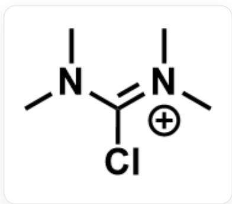

$$
C N (C) / C (C I) = [ N + ] (C) / C
$$

A laboratory attempted to synthesize compound A by reacting excess Vilsmeier salt with an equivalent amount of base and o-aminobenzamide, but found that no A was formed. Instead, a yellow, low-melting-point, non-crystalline compound B was obtained. Liquid chromatography-mass spectrometry (LC-MS) analysis revealed that the molecular weight of B was 216.28.

The laboratory then heated compound B with a large excess of hydroxylamine hydrochloride and an equivalent amount of sodium acetate in a methanol-water solution, intending to prepare the seven-membered cyclic compound C with a molecular weight of 204.23. However, thin-layer chromatography (TLC) development using dichloromethane and petroleum ether containing triethylamine revealed a non-fluorescent compound D and a fluorescent compound. LC-MS and  ${}^{1}\mathrm{H}$  NMR analysis confirmed that the fluorescent compound was A. LC-MS analysis showed that the molecular weight of D was also 204.23.

X-ray diffraction (XRD) confirmed that compound D possesses a hexa-hexacyclic system, which was not the intended structure of C. To investigate the reaction mechanism, diethylhydroxylamine was used instead of hydroxylamine hydrochloride and sodium acetate, but no analogs of D were formed.

The following options each contain three structural images: the first is the possible structure of  $\mathbf{A}$ , the second is the possible structure of  $\mathbf{C}$ , and the third is the possible structure of  $\mathbf{D}$ . Select the option where all three structures are correct.

A: A:

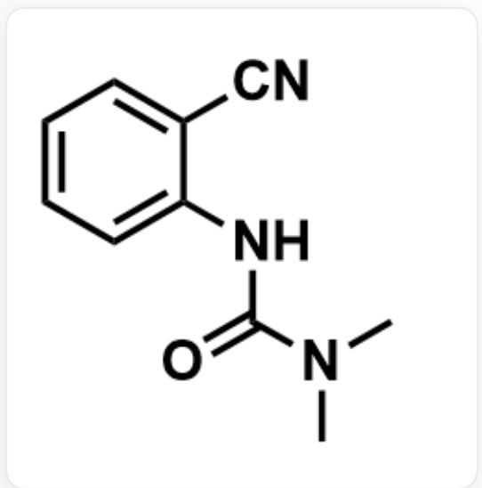

$\mathrm{O = C(N(C)C)NC1 = CC = CC = C1C\#N}$

C:

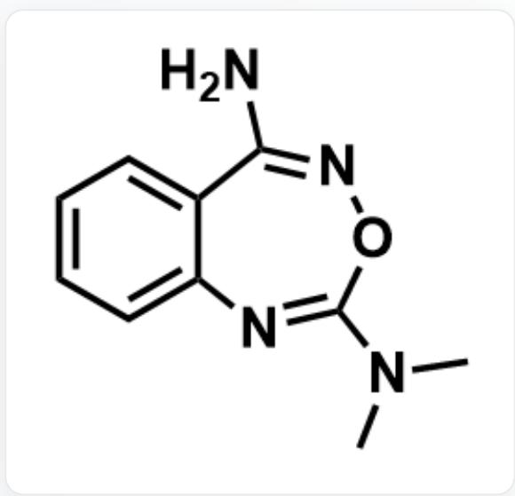

NC1=NOC(N(C)C)=NC2=CC=CC=C21

D:

O/N=C1NC(N(C)C)=NC2=CC=CC=C2\1

B. A:

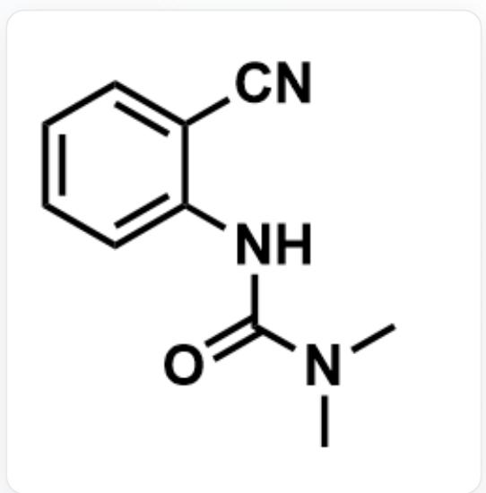

O=C(N(C)C)NC1=CC=CC=C1C#N

C:

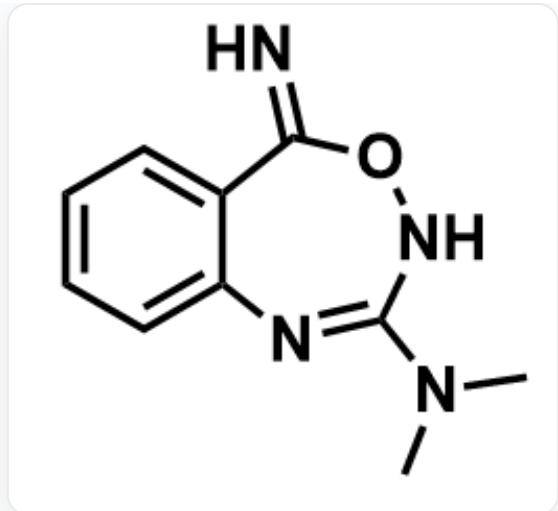

N=C1C2=CC=CC=C2N=C(N(C)C)NO1

D:

O/N=C1NC(N(C)C)=NC2=CC=CC=C2\1

C. A:

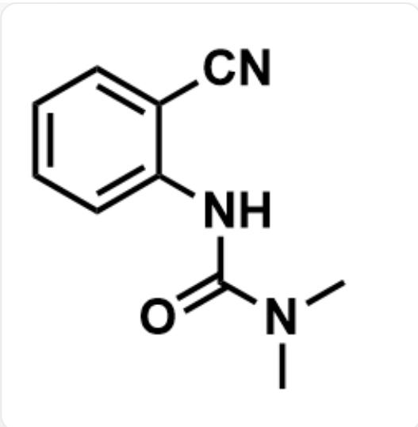

$\mathrm{O = C(N(C)C)NC1 = CC = CC = C1C\#N}$

C:

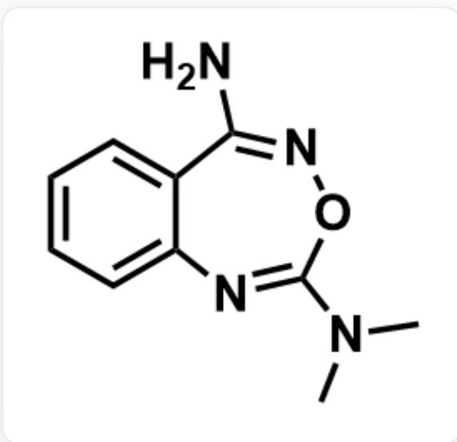

NC1=NOC(N(C)C)=NC2=CC=CC=C21

D:

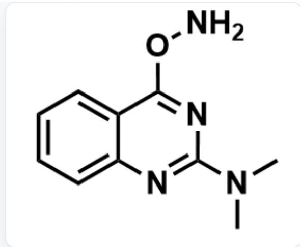

CN(C)C1=NC2=CC=CC=C2C(ON)=N1

D. A:

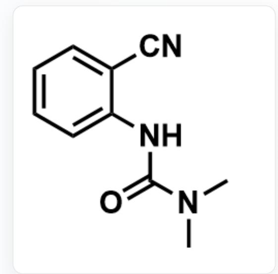

$\mathrm{O = C(N(C)C)NC1 = CC = CC = C1C\#N}$

C:

N=C1C2=CC=CC=C2N=C(N(C)C)NO1

D:

CN(C)C1=NC2=CC=CC=C2C(ON)=N1

E. A:

$\mathrm{O = C1C2 = CC = CC = C2N = C(N(C)C)N1}$

C:

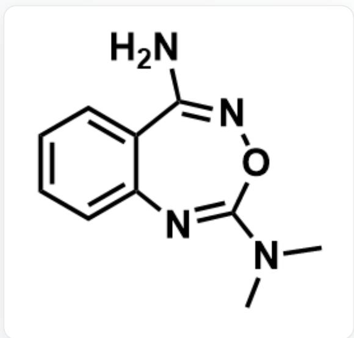

NC1=NOC(N(C)C)=NC2=CC=CC=C21

D:

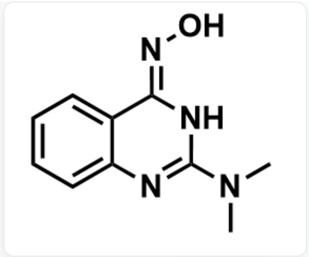

O/N=C1NC(N(C)C)=NC2=CC=CC=C2\1

F. A:

$\mathrm{O = C1C2 = CC = CC = C2N = C(N(C)C)N1}$

C:

N=C1C2=CC=CC=C2N=C(N(C)C)NO1

D:

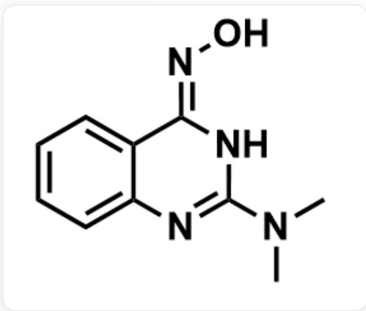

O/N=C1NC(N(C)C)=NC2=CC=CC=C2\1

G. A:

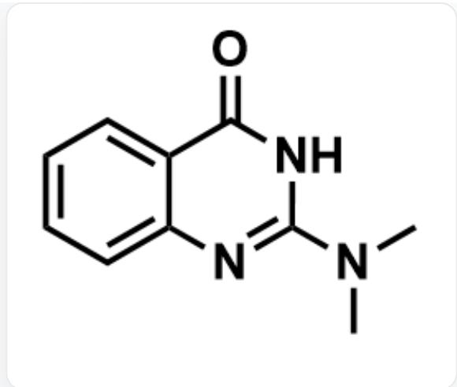

O=C1C2=CC=CC=C2N=C(N(C)C)N1

C:

NC1=NOC(N(C)C)=NC2=CC=CC=C21

D:

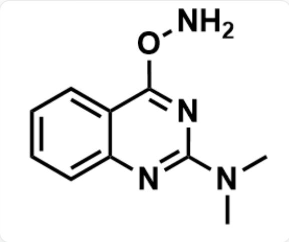

CN(C)C1=NC2=CC=CC=C2C(ON)=N1

H. A:

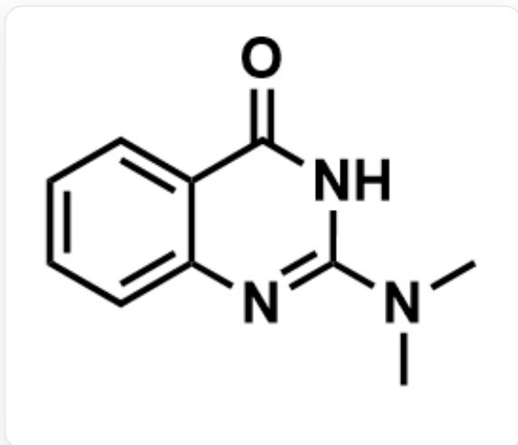

$\mathrm{O = C1C2 = CC = CC = C2N = C(N(C)C)N1}$

C:

  
N=C1C2=CC=CC=C2N=C(N(C)C)NO1

D:

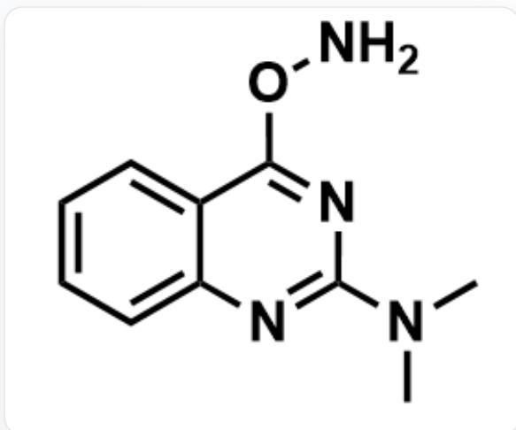  
CN(C)C1=NC2=CC=CC=C2C(ON)=N1

1. None of the above options are correct

# Answer

Correct Answer: E

# Detailed Explanation

(1)

Upon observing the substrate, both the amide oxygen and the amino nitrogen of anthranilamide are nucleophilic sites and can react with the Vilsmeier salt.

# CHECKPOINT

1 PTS

Both the amide oxygen and the amino nitrogen of the substrate are nucleophilic sites

The question states that A exhibits fluorescence, indicating that A should possess a large conjugated system and a relatively rigid skeleton, and cannot consist of only one benzene ring.

It can be inferred that the formation of compound A involves the reaction of the amino group with the Vilsmeier salt. During the formation of A, the amino group nucleophilically attacks the Vilsmeier salt, followed by an intramolecular attack by the amide to form a six-membered ring. The elimination of dimethylamine yields A, which contains a conjugated system.

# CHECKPOINT

1 PTS

A exhibits fluorescence and cannot consist of only one benzene ring

# CHECKPOINT

1 PTS

The formation of A involves the reaction of the amino group with the Vilsmeier salt

The structure of compound A is shown below:

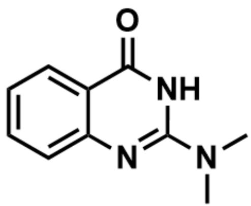

$\mathrm{O = C1C2 = CC = CC = C2N = C(N(C)C)N1}$

# CHECKPOINT

2 PTS

The structure of A is  $\mathrm{O = C1C2 = CC = CC = C2N = C(N(C)C)N1}$

If the amide reacts with the Vilsmeier salt first, the amide oxygen nucleophilically attacks the Vilsmeier salt. The Vilsmeier salt acts as a dehydrating agent, formally eliminating water to yield anthranilonitrile and dimethylaminourea. Based on the molecular formula, dimethylaminourea further reacts with the amino group to eliminate water, resulting in B.

# CHECKPOINT

1 PTS

The formation of  $\mathbf{B}$  involves the reaction of the amide with the Vilsmeier salt first

The structure of compound B is shown below:

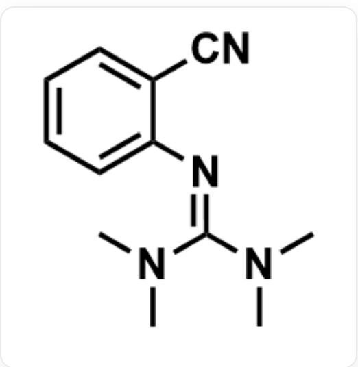

CN(C)/C(N(C)C)=N/C1=CC=CC=C1C#N

# CHECKPOINT

2 PTS

The structure of  $\mathbf{B}$  is  $\mathrm{CN(C) / C(N(C)C) = N / C1 = CC = CC = C1C\#N}$

(2)

Compound C is formed by the reaction of compound B with hydroxylamine. Based on the molecular weight, C contains one more hydroxylamine and one less dimethylamine than B, indicating a substitution reaction. Since C contains a seven-membered ring, an intramolecular cyclization also occurs. Considering the reactivity of compound B, the most electrophilic site is the cyano group, and hydroxylamine should react with the cyano group first.

# CHECKPOINT

1 PTS

Hydroxylamine should react with the cyano group first

Both the nitrogen and oxygen of hydroxylamine are nucleophilic sites, and further analysis requires information about compound D.

The question states: Using diethylhydroxylamine as a reactant fails to yield an analog of D, thereby excluding the possibility of nucleophilic attack by the oxygen end of hydroxylamine. Thus, the nitrogen end of hydroxylamine is connected to the carbon atom of the six-membered ring.

# CHECKPOINT

1 PTS

Diethylhydroxylamine as a reactant fails to yield an analog of D, indicating the nitrogen end of hydroxylamine acts as the nucleophilic site

Therefore, the carbon corresponding to the cyano group in  $\mathbf{B}$  is connected to two nitrogen atoms in  $\mathbf{C}$  and  $\mathbf{D}$ , namely the nitrogen of the cyano group and the nitrogen of hydroxylamine.

# CHECKPOINT

1 PTS

The carbon corresponding to the cyano group in  $\mathbf{B}$  is connected to two nitrogen atoms in C and D

The reaction of the cyano group with hydroxylamine can yield an amidoxime intermediate with the structure  $\mathrm{N / C(C1 = CC = CC = C1 / N = C(N(C)C)\backslash N(C)C) = N\backslash O}$ . The guanidine carbon atom in the molecule is an electrophilic site, and either the oxygen atom or the amino nitrogen atom of the amidoxime can act as a nucleophile, forming a seven-membered ring or a six-membered ring, respectively. Eliminating one molecule of dimethylamine yields C and D, respectively.

# CHECKPOINT

1 PTS

The reaction of the cyano group with hydroxylamine yields the amidoxime intermediate N/C(C1=CC=CC=C1/N=C(N(C)C)\N(C)C)=N\O

# CHECKPOINT

1 PTS

The oxygen atom or amino nitrogen atom of the amidoxime can nucleophilically attack the guanidine carbon atom to form a seven-membered/six-membered ring

The structure of compound C is shown below:

NC1=NOC(N(C)C)=NC2=CC=CC=C21

# CHECKPOINT

2 PTS

The structure of C is NC1=NOC(N(C)C)=NC2=CC=CC=C21

The structure of compound  $\mathbf{D}$  is shown below:

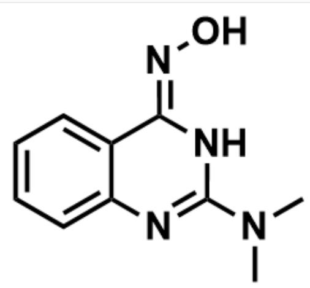

O/N=C1NC(N(C)C)=NC2=CC=CC=C2\1

# CHECKPOINT

2 PTS

The structure of D is O/N=C1NC(N(C)C)=NC2=CC=CC=C2\1

In conclusion, option E is correct.