# 题目

Vilsmeier盐的正离子结构如图所示,

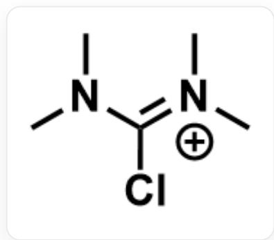

$$
C N (C) / C (C I) = [ N + ] (C) / C
$$

有实验室想用过量的Vilsmeier盐和等当量的碱与邻氨基苯甲酰胺反应合成化合物A，但是发现没有A生成，却得到了黄色低熔点不易结晶的化合物B。经过液相质谱仪检测，B的分子量为216.28。

该实验室又将化合物B与大过量的盐酸羟胺以及与盐酸羟胺等当量的乙酸钠在甲醇的水溶液中加热，拟制备分子量为204.23的七元环状化合物C，但是经过加有三乙胺的二氯甲烷和石油醚TLC展开发现一无荧光化合物D，以及一个具有荧光的化合物。经过液相质谱仪和核磁共振氢谱检测，该具有荧光的化合物就是化合物A。经过液相质谱仪检测发现化合物D的分子量也是204.23。

经过XRD证实，化合物D具有六并六环系，并非我们拟合成的化合物C。为了推测该反应的机理，我们用了二乙基羟胺代替盐酸羟胺乙酸钠，发现并没有化合物D的类似物生成。

以下选项均包含三张结构式图片，第一张为可能的A的结构，第二张为可能的C的结构、第三张为可能的D的结构，选出三个结构均正确的选项。

A. A:

$\mathrm{O = C(N(C)C)NC1 = CC = CC = C1C\#N}$

C:

NC1=NOC(N(C)C)=NC2=CC=CC=C21

D:

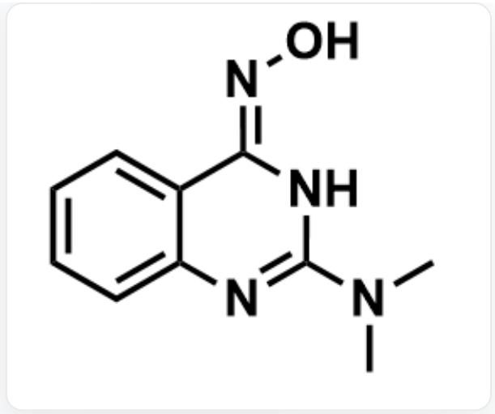

O/N=C1NC(N(C)C)=NC2=CC=CC=C2\1

B. A:

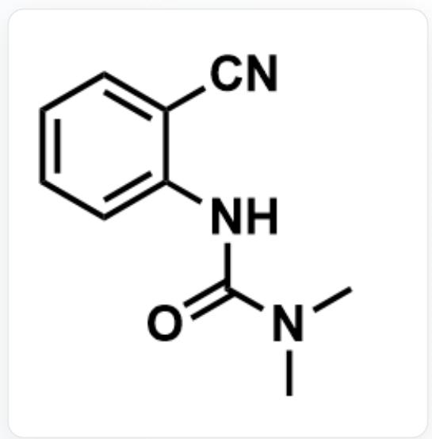

O=C(N(C)C)NC1=CC=CC=C1C#N

C:

N=C1C2=CC=CC=C2N=C(N(C)C)NO1

D:

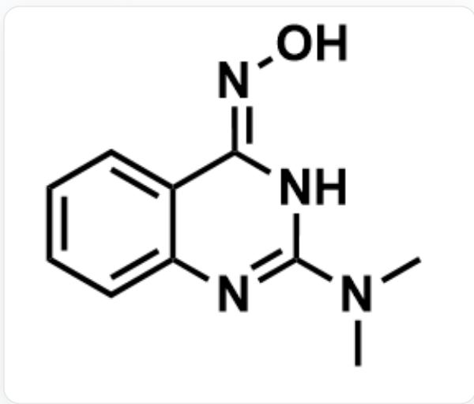

O/N=C1NC(N(C)C)=NC2=CC=CC=C2\1

C. A:

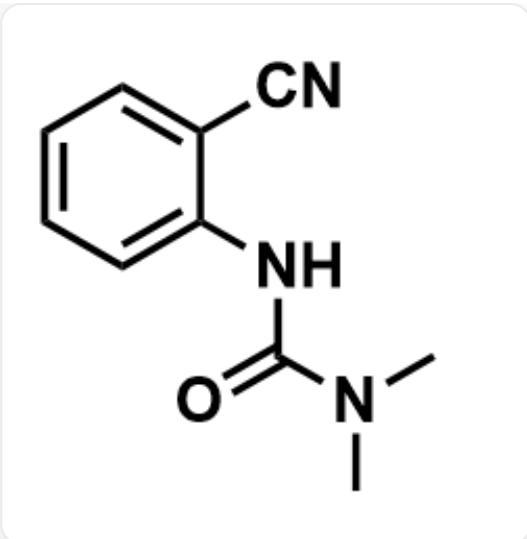

$\mathrm{O = C(N(C)C)NC1 = CC = CC = C1C\#N}$

C:

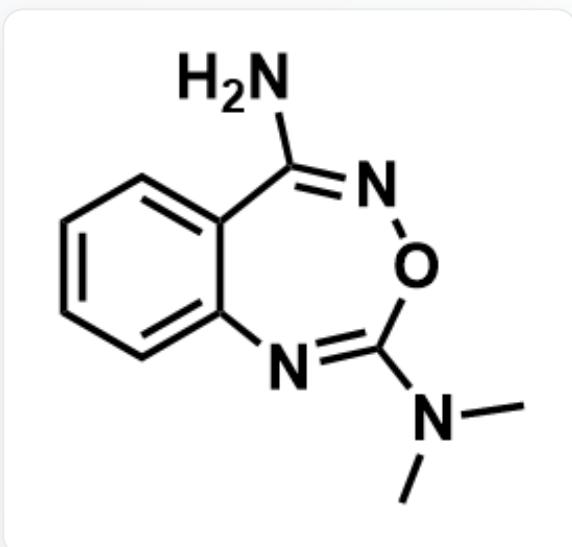

NC1=NOC(N(C)C)=NC2=CC=CC=C21

D:

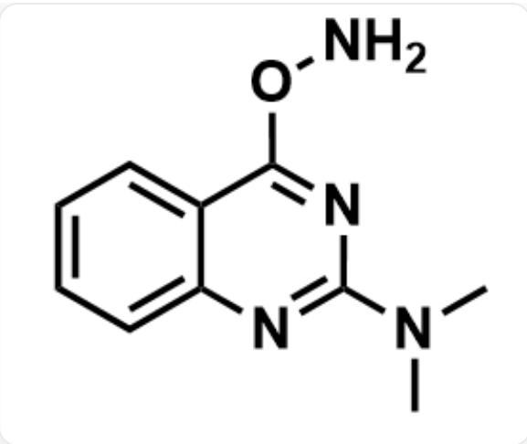

CN(C)C1=NC2=CC=CC=C2C(ON)=N1

D. A:

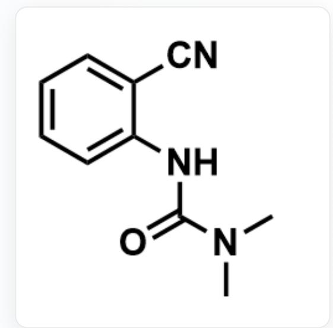

$\mathrm{O = C(N(C)C)NC1 = CC = CC = C1C\#N}$

C:

N=C1C2=CC=CC=C2N=C(N(C)C)NO1

D:

CN(C)C1=NC2=CC=CC=C2C(ON)=N1

E. A:

$\mathrm{O = C1C2 = CC = CC = C2N = C(N(C)C)N1}$

C:

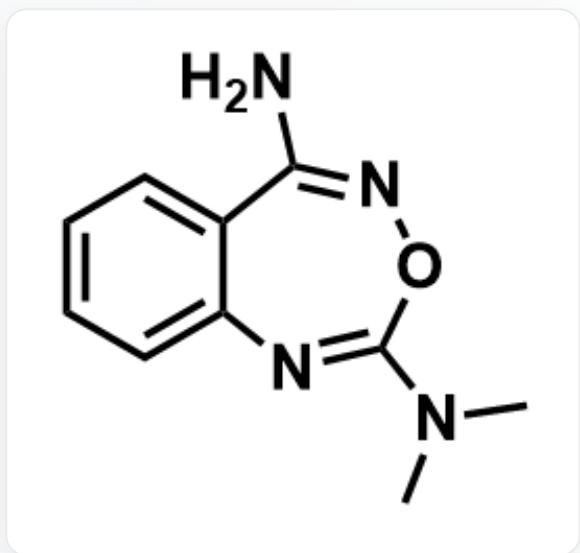

NC1=NOC(N(C)C)=NC2=CC=CC=C21

D:

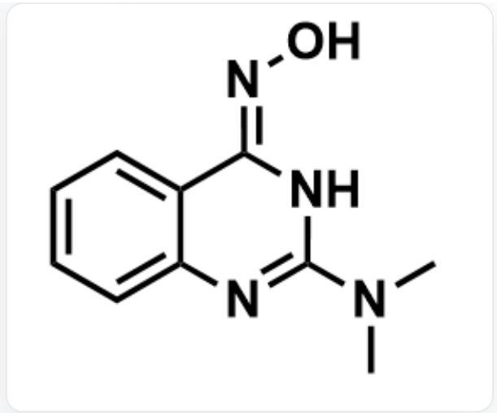

O/N=C1NC(N(C)C)=NC2=CC=CC=C2\1

F. A:

$\mathrm{O = C1C2 = CC = CC = C2N = C(N(C)C)N1}$

C:

N=C1C2=CC=CC=C2N=C(N(C)C)NO1

D:

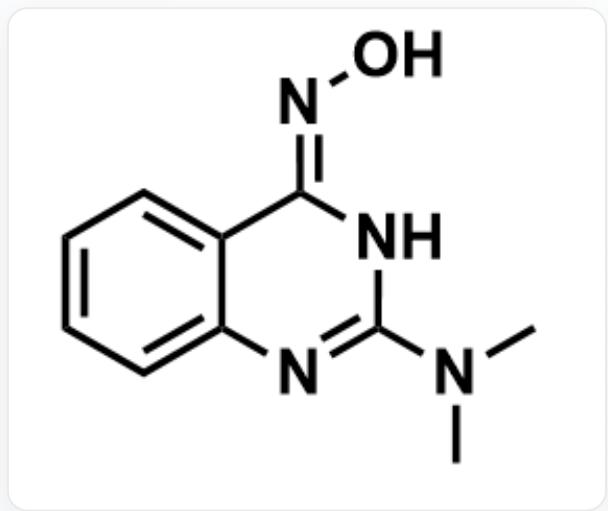

O/N=C1NC(N(C)C)=NC2=CC=CC=C2\1

G. A:

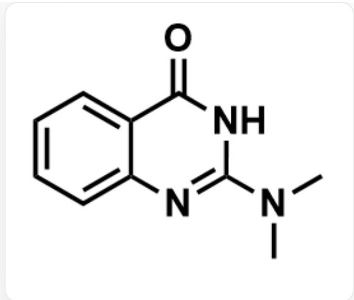

$\mathrm{O = C1C2 = CC = CC = C2N = C(N(C)C)N1}$

C:

NC1=NOC(N(C)C)=NC2=CC=CC=C21

D:

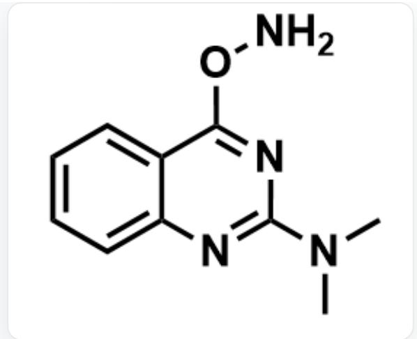

CN(C)C1=NC2=CC=CC=C2C(ON)=N1

H. A:

$\mathrm{O = C1C2 = CC = CC = C2N = C(N(C)C)N1}$

C:

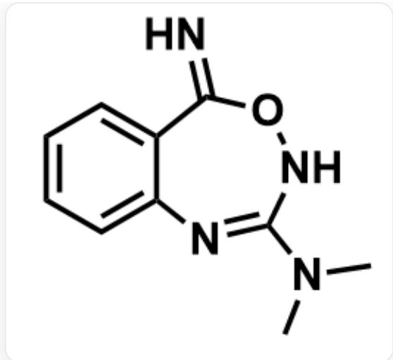

N=C1C2=CC=CC=C2N=C(N(C)C)NO1

D:

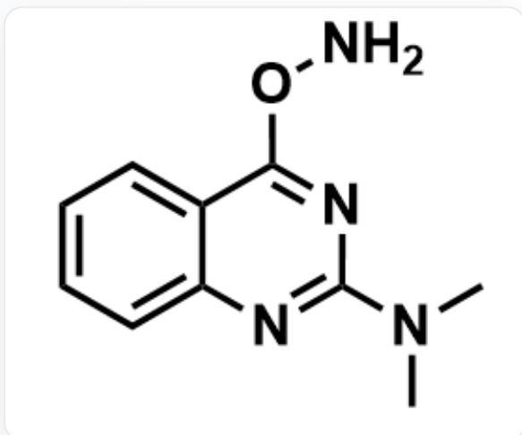

CN(C)C1=NC2=CC=CC=C2C(ON)=N1

1. 以上选项均不正确

# 答案

正确答案: E

# 详细解析

# (一)

观察底物，邻氨基苯甲酰胺的酰胺氧和胺基氮均为亲核位点，均可以与Vilsmeier盐反应。

# CHECKPOINT

1 PTS

底物的酰胺氧和胺基氮均为亲核位点

题干提到A具有荧光，可判断A应当具备大共轭体系与较为刚性的骨架，不会仅含一个苯环。

可以想到，化合物A的生成涉及胺基与Vilsmeier盐的反应，生成A时，胺基将亲核进攻Vilsmeier盐，之后酰胺分子内进攻形成六元环，脱去二甲胺，得到含共轭体系的A。

# CHECKPOINT

1 PTS

A具有荧光，不会仅含一个苯环

# CHECKPOINT

1 PTS

A的生成为胺基与Vilsmeier盐的反应

化合物A的结构如图所示

$\mathrm{O = C1C2 = CC = CC = C2N = C(N(C)C)N1}$

# CHECKPOINT

2 PTS

A的结构为  $\mathrm{O = C1C2 = CC = CC = C2N = C(N(C)C)N1}$

若酰胺先与Vilsmeier盐反应，则酰胺氧亲核进攻Vilsmeier盐，Vilsmeier盐作为脱水剂形式上脱水得到邻氨基苯甲腈以及二甲氨基脲，根据分子式可得二甲氨基脲还会继续与胺基反应脱水，即得到B。

# CHECKPOINT

1 PTS

B的生成为酰胺先与Vilsmeier盐反应

化合物B的结构如图所示

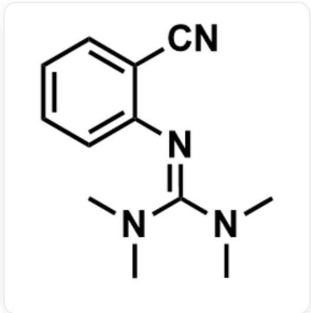

CN(C)/C(N(C)C)=N/C1=CC=CC=C1C#N

# CHECKPOINT

2 PTS

B的结构为CN(C)/C(N(C)C)=N/C1=CC=CC=C1C#N

# （二）

化合物C由化合物B与羟胺反应生成，根据分子量可以得出C比B多一个羟胺，少一个二甲胺，故反应为取代反应，由于C中含有七元环，还发生了分子内的成环反应。考虑化合物B的反应特点，其中最亲电的位点为氰基，羟胺应当先与氰基反应。

# CHECKPOINT

1 PTS

羟胺应当先与氰基反应

羟胺的氮与氧均是亲核位点，需要结合化合物D相关信息进行分析。

题干提到：使用二乙基羟胺无法得到D的类似物，从而排除了羟胺使用氧端亲核进攻的选项，故羟胺的氮端与六元环上碳原子相连。

# CHECKPOINT

1 PTS

二乙基羟胺作为反应物无法得到D的类似物，从而羟胺的氮端作为亲核位点

因此，B中氰基对应的碳在C、D中连接了两个氮，分别是氰基的氮与羟胺的氮。

# CHECKPOINT

1 PTS

B中氰基对应的碳在C、D中连接了两个氮

氰基与羟胺反应可生成偕胺肟中间体，其结构式为N/C(C1=CC=CC=C1/N=C(N(C)C)\N(C)C)=N\O，分子内胍基碳原子为亲电位点，偕胺肟的氧原子或氨基氮原子均可亲核，分别生成七元环和六元环，脱去一分子二甲胺即分别得到C、D。

# CHECKPOINT

1 PTS

氰基与羟胺反应可生成偕胺肟中间体N/C(C1=CC=CC=C1/N=C(N(C)C)\N(C)C)=N\O

# CHECKPOINT

1 PTS

借胺肟的氧原子或氨基氮原子均可亲核胍基碳原子生成七元环/六元环

化合物C的结构如图所示

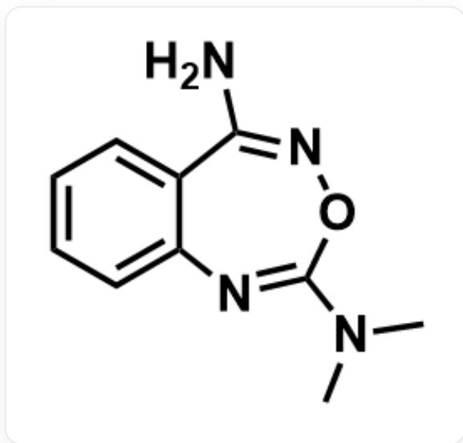

NC1=NOC(N(C)C)=NC2=CC=CC=C21

# CHECKPOINT

2 PTS

C的结构为NC1=NOC(N(C)C)=NC2=CC=CC=C21

化合物D的结构如图所示

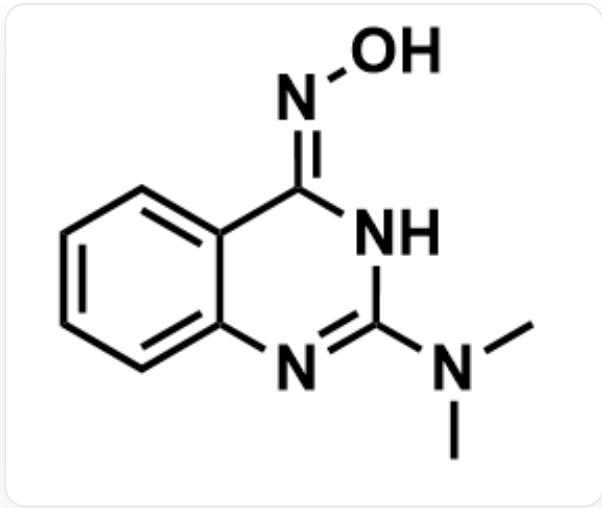

O/N=C1NC(N(C)C)=NC2=CC=CC=C2\1

# CHECKPOINT

2 PTS

D的结构为O/N=C1NC(N(C)C)=NC2=CC=CC=C2\1

综上，E选项符合题意。