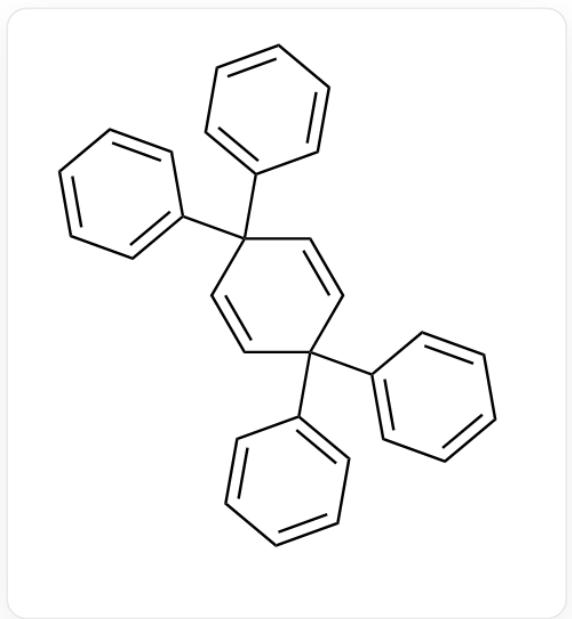
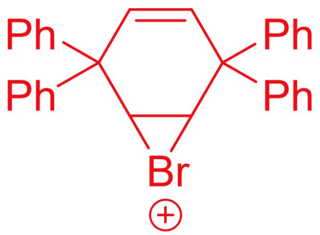
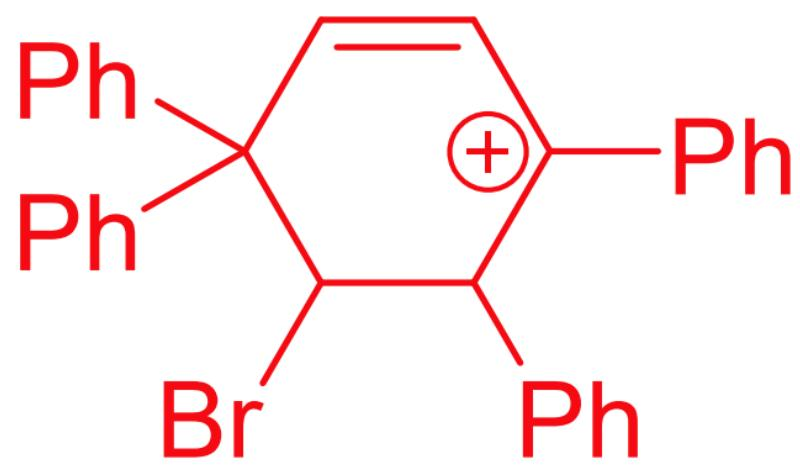
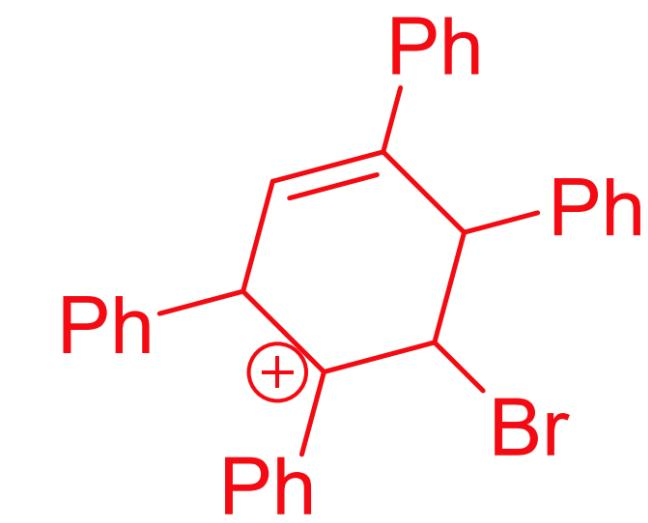
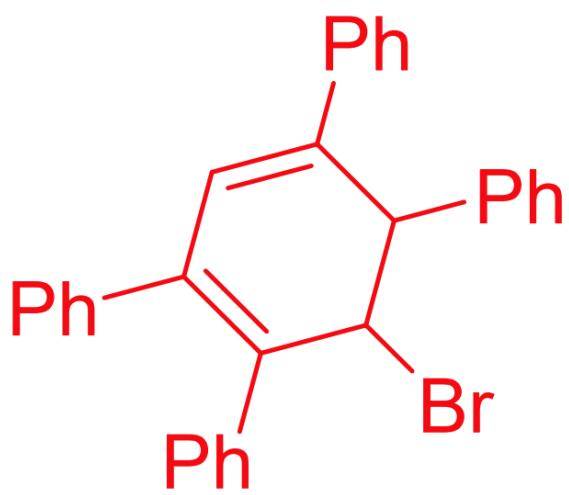
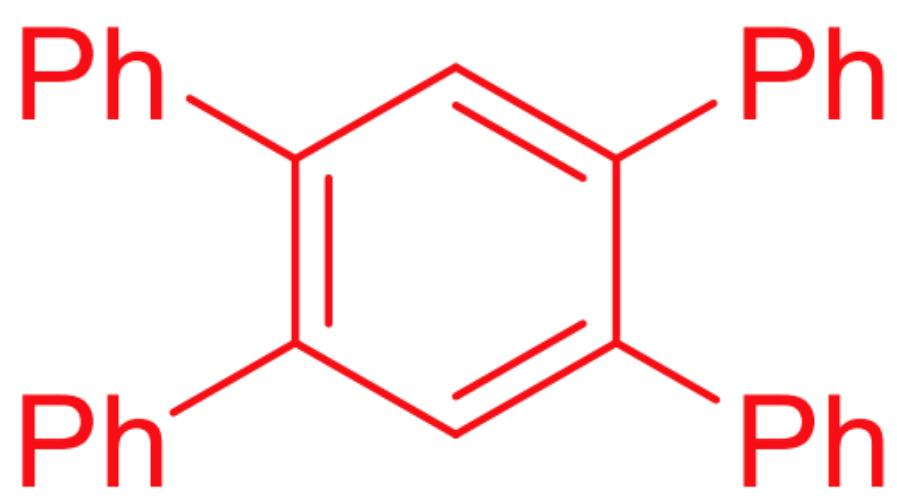

# Question

In carbon tetrachloride solution,

$$
C 1 (C 2 (C 3 = C C = C C = C 3) C = C C (C 4 = C C = C C = C 4) (C 5 = C C = C C = C 5) C = C 2) = C C = C C = C 1
$$

reacts with  $\mathrm{Br}_2$  at room temperature for  $26\mathrm{h}$ , yielding compound  $\mathbf{A}(\mathrm{C}_{30}\mathrm{H}_{22})$  with a yield of  $98\%$ .

If the reactant is changed to

COC1=CC=C(C2(C3=CC=C(OC)C=C3)C=CC(C4=CC=C(OC)C=C4)(C5=CC=C(OC)C=C5)C=C2)C=C1

, the resulting product is  $\mathbf{B}(\mathrm{C}_{34}\mathrm{H}_{26}\mathrm{Br}_4\mathrm{O}_4)$

There are the following statements about  $\mathbf{A},\mathbf{B}$  and the reaction process:

1. The point groups to which the  $\mathbf{A},\mathbf{B}$  molecules belong are the same when in the conformation with the highest symmetry.  
2. If  $\mathbf{Br}_2$  is replaced with  $\mathbf{I}_2$ , the point group to which the resulting product  $\mathbf{B}'$  belongs in the conformation with the highest symmetry may be different from  $\mathbf{B}$ .  
3. If the reaction time is further extended, the yields of  $\mathbf{A},\mathbf{B}$  will remain unchanged.  
4. The maximum number of rings in each intermediate that generates  $\mathbf{A}$  is 5.

Then, the following options give all the correct options:

A. All other options are incorrect  
B. 1

C. 2  
D. 3  
E. 4  
F. 1, 2  
G. 1, 3  
H. 1, 4  
1. 2,3  
J. 2, 4  
K. 3, 4  
L. 1,2,3  
M. 1, 2, 4  
N. 1, 3, 4  
O. 2,3,4  
P. 1, 2, 3, 4

# Answer

Correct Answer: F

# Detailed Explanation

$$
C 1 (C 2 (C 3 = C C = C C = C 3) C = C C (C 4 = C C = C C = C 4) (C 5 = C C = C C = C 5) C = C 2) = C C = C C = C 1
$$

Reacts with  $\mathrm{Br}_2$  to initially generate a bromonium ion intermediate:

C12C(C3=CC=CC=C3)(C4=CC=CC=C4)C=CC(C5=CC=CC=C5)(C6=CC=CC=C6)C1[Br+]2

Subsequently, phenyl migration occurs, opening the three-membered ring to form a carbocation intermediate:

BrC1C(C2=CC=CC=C2)(C3=CC=CC=C3)C=C[C+](C4=CC=CC=C4)C1C5=CC=CC=C5

Then, another phenyl migration occurs, forming another carbocation intermediate:

BrC1[C+](C2=CC=CC=C2)C(C3=CC=CC=C3)C=C(C4=CC=CC=C4)C1C5=CC=CC=C5

At this point, there are no groups available for migration, so the carbocation loses a proton to form a double bond:

BrC1C(C2=CC=CC=C2)=C(C3=CC=CC=C3)C=C(C4=CC=CC=C4)C1C5=CC=CC=C5

Finally, an elimination reaction occurs, forming a stable aromatic ring product:

C1(C2=CC=CC=C2)=C(C3=CC=CC=C3)C=C(C4=CC=CC=C4)C(C5=CC=CC=C5)=C1

# CHECKPOINT

1 PTS

Important intermediate 1 for the reaction to generate A: C12C(C3=CC=CC=C3) (C4=CC=CC=C4)C=CC(C5=CC=CC=C5)(C6=CC=CC=C6)C1[Br+]2

# CHECKPOINT

1 PTS

Important intermediate 2 for the reaction to generate A: BrC1C(C2=CC=CC=C2)(C3=CC=CC=C3)C=C[C+] (C4=CC=CC=C4)C1C5=CC=CC=C5

# CHECKPOINT

1 PTS

Important intermediate 3 for the reaction to generate A: BrC1[C+]

$$
(C 2 = C C = C C = C 2) C (C 3 = C C = C C = C 3) C = C (C 4 = C C = C C = C 4) C 1 C 5 = C C = C C = C 5
$$

# CHECKPOINT

1 PTS

Important intermediate 4 for the reaction to generate A:

$$
\mathrm {B r C 1 C} (\mathrm {C} 2 = \mathrm {C C} = \mathrm {C C} = \mathrm {C} 2) = \mathrm {C} (\mathrm {C} 3 = \mathrm {C C} = \mathrm {C C} = \mathrm {C} 3) \mathrm {C} = \mathrm {C} (\mathrm {C} 4 = \mathrm {C C} = \mathrm {C C} = \mathrm {C} 4) \mathrm {C} 1 \mathrm {C} 5 = \mathrm {C C} = \mathrm {C C} = \mathrm {C} 5
$$

# CHECKPOINT

1 PTS

A is  $\mathrm{C}1(\mathrm{C}2 = \mathrm{CC} = \mathrm{CC} = \mathrm{C}2) = \mathrm{C}(\mathrm{C}3 = \mathrm{CC} = \mathrm{CC} = \mathrm{C}3)\mathrm{C} = \mathrm{C}(\mathrm{C}4 = \mathrm{CC} = \mathrm{CC} = \mathrm{C}4)\mathrm{C}(\mathrm{C}5 = \mathrm{CC} = \mathrm{CC} = \mathrm{C}5) = \mathrm{C}1$

The generation of  $\mathbf{B}$  also involves the above process, first producing a product similar to  $\mathbf{A}$ . Noting that  $\mathbf{B}(\mathrm{C}_{34}\mathrm{H}_{26}\mathrm{Br}_4\mathrm{O}_4)$  has four bromine atoms, it is speculated that electrophilic substitution has occurred on the benzene ring. Because of the presence of methoxy as an electron-donating group,  $\mathbf{B}$  is:

BrC1=CC(C2=C(C=C(C3=CC(Br)=C(OC)C=C3)=C2)C4=CC=C(OC)C(Br)=C4)C5=CC(Br)=C(OC)C=C5)=CC=C1OC

# CHECKPOINT

1 PTS

B

is

$$
\mathrm {B r C 1} = \mathrm {C C} (\mathrm {C 2} = \mathrm {C} (\mathrm {C} = \mathrm {C} (\mathrm {C} (\mathrm {C 3} = \mathrm {C C} (\mathrm {B r}) = \mathrm {C} (\mathrm {O C}) \mathrm {C} = \mathrm {C 3}) = \mathrm {C 2}) \mathrm {C 4} = \mathrm {C C} = \mathrm {C} (\mathrm {O C}) \mathrm {C} (\mathrm {B r}) = \mathrm {C 4}) \mathrm {C 5} = \mathrm {C C} (\mathrm {B r}) = \mathrm {C} (\mathrm {O C}) \mathrm {C} = \mathrm {C 5}) = \mathrm {C C}
$$

The point group of molecules  $\mathbf{A},\mathbf{B}$  in the conformation with the highest symmetry are both  $D_{2h}$ , statement 1 is correct.

# CHECKPOINT

1 PTS

The point group of molecules  $\mathbf{A},\mathbf{B}$  in the conformation with the highest symmetry are both  $D_{2h}$

If  $\mathrm{Br}_2$  is replaced with  $\mathrm{I}_2$ , the resulting product  $\mathbf{B}'$  is structurally similar to  $\mathbf{B}$ , but due to the larger radius of the iodine atom, it may prevent the two benzene rings from being in the same plane, thereby disrupting the symmetry.

# CHECKPOINT

1 PTS

The larger radius of the iodine atom may cause the product to lose its planar structure

If the reaction time is further extended,  $\mathbf{A}$  is relatively stable and will not continue to react.  $\mathbf{B}$  may continue to undergo electrophilic substitution reactions, thus changing the yield.

# CHECKPOINT

1 PTS

B will continue to undergo electrophilic substitution reactions

It can be seen from the intermediates that the maximum number of rings in each intermediate that generates  $\mathbf{A}$  is 6.

# CHECKPOINT

1 PTS

C12C(C3=CC=CC=C3)(C4=CC=CC=C4)C=CC(C5=CC=CC=C5)(C6=CC=CC=C6)C1[Br+]2 has 6 rings

Therefore, statements 1 and 2 are correct.