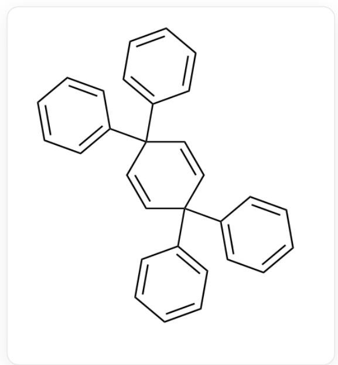
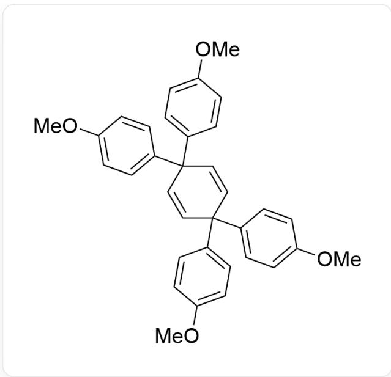
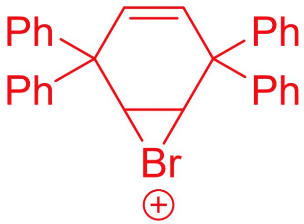
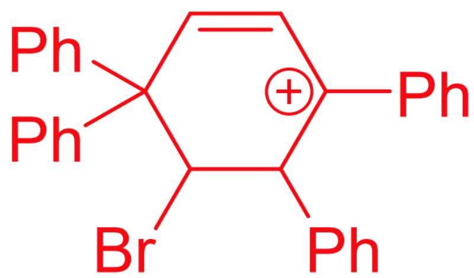
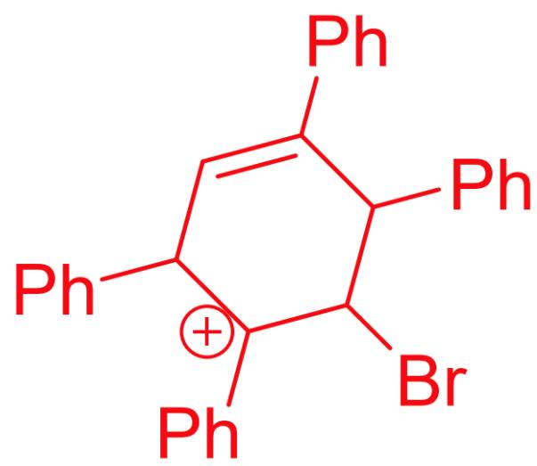
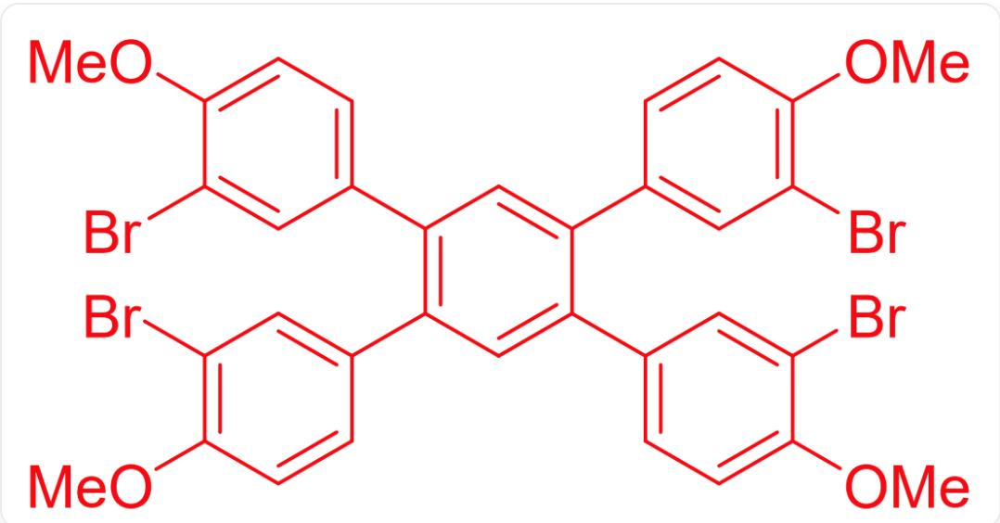

# 题目

在四氯化碳溶液中,



$$
C 1 (C 2 (C 3 = C C = C C = C 3) C = C C (C 4 = C C = C C = C 4) (C 5 = C C = C C = C 5) C = C 2) = C C = C C = C 1
$$

与  $\mathrm{Br}_{2}$  于室温反应  $26 \mathrm{~h}$ , 以  $98 \%$  的产率得到化合物  $\mathrm{A} \left(\mathrm{C}_{30} \mathrm{H}_{22}\right)$  。

若将反应物换为



$\mathrm{COC1 = CC = C(C2(C3 = CC = C(OC)C = C3)C = CC(C4 = CC = C(OC)C = C4)(C5 = CC = C(OC)C = C5)C = C2)C = C1}$

，所得产物为  $\mathrm{B}(\mathrm{C}_{34}\mathrm{H}_{26}\mathrm{Br}_4\mathrm{O}_4)$  。

有下列关于A,B以及反应过程的说法：

1. A, B 分子在对称性最高的构象时所属的点群相同。  
2, 若将  $\mathrm{Br}_{2}$  替换为  $\mathrm{I}_{2}$ , 所得到的产物  $\mathbf{B}^{\prime}$  在对称性最高的构象时所属的点群可能与  $\mathbf{B}$  不同。  
3，若继续延长反应时间，A,B的产率均会保持不变。  
4. 生成  $\mathbf{A}$  的各个中间体中环数最多为 5。

则下列选项中给出了全部正确选项的是：

A. 其他选项均不正确  
B. 1  
C. 2

D. 3  
E. 4  
F. 1, 2  
G. 1, 3  
H. 1, 4  
1. 2,3  
J. 2,4  
K. 3, 4  
L. 1,2,3  
M. 1, 2, 4  
N. 1,3,4  
O. 2, 3, 4  
P. 1, 2, 3, 4

# 答案

正确答案: F

# 详细解析


$$
C 1 (C 2 (C 3 = C C = C C = C 3) C = C C (C 4 = C C = C C = C 4) (C 5 = C C = C C = C 5) C = C 2) = C C = C C = C 1
$$

与  $\mathrm{Br}_2$  反应，首先生成溴离子中间体：



```javascript
C12C(C3=CC=CC=C3)(C4=CC=CC=C4)C=CC(C5=CC=CC=C5)(C6=CC=CC=C6)C1[Br+]2
```

随后发生苯基的迁移，打开三元环形成碳正离子中间体：



```javascript
BrC1C(C2=CC=CC=C2)(C3=CC=CC=C3)C=C[C+](C4=CC=CC=C4)C1C5=CC=CC=C5
```

然后再发生一步苯基的迁移，形成另一个碳正离子中间体：



BrC1[C+](C2=CC=CC=C2)C(C3=CC=CC=C3)C=C(C4=CC=CC=C4)C1C5=CC=CC=C5

此时没有能够发生迁移的基团了，于是失去碳正离子生成双键：


BrC1C(C2=CC=CC=C2)=C(C3=CC=CC=C3)C=C(C4=CC=CC=C4)C1C5=CC=CC=C5

最后发生消除反应，形成稳定的芳环产物：


C1(C2=CC=CC=C2)=C(C3=CC=CC=C3)C=C(C4=CC=CC=C4)C(C5=CC=CC=C5)=C1

# CHECKPOINT

1 PTS

生成A的反应的重要中间体1：C12C(C3=CC=CC=C3)(C4=CC=CC=C4)C=CC(C5=CC=CC=C5) (C6=CC=CC=C6)C1[Br+]2

# CHECKPOINT

1 PTS

生成A的反应的重要中间体2：BrC1C(C2=CC=CC=C2)(C3=CC=CC=C3)C=C[C+](C4=CC=CC=C4)C1C5=CC=CC=C5

# CHECKPOINT

1 PTS

生成成  $\mathbf{A}$  的反应的重要中間体3：BrC1[C+]

$$
(C 2 = C C = C C = C 2) C (C 3 = C C = C C = C 3) C = C (C 4 = C C = C C = C 4) C 1 C 5 = C C = C C = C 5
$$

# CHECKPOINT

1 PTS

生成成為 A類的反對應應的最重要要點中間體體積 4 ：

$$
\mathrm {B r C 1 C} (\mathrm {C} 2 = \mathrm {C C} = \mathrm {C C} = \mathrm {C} 2) = \mathrm {C} (\mathrm {C} 3 = \mathrm {C C} = \mathrm {C C} = \mathrm {C} 3) \mathrm {C} = \mathrm {C} (\mathrm {C} 4 = \mathrm {C C} = \mathrm {C C} = \mathrm {C} 4) \mathrm {C} 1 \mathrm {C} 5 = \mathrm {C C} = \mathrm {C C} = \mathrm {C} 5
$$

# CHECKPOINT

1 PTS

A 为  $\mathrm{C}1(\mathrm{C}2 = \mathrm{CC} = \mathrm{CC} = \mathrm{C}2) = \mathrm{C}(\mathrm{C}3 = \mathrm{CC} = \mathrm{CC} = \mathrm{C}3)\mathrm{C} = \mathrm{C}(\mathrm{C}4 = \mathrm{CC} = \mathrm{CC} = \mathrm{C}4)\mathrm{C}(\mathrm{C}5 = \mathrm{CC} = \mathrm{CC} = \mathrm{C}5) = \mathrm{C}1$

B 的产生也要经过上述过程, 先产生与 A 类似的产物, 注意到  $\mathrm{B}\left(\mathrm{C}_{34} \mathrm{H}_{26} \mathrm{Br}_{4} \mathrm{O}_{4}\right)$  中有四个溴原子, 推测为发生了苯环上的亲电取代反应, 因为甲氧基给电子基的存在, 因此 B 为:



BrC1=CC(C2=C(C=C(C3=CC(Br)=C(OC)C=C3)=C2)C4=CC=C(OC)C(Br)=C4)C5=CC(Br)=C(OC)C=C5)=CC=C1OC

# CHECKPOINT

1 PTS

B

为

$$
\mathrm {B r C 1} = \mathrm {C C} (\mathrm {C 2} = \mathrm {C} (\mathrm {C} = \mathrm {C} (\mathrm {C} (\mathrm {C 3} = \mathrm {C C} (\mathrm {B r}) = \mathrm {C} (\mathrm {O C}) \mathrm {C} = \mathrm {C 3}) = \mathrm {C 2}) \mathrm {C 4} = \mathrm {C C} = \mathrm {C} (\mathrm {O C}) \mathrm {C} (\mathrm {B r}) = \mathrm {C 4}) \mathrm {C 5} = \mathrm {C C} (\mathrm {B r}) = \mathrm {C} (\mathrm {O C}) \mathrm {C} = \mathrm {C 5}) = \mathrm {C C}
$$

A,B分子在对称性最高的构象时所属的点群均为  $D_{2h}$  ，说法1正确。

# CHECKPOINT

1 PTS

A,B分子对称性最高的构象时所属的点群均为  $D_{2h}$

若将  $\mathrm{Br}_2$  替换为  $\mathrm{I}_2$  ，所得到的产物  $\mathbf{B}^{\prime}$  与  $\mathbf{B}$  结构类似，但是由于碘原子半径较大，可能会使两个苯环无法处于同一平面从而破坏了对称性。

# CHECKPOINT

1 PTS

碘原子半径较大可能会使产物失去平面结构

若继续延长反应时间，A比较稳定，不会继续发生反应，B可能会继续发生亲电取代反应，从而使产率改变。

# CHECKPOINT

1 PTS

B会继续发生亲电取代反应

从中间体可以看出生成A的各个中间体中环数最多为6。

# CHECKPOINT

1 PTS

C12C(C3=CC=CC=C3)(C4=CC=CC=C4)C=CC(C5=CC=CC=C5)(C6=CC=CC=C6)C1[Br+]2中有6个环

因此说法1，2正确