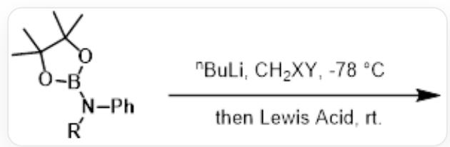

# Question

The boronate ester phase is attacked by the nucleophilic carbon atom of the leaving group, followed by a 1,2-migration to transform into a carbaboronate ester. This reaction is known as the Matteson reaction, which is essentially similar to the hydroboration-oxidation reaction. The research group of Guangbin Dong at the University of Chicago extended this reaction to aminoboronate esters, achieving the aza-Matteson reaction between N-B bonds. However, unlike the Matteson reaction, depending on the halogens on dihalomethane, they were able to control the formation of mono-insertion and double-insertion products.

  
[R]N(C1=CC=CC=C1)B2OC(C)(C)C(C)(C)O2 reacts with n-butyllithium and  $CH_{2}XY$  at  $-78^{\circ}\mathrm{C}$ , followed by warming to room temperature and reaction with a Lewis acid.

Which of the following statements are correct?

1. When using chlorobromomethane, a double-insertion reaction can occur.  
2. When using dibromomethane, a double-insertion reaction can occur.  
3. The reason double insertion can occur is that nitrogen's 1,2-migration can involve lone pair electrons, making the rate faster.  
4. The reason the reaction stops at the double-insertion product is that the lone pair electrons of nitrogen in the double-insertion product can coordinate with the boronate ester, preventing further reaction.

A. 1.3.4.  
B. 2.3.4.

C. 2.3.  
D. 2.4.  
E. 1.3.  
F. 1.4.  
G. 1.  
H. 2.  
1. 3.  
J. 4.  
K. There is no correct statement.

# Answer

Correct Answer: C

# Detailed Explanation

In the lithium-halogen exchange reaction, Br is exchanged first. In the first insertion reaction, due to the better leaving ability of bromine compared to chlorine, when dibromomethane participates in the reaction, the tetracoordinated boron can undergo 1,2-nitrogen migration at low temperature to form a tricoordinated boron, which is further attacked by the second anion, resulting in a double insertion reaction. In contrast, chlorobromomethane requires room temperature for the chlorine atom to leave.

Therefore, dibromomethane can undergo double insertion, while chlorobromomethane can only undergo single insertion.

# CHECKPOINT

1 PTS

Due to the better leaving ability of bromine compared to chlorine, when dibromomethane participates in the reaction, the tetracoordinated boron can undergo 1,2-nitrogen migration at low temperature.

# CHECKPOINT

1 PTS

Therefore, dibromomethane can undergo double insertion, while chlorobromomethane can only undergo single insertion.

Thus, 2 is correct.

Because the 1,2-migration of nitrogen can involve lone pair electrons, the reaction proceeds faster, so nitrogen migration reactions can occur rapidly at low temperatures. 3 is correct.

# CHECKPOINT

1 PTS

The 1,2-migration of N can involve lone pair electrons, resulting in a faster rate.

However, after completing one insertion, the reaction reverts to a carbon migration reaction, which requires room temperature to occur. 4 is incorrect.

# CHECKPOINT

1 PTS

After completing one insertion, the reaction reverts to a C migration reaction, which requires room temperature to occur.

In conclusion, choose C.