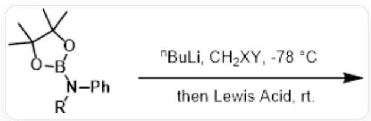

# 题目

硼酸酯相被连接离去基团的亲核性碳原子进攻，随后发生1,2-迁移转化为碳硼酸酯，此反应为Matteson反应，其本质与硼氢化氧化反应类似。芝加哥大学董广彬课题组将这一反应拓展到氨基硼酸酯上，实现了N-B键之间的aza-Matteson反应。然而，与Matteson反应不同，根据二卤代甲烷上卤素的不同，他们能够实现单插入和双插入产物的控制。

  
[R]N(C1=CC=CC=C1)B2OC(C)(C)C(C)(C)O2在-78°C下与正丁基锂、CH₂XY反应后，升室温与Lewis酸反应。

下面的说法中有哪些是正确的？

1. 当使用一氯一溴甲烷时，可以发生双插入反应  
2. 当使用二溴甲烷时，可以发生双插入反应  
3. 能发生双插入的原因是因为氮的1，2迁移可以有孤对电子参与，速率更快  
4. 能停留在双插入产物的原因是因为双插入的产物中氮的孤对电子可以配位硼酸酯使得其无法继续反应

A. 1.3.4.  
B. 2.3.4.  
C. 2.3.  
D. 2.4.

E. 1.3.  
F. 1.4.  
G. 1.  
H. 2.  
1. 3.  
J. 4.  
K. 没有正确的说法

# 答案

正确答案: C

# 详细解析

在锂卤交换反应中，Br会被首先交换。第一次插入反应中，由于溴的离去性比氯好，因此二溴甲烷参与反应时，四配位的硼可以在低温发生1，2氮迁移得到三配位硼，进一步被第二个负离子进攻，发生双插入反应，而一氯一溴甲烷必须在室温才能离去氯原子。

因此二溴甲烷可以发生双插入，一氯一溴甲烷只能发生单插入反应。

# CHECKPOINT

1 PTS

由于溴的离去性比氯好，因此二溴甲烷参与反应时，四配位的硼可以在低温发生1，2氮迁移

# CHECKPOINT

1 PTS

因此二溴甲烷可以发生双插入，一氯一溴甲烷只能发生单插入反应。

因此1错误，2是正确的。

因为N的1，2迁移可以有孤对电子参与，速率更快，所以迁移氮的反应可以在低温下快速发生。3正确

# CHECKPOINT

1 PTS

N的1，2迁移可以有孤对电子参与，速率更快

而当完成一次插入后，反应再次成为碳迁移反应，需要在室温下发生，4错误。

# CHECKPOINT

1 PTS

完成一次插入后，反应再次成为C迁移反应，需要在室温下发生

综上，选择C。