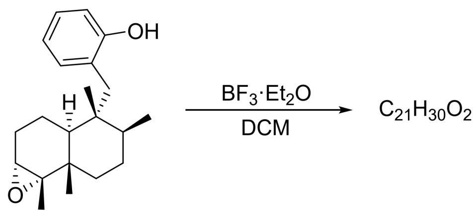
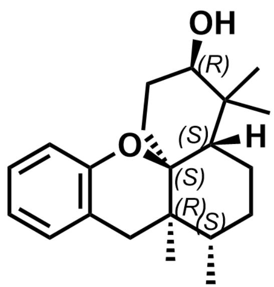

# Question

The following reaction undergoes two carbocation rearrangement processes to finally obtain product A. Regarding the final product A of the reaction, which of the following statements are correct:

[H][C@]12[C@]([C@H](CC[C@]1(C)[C@]1([C@@H](CC2)O1)C)C)(C)CC1C(=CC=CC=1)O>BF_3·Et_2O> [A], where the molecular formula of A is  $C_{21}H_{30}O_{2}$ , and the reaction solvent is DCM

A. A has two rings  
B. A The stereochemistry of the carbon atom attached to the hydroxyl group in is S.  
C. A has 5 stereocenters, of which 2 have R configuration and 3 have S configuration.  
D. A has 5 stereocenters, of which 3 have R configuration and 2 have S configuration.  
E. A has 6 stereocenters, of which 3 are R configuration and 3 are S configuration.  
F. A has 6 stereocenters, of which 2 have R configuration and 4 have S configuration.

G. All of the above options are incorrect.

# Answer

Correct Answer: C

# Detailed Explanation

The epoxide group of the substrate undergoes ring-opening under the catalysis of  $\mathrm{BF}_3\cdot \mathrm{Et}_2\mathrm{O}$  (possibly via an oxonium ion mechanism), generating a tertiary carbocation.

# CHECKPOINT

1 PTS

The epoxide group of the substrate undergoes ring-opening under the catalysis of  $\mathrm{BF}_3\cdot \mathrm{Et}_2\mathrm{O}$ , generating a tertiary carbocation

According to the question, two carbocation rearrangements are involved. First, the methyl group on the adjacent quaternary carbon undergoes a concerted sigmoidotropic migration to generate a tertiary carbocation at the bridgehead.

# CHECKPOINT

1 PTS

The methyl group on the quaternary carbon undergoes a concerted sigmoidotropic migration to generate a tertiary carbocation at the bridgehead

Subsequently, a 1,2-sigmatropic hydride shift occurs. Finally, due to steric hindrance, the phenolic hydroxyl group attacks the carbocation in a concerted manner with proton transfer, ultimately resulting in a cis-fused ring structure.

# CHECKPOINT

1 PTS

Subsequently, a 1,2-sigmatropic hydride shift occurs

# CHECKPOINT

1 PTS

Due to steric hindrance, the phenolic hydroxyl group attacks the carbocation in a concerted manner with proton transfer, ultimately resulting in a cis-fused ring structure

The structure of the final product  $\mathbf{A}$  is as follows:

[H][C@@]12CC[C@H](C)[C@@]3(C)[C@@]1(OC4=C(C3)C=CC=C4)CC[C@@H](O)C2(C)C, which has 5 chiral centers, with 2 R configurations and 3 S configurations

Therefore,  $\mathbf{A}$  has three rings.

# CHECKPOINT

1 PTS

A has three rings, option A is incorrect

The stereoconfiguration of the carbon attached to the hydroxyl group is R.

# CHECKPOINT

1 PTS

The stereoconfiguration of the carbon attached to the hydroxyl group is R, option B is incorrect

A has 5 stereocenters, with 2 R configurations and 3 S configurations.

# CHECKPOINT

2 PTS

A has 5 stereocenters, with 2 R configurations and 3 S configurations, option C is correct, options D, E, and F are incorrect

In summary, the correct answer is C.

# CHECKPOINT

1 PTS

The correct answer is C