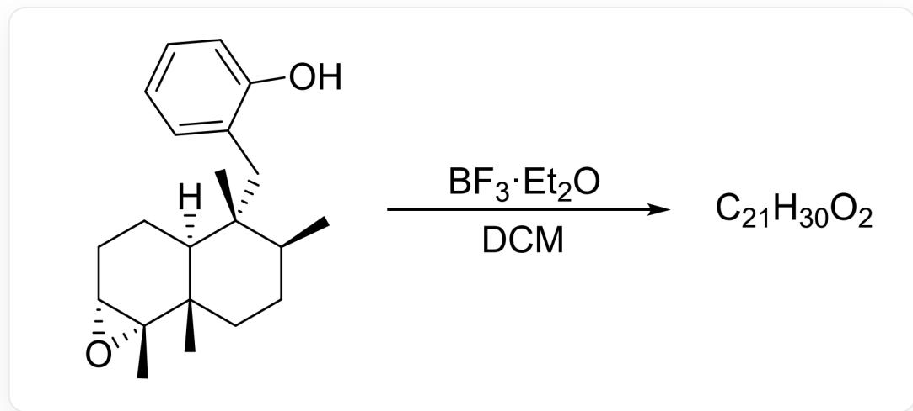
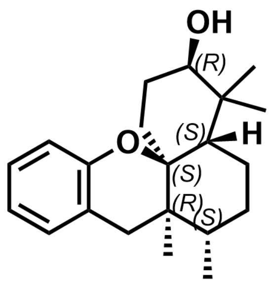

# 题目

以下反应经过两次碳正离子重排过程最终得到产物 A。对于反应的最终产物 A，下列说法正确的有：

  
[H][C@]12[C@]([C@H](CC[C@]1(C)[C@]1([C@@H](CC2)O1)C)C)(C)CC1C(=CC=CC=1)O>BF_3·Et_2O> [A], 其中A的分子式为  $C_{21}H_{30}O_{2}$ , 反应溶剂为DCM

A. A 有两个环  
B. A 中羟基所连碳原子的立体构型为  $\mathrm{S}$  
C. A 中有 5 个立体化学中心, 其中有 2 个R构型, 3 个S构型  
D. A 中有 5 个立体化学中心, 其中有 3 个  $\mathrm{R}$  构型, 2 个  $\mathrm{S}$  构型  
E. A 中有 6 个立体化学中心, 其中有 3 个  $\mathrm{R}$  构型, 3 个  $\mathrm{S}$  构型  
F. A 中有 6 个立体化学中心, 其中有 2 个R构型, 4 个S构型

# G. 以上选项均不正确

# 答案

正确答案: C

# 详细解析

底物的环氧基团在  $\mathrm{BF}_{3} \cdot \mathrm{Et}_{2} \mathrm{O}$  的催化下发生开环（也可能是鎘离子的机理），生成三级碳正离子

# CHECKPOINT

1 PTS

底物的环氧基团在  $\mathrm{BF}_3\cdot \mathrm{Et}_2\mathrm{O}$  的催化下发生开环，生成三级碳正离子

根据题意，涉及两次碳正离子重排，则首先相邻的四级碳的甲基进行同面迁移，得到桥头的三级碳正离子，

# CHECKPOINT

1 PTS

四级碳的甲基进行同面迁移, 得到桥头的三级碳正离子

随后再发生氢的1,2-同面迁移，最后酚羟基由于空间位阻限制同面进攻碳正离子并质子转移最终得到顺式并环结构。

# CHECKPOINT

1 PTS

随后再发生氢的1,2-同面迁移

# CHECKPOINT

1 PTS

酚羟基由于空间位阻限制同面进攻碳正离子并质子转移最终得到顺式并环结构

最终产物A的结构如下：

  
[H][C@@]12CC[C@H](C)[C@@]3(C)[C@@]1(OC4=C(C3)C=CC=C4)CC[C@@H](O)C2(C)C，其中有5个手性中心，分别为2个R构型，3个S构型

因此，A有三个环

# CHECKPOINT

1 PTS

A 有三个环，选项A错误

羟基所连碳的立体构型为R

# CHECKPOINT

1 PTS

羟基所连碳的立体构型为R，选项B错误

A 中有5个立体化学中心，其中有2个R构型，3个S构型

# CHECKPOINT

2 PTS

A中有5个立体化学中心，其中有2个R构型，3个S构型，选项C正确，选项D、E、F错误

综上，正确答案为C

# CHECKPOINT

1 PTS

正确答案为C