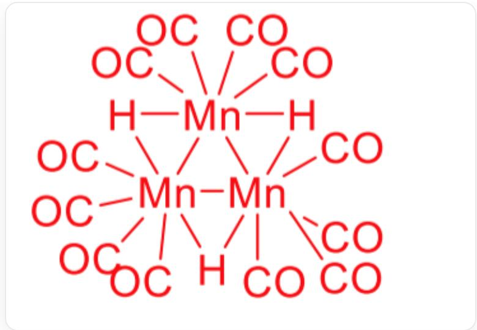

# Question

$Mn$  carbonyl compounds and their derivatives are rich and varied. Reacting a  $D_{4d}$  point group carbonyl compound  $\mathbf{X}$  of  $Mn$  with  $Na$  yields a 1:1 ionic compound  $\mathbf{A}$ .  $\mathbf{A}$  reacts with allyl chloride to produce  $\mathbf{B}$ . Heating  $\mathbf{B}$  results in the loss of one molecule of a toxic gas, yielding  $\mathbf{C}$ . Simultaneously,  $\mathbf{B}$  reacts with perchloric acid to produce an ionic compound  $\mathbf{D}$ .  $\mathbf{A}$  can react with 1,3-dibromopropane to produce a neutral complex  $\mathbf{E}$ , and it can also react with  $BrCH_{2}CH_{2}SMe$  to produce  $\mathbf{F}$  (hint: one molecule of a toxic gas is also generated).  $\mathbf{A}$  reacts with phosphoric acid to produce a mononuclear complex  $G$  with a four-fold axis.  $G$  further transforms into a trinuclear complex  $\mathbf{H}$ .  $\mathbf{G}$  can react with diazomethane in a 1:1 ratio to produce  $\mathbf{I}$ .  $\mathbf{X}$  can react with dimethylamine to produce a 1:2 ionic compound  $\mathbf{J}$ , while also generating a common solvent  $K$ . The mass fraction of the Mn element in  $\mathbf{J}$  is  $23.04\%$ , and  $\mathbf{J}$  and  $\mathbf{A}$  have the same anion.

The following statements are made about  $\mathbf{A} - K$ :

1. Both  $\mathbf{A}$  and  $\mathbf{B}$  satisfy the EAN rule.  
2. C does not satisfy the EAN rule.  
3. The cation in  $\mathbf{D}$  has a  $C_4$  axis.  
4. The molar mass of  $\mathbf{E}$  is approximately  $317\mathrm{g / mol}$ .  
5.  $\mathbf{G}$  and  $\mathbf{I}$  have the same highest order of rotational axis.  
6.  $\mathbf{H}$  belongs to the  $D_{3h}$  point group.  
7. If carbon and hydrogen atoms are ignored, the cation of  $\mathbf{J}$  belongs to the  $O_{h}$  point group.

Let the sum of the numbers of the correct statements be a, and the smallest number of the correct statements be b, then a and b are respectively:

A. 12, 1

B. 12, 2  
C. 12, 3  
D. 13, 1  
E. 13, 2  
F. 13, 3  
G. 14, 1  
H. 14, 2  
14,3  
J. 15, 1  
K. 15, 2  
L. 15, 3  
M. 21, 1  
N. 21, 2  
O. 21, 3

P. 22, 1  
Q. 22, 2  
R. 22, 3  
S. 23, 1  
T. 23, 2  
U. 23, 3

# Answer

Correct Answer: G

# Detailed Explanation

$\mathbf{X}$  is a carbonyl compound of  $Mn$  and the molecular point group is  $D_{4d}$ , then it is easy to know that  $\mathbf{X}$  is the dinuclear complex of  $Mn$ ,  $Mn_2(CO)_{10}$ .

# CHECKPOINT

1 PTS

X is  $Mn_{2}(CO)_{10}$

The ionic compound obtained from the reaction of  $Mn_{2}(CO)_{10}$  with  $Na$  is  $NaMn(CO)_{5}$ .

# CHECKPOINT

1 PTS

A is  $NaMn(CO)_5$

$N a M n(C O)_{5}$  can undergo a substitution reaction with allyl chloride, and the product is  $M n(C O)_{5}(C H_{2}C H = C H2)$ .

# CHECKPOINT

1 PTS

B is  $Mn(CO)_5(CH_2CH = CH2)$

From  $\mathbf{B}$  to  $\mathbf{C}$ , the double bond of allyl undergoes ligand substitution reaction with carbonyl, and the product is  $Mn(CO)_4(CH_2CHCH2)$ .

# CHECKPOINT

1 PTS

C is  $Mn(CO)_4(CH_2CHCH2)$

Therefore,  $\mathbf{A},\mathbf{B},\mathbf{C}$  all satisfy the EAN rule. Statement 1 is correct, and 2 is wrong.

B reacts with perchloric acid to undergo a protonation reaction on allyl, generating  $\left[Mn(CO)_{5}\left(CH_{2} = CHCH_{3}\right)\right]^{+}ClO_{4}^{-}$ .

# CHECKPOINT

1 PTS

$\mathbf{D}$  is  $[Mn(CO)_5(CH_2 = CHCH_3)]^+ ClO_4^-$

The propene in  $\mathbf{D}$  destroys the symmetry, so that the cation does not have a  $C_4$  axis, statement 3 is wrong.

1,3-dibromopropane and  $BrCH_{2}CH_{2}SMe$  can both undergo substitution reactions with A. Since 1,3-dibromopropane has two leaving groups, and  $BrCH_{2}CH_{2}SMe$  has only one leaving group, 1,3-dibromopropane can undergo two substitution reactions, and  $BrCH_{2}CH_{2}SMe$  can only undergo one substitution reaction, and the S atom in it can undergo intramolecular ligand substitution reaction after the reaction, so the products are  $(CO)_{5}MnCH_{2}CH_{2}CH_{2}Mn(CO)_{5}$  and  $Mn(CO)_{4}(CH2CH_{2}SCH_{3})$  respectively.

# CHECKPOINT

1 PTS

E is  $(CO)_{5}MnCH_{2}CH_{2}CH_{2}Mn(CO)_{5}$

# CHECKPOINT

1 PTS

$\mathbf{F}$  is  $Mn(CO)_4(CH2CH_2SCH_3)$

The calculated molar mass of  $\mathbf{E}$  is  $432\mathrm{g / mol}$ , statement 4 is wrong.

A undergoes a protonation reaction with phosphoric acid, and the product is  $Mn(CO)_{5}H$ .

# CHECKPOINT

1 PTS

G is  $Mn(CO)_5H$

Three molecules of  $\mathbf{G}$  each lose one carbonyl group and can trimerize to form a trinuclear complex  $\mathbf{H}$ , whose chemical formula is  $[Mn(CO)_4H]_3$ , and its structure is

This is a color diagram of a chemical structure, where all text and lines are red. At the center of the image is a triangular structure composed of three "Mn" symbols. These three "Mn" symbols are connected to each other by solid red lines, in pairs. Additionally, there are three "H" symbols in the diagram, each located between two "Mn"

symbols and connected to these two adjacent "Mn" symbols by a single solid red line. In addition to these connections, each "Mn" symbol is connected to other chemical groups: The "Mn" symbol at the top vertex of the triangle connects to two "OC" groups to its top-left and two "CO" groups to its top-right; The "Mn" symbol on the left side of the triangle connects to four "OC" groups, located at its top-left, left, bottom-left, and directly below it;

The "Mn" symbol on the right side of the triangle connects to four "CO" groups, located at its top-right, right, bottom-right, and directly below it.

# CHECKPOINT

2 PTS

$\mathbf{H}$  is  $[Mn(CO)_4H]_3$

$\mathbf{H}$  belongs to the  $D_{3h}$  point group, statement 6 is correct.  
G reacts with diazomethane to lose nitrogen, yielding  $Mn(CO)_{5}CH_{3}$ .

# CHECKPOINT

1 PTS

I is  $Mn(CO)_{5}CH_{3}$

The highest rotation axis order of  $\mathbf{G}$  is 4, while  $\mathbf{I}$  loses its rotational symmetry due to the presence of methyl, statement 5 is wrong.

$Mn_{2}(CO)_{10}$  reacts with dimethylamine to obtain a 1:2 type ionic compound. Through mass fraction calculation,  $\mathbf{J}$  is  $[Mn(NHMe_2)_6^{2+}][Mn(CO)_5^-]_2$ .

# CHECKPOINT

2 PTS

J is  $[Mn(NHMe_2)_6^{2 + }][Mn(CO)_5^- ]_2$

Ignoring carbon and hydrogen atoms, the cation of  $\mathbf{J}$  can be regarded as a regular octahedron formed by  $Mn$  and  $N$ , which is the  $O_h$  point group, statement 7 is correct.

Therefore, choose option G