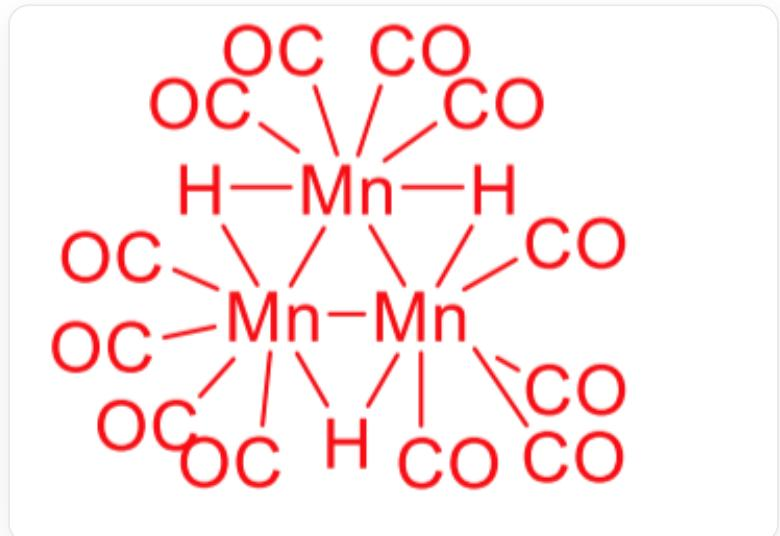

# 题目

$Mn$  的羰基化合物及其衍生物丰富多彩。将  $Mn$  的  $D_{4d}$  点群的羰基化合物  $\mathbf{X}$  与  $Na$  反应，得到1:1离子化合物A，A与烯丙基氯反应得到B，B加热失去一分子有毒气体得到C；同时B与高氯酸反应得到离子化合物D。A可以与1,3-二溴丙烷反应得到电中性配合物E，还可以与  $BrCH_{2}CH_{2}SMe$  反应得到F（提示：还生成了一分子有毒气体)。A与磷酸反应得到具有四次轴的单核配合物  $G$  ，  $G$  进一步转化得到三核配合物H，  $\mathbf{G}$  可以与重氮甲烷1：1反应得到I。X可以与二甲胺反应得到1:2的离子化合物J，同时产生了某种常见溶剂  $K$  。J中Mn元素的质量分数为  $23.04\%$  ，J与A具有相同的阴离子。

有下列关于  $\mathbf{A} - K$  的说法：

1，A和B中的  $Mn$  都满足EAN规则。  
2，C中的  $Mn$  不满足EAN规则。  
3, D 中的阳离子具有  $C_{4}$  轴。  
4,  $\mathbf{E}$  的摩尔质量约为  $317 \mathrm{~g} / \mathrm{mol}$  。  
5, G和I的最高旋转轴次相同。  
6, H 属于  $D_{3 h}$  点群。  
7, 若忽略碳原子和氢原子, 则  $\mathbf{J}$  的阳离子属于  $O_{h}$  点群。

设其中正确的说法序号之和为a，正确说法的序号的最小值为b，则a和b分别为：

A. 12, 1  
B. 12, 2  
C. 12, 3

D. 13, 1  
E. 13, 2  
F. 13, 3  
G. 14, 1  
H. 14, 2  
14,3  
J. 15, 1  
K. 15, 2  
L. 15, 3  
M. 21, 1  
N. 21, 2  
O. 21, 3  
P. 22, 1  
Q. 22, 2

R. 22, 3  
S. 23, 1  
T. 23, 2  
U. 23, 3

# 答案

正确答案: G

# 详细解析

$\mathbf{X}$  为  $Mn$  的羰基化合物且分子点群为  $D_{4d}$ ，则易有  $\mathbf{X}$  为  $Mn$  的双核配合物  $Mn_{2}(CO)_{10}$ 。

# CHECKPOINT

1 PTS

X为  $Mn_{2}(CO)_{10}$

$Mn_{2}(CO)_{10}$  与  $Na$  反应得到的离子化合物为  $NaMn(CO)_{5}$  。

# CHECKPOINT

1 PTS

A 为  $N a M n (C O)_{5}$

$N a M n (C O) _ { 5 }$  与烯丙基氯可以发生取代反应，产物为  $Mn(CO)_5(CH_2CH = CH2)$  。

# CHECKPOINT

1 PTS

$\mathbf{B}$  为  $Mn(CO)_5(CH_2CH = CH2)$

B 到 C 发生烯丙基的双键对羰基的配体取代反应, 产物为  $M n(C O)_{4}(C H_{2}C H C H_{2})$  。

# CHECKPOINT

1 PTS

C为  $M n(C O)_{4}(C H_{2}C H C H2)$

因此A,B,C均满足EAN规则。说法1正确，2错误。

B与高氯酸反应可以在烯丙基上发生质子化反应，生成  $[Mn(CO)_5(CH_2 = CHCH_3)]^+ ClO_4^-$  。

# CHECKPOINT

1 PTS

D 为  $[Mn(CO)_{5}(CH_{2} = CHCH_{3})]^{+}ClO_{4}^{-}$

D中的丙烯破坏了对称性，使得阳离子没有  $C_4$  轴，说法3错误。

1,3-二溴丙烷和  $BrCH_{2}CH_{2}SMe$  均可以与A发生取代反应，由于1,3-二溴丙烷上有两个离去基团， $BrCH_{2}CH_{2}SMe$  上只有一个离去基团，因此1,3-二溴丙烷可以发生两次取代反应， $BrCH_{2}CH_{2}SMe$  只能发生一次取代反应，且其中的S原子在反应后可以在分子内发生配体取代反应，因此产物分别为 $(CO)_{5}MnCH_{2}CH_{2}CH_{2}Mn(CO)_{5}$  和  $Mn(CO)_{4}(CH2CH_{2}SCH_{3})$  。

# CHECKPOINT

1 PTS

E为  $(CO)_{5}MnCH_{2}CH_{2}CH_{2}Mn(CO)_{5}$

# CHECKPOINT

1 PTS

$\mathbf{F}$  为  $M n(C O)_{4}(C H2C H_{2}S C H_{3})$

计算得到  $\mathbf{E}$  的摩尔质量为  $432\mathrm{g / mol}$ ，说法4错误。

A 与磷酸发生质子化反应, 产物为  $M n(C O)_{5} H$  。

# CHECKPOINT

1 PTS

$\mathbf{G}$  为  $Mn(CO)_5H$

三分子  $\mathbf{G}$  各脱去一个羰基后可以三聚从而形成三核配合物  $\mathbf{H}$ ，其化学式为  $[Mn(CO)_4H]_3$ ，其结构为

这是一张彩色的化学结构示意图，其中所有文字和线条均为红色。图像的中心是由三个"Mn"符号组成的三角形结构，这三个"Mn"符号之间由红色实线两两相连。此外，图中还有三个"H"符号，每一个"H"符号都位于两个"Mn"符号之间，并分别通过一条红色实线与这两个相邻的"Mn"符号相连接。除了这些连接外，每个"Mn"符号还连接了其他的化学基团：位于三角形上顶点的"Mn"符号，向其左上方连接两个"OC"基团，向其右上方连接两个"CO"基团；位于三角形左侧的"Mn"符号，连接了四个"OC"基团，这些基团分别位于其左上方、左方、左下方和正下方；位于三角形右侧的"Mn"符号，连接了四个"CO"基团，这些基团分别位于其右上方、右方、右下方和正下方。

# CHECKPOINT

2 PTS

$\mathbf{H}$  为  $[Mn(CO)_4H]_3$

H属于  $D_{3h}$  点群，说法6正确。

G与重氮甲烷反应脱去氮气，得到  $M n(C O)_{5} C H_{3}$  。

# CHECKPOINT

1 PTS

I为  $Mn(CO)_{5}CH_{3}$

G 的最高旋转轴次为 4 , 而 I 由于甲基的存在使其失去旋转对称性, 说法5错误。

$Mn_{2}(CO)_{10}$  与二甲胺反应得到1:2型离子化合物，通过质量分数计算得到  $\mathbf{J}$  为  $[Mn(NHMe_2)_6^{2+}][Mn(CO)_5^-]_2$ 。

# CHECKPOINT

2 PTS

$\mathbf{J}$  为  $[Mn(NHMe_2)_6^{2+}][Mn(CO)_5^-]_2$

忽略碳原子与氢原子，则J的阳离子可以看成  $Mn$  和  $N$  形成的正八面体，为  $O_{h}$  点群，说法7正确。

因此选择选项G