# Question

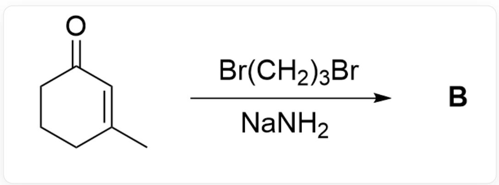  
$\mathrm{O = C1C = C(C)CCC1 > BrCCCBr.}$  [Na]N>[B], B is the product

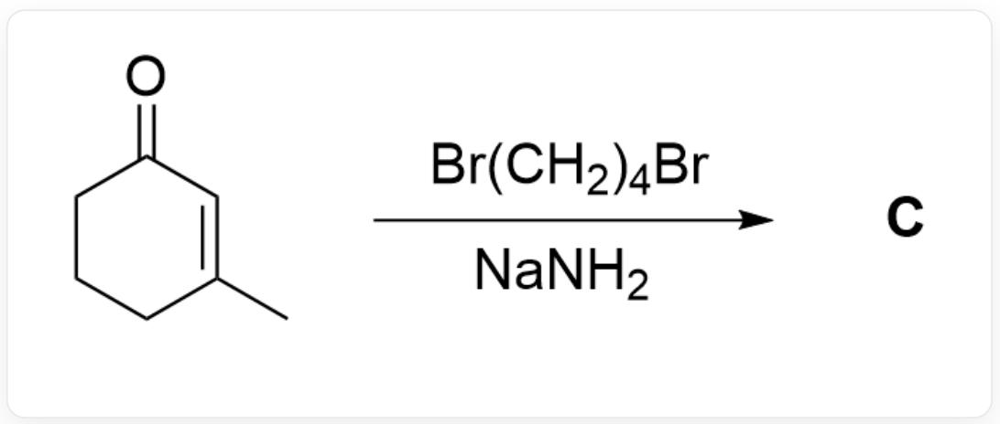  
O=C1C=C(C)CCC1>BrCCCCBr.[Na]N>[C], C is the product

Given that the products  $\mathbf{B}$  and  $\mathbf{C}$  obtained in the liquid ammonia solution of sodium amide are slightly different, and without considering enantiomerism, try to give the structural formulas of products  $\mathbf{B}$  and  $\mathbf{C}$  respectively.

A. All other options are incorrect  
B.

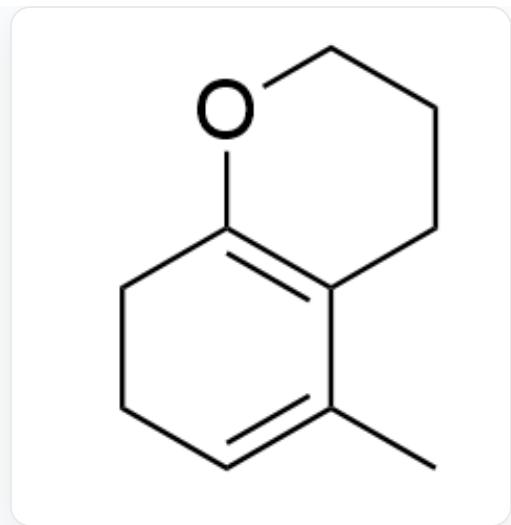  
CC1=CCCC2=C1CCCCO2

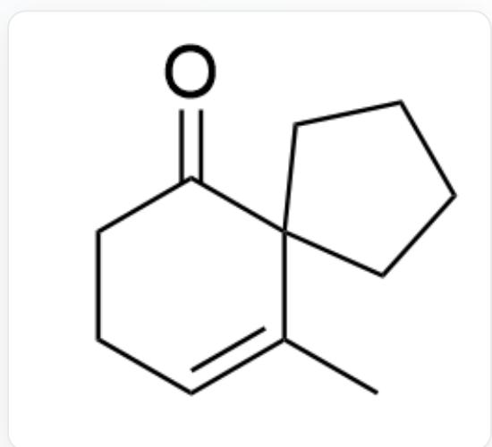  
$\mathrm{O = C1C2(CCCC2)C(C) = CCC1}$

C.

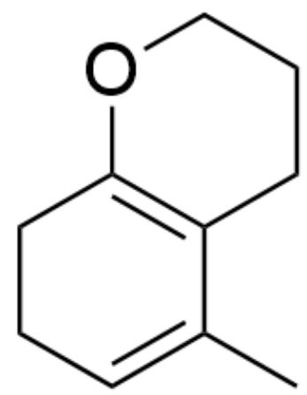

CC1=CCCC2=C1CCCCO2

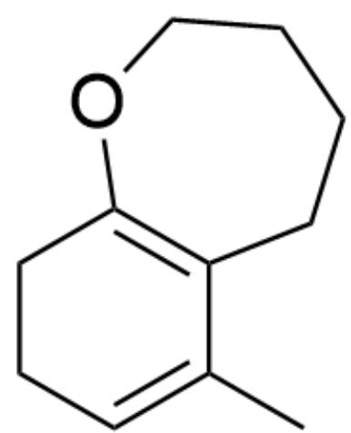

CC1=CCCC2=C1CCCCO2

D.

  
CC1=CCCC2=C1CCCCO2

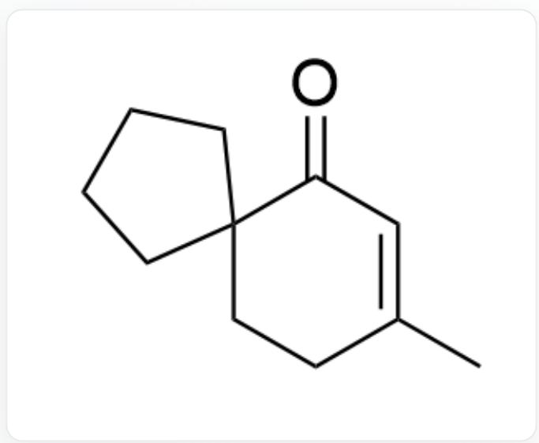  
$\mathrm{O = C1C = C(C)CCC12CCCCC2}$

E.

CC1=CCCC2=C1CCCCO2

$\mathrm{O = C1C = C(C)C2(CCCC2)CC1}$

F.

CC1=CCCC2=C1CCCCO2

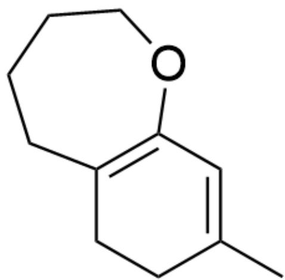

CC1=CC(OCCCC2)=C2CC1

G.

  
$\mathrm{O = C1C2(CCC2)C(C) = CCC1}$

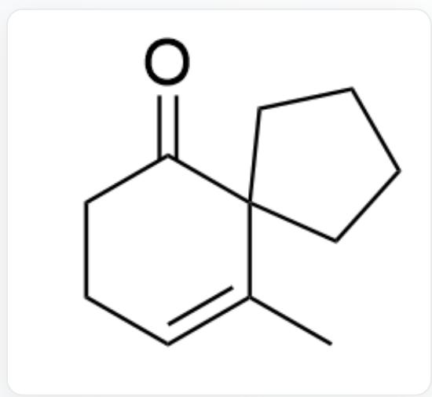  
$\mathrm{O = C1C2(CCCC2)C(C) = CCC1}$

H.

  
$\mathrm{O = C1C2(CCC2)C(C) = CCC1}$

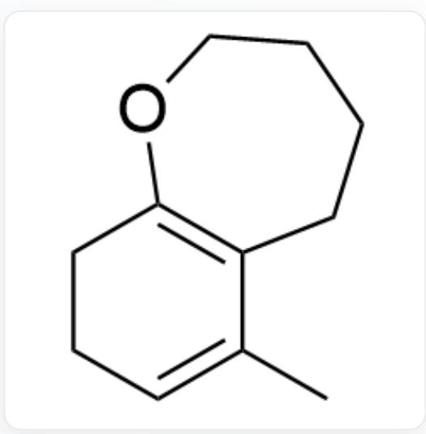  
CC1=CCCCC2=C1CCCCCO2

1.

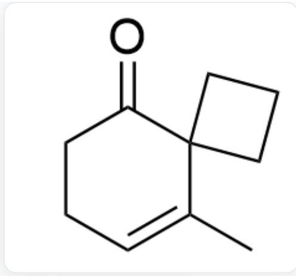  
$\mathrm{O = C1C2(CCC2)C(C) = CCC1}$

  
$\mathrm{O = C1C = C(C)CCC12CCCC}$

J.

  
$\mathrm{O = C1C2(CCC2)C(C) = CCC1}$

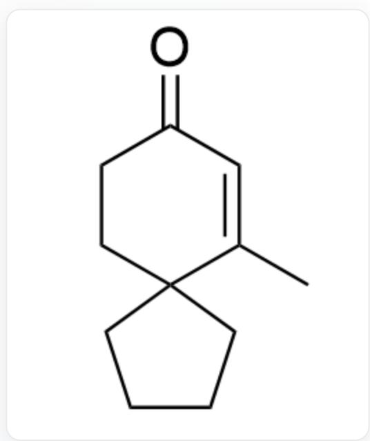  
$\mathrm{O = C1C = C(C)C2(CCCC2)CC1}$

K.

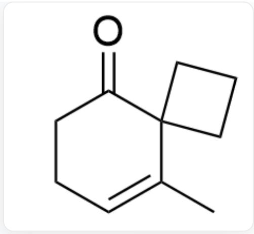  
$\mathrm{O = C1C2(CCC2)C(C) = CCC1}$

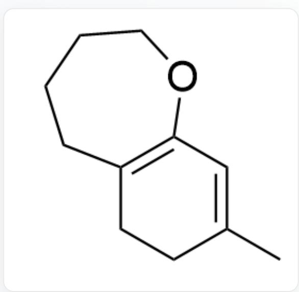  
CC1=CC(OCCCC2)=C2CC1

L.

CC1=CC(OCCC2)=C2CC1

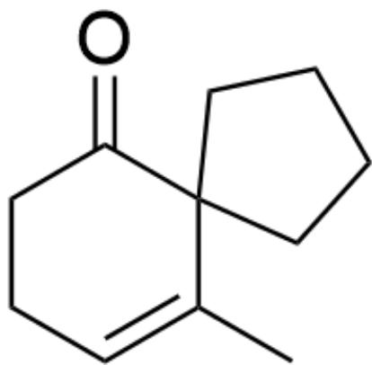

$\mathrm{O = C1C2(CCCC2)C(C) = CCC1}$

M.

CC1=CC(OCCC2)=C2CC1

CC1=CCCC2=C1CCCCO2

N.

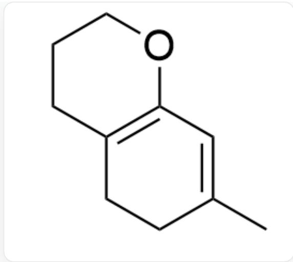  
CC1=CC(OCCC2)=C2CC1

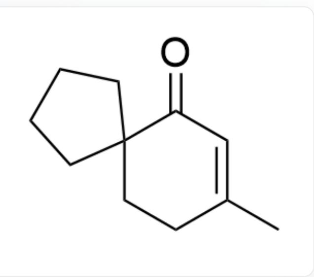  
$\mathrm{O = C1C = C(C)CCC12CCCC2}$

0.

CC1=CC(OCCC2)=C2CC1

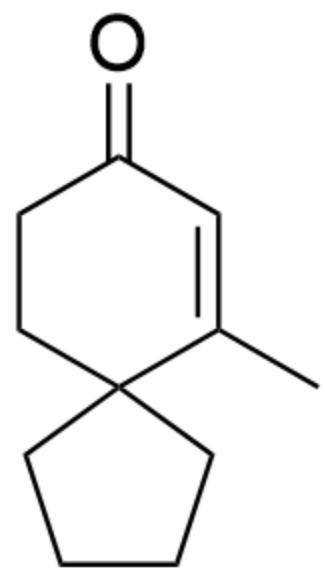

$\mathrm{O = C1C = C(C)C2(CCCC2)CC1}$

P.

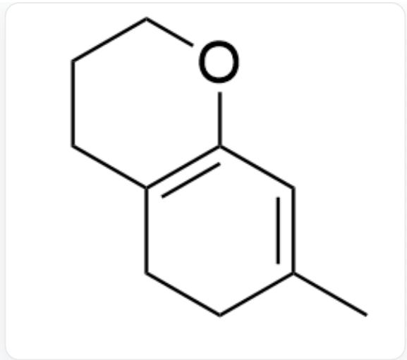  
CC1=CC(OCCC2)=C2CC1

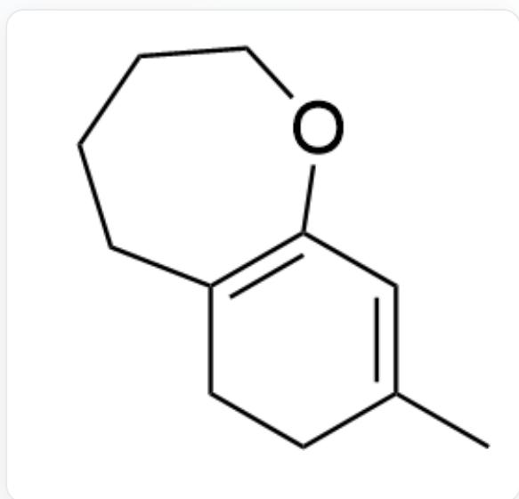  
CC1=CC(OCCCC2)=C2CC1

# Answer

Correct Answer: B

# Detailed Explanation

First, in the liquid ammonia system, the thermodynamically stable linear conjugated anion intermediate 1 tends to form preferentially.

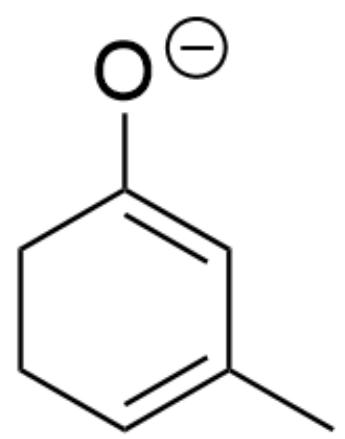  
[ \mathrm{[O - ]C1 = CC(C) = CCC1} ]

CHECKPOINT

1 PTS

Anion intermediate 1:[O-]C1=CC(C)  $\equiv$  CCC1

For the reaction to generate products B and C, since the carbanion is more stable at the  $\alpha$  position of the carbonyl group, it first reacts with the corresponding haloalkanes to obtain intermediate 2 and intermediate 3 respectively.

# CHECKPOINT

1 PTS

Since the carbanion is more stable at the  $\alpha$  position of the carbonyl group, it first reacts with the corresponding haloalkanes to obtain intermediate 2 and intermediate 3

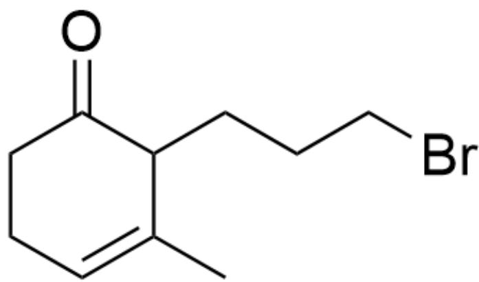  
Intermediate 2: O=C1C(CCCBr)C(C)=CCC1

# CHECKPOINT

1 PTS

Intermediate 2: O=C1C(CCCBr)C(C)=CCC1

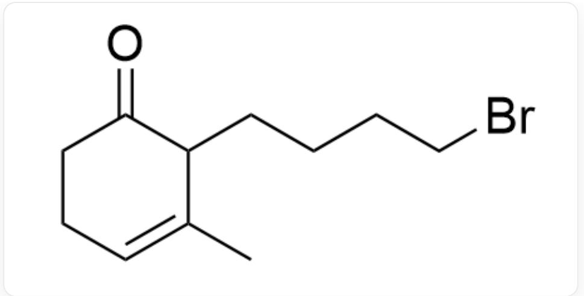

Intermediate 3: O=C1C(CCCCCBr)C(C)=CCC1

# CHECKPOINT

1 PTS

Intermediate 3: O=C1C(CCCCCBr)C(C)=CCC1

Then, a proton is abstracted by a base to obtain intermediate 4 and intermediate 5 respectively.

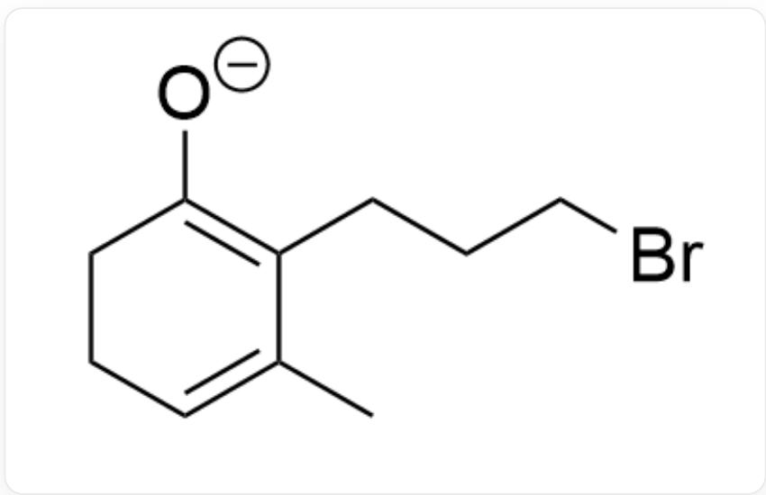

Intermediate 4: [O-]C1=C(CCCBr)C(C)=CCC1

# CHECKPOINT

1 PTS

Intermediate 4: [O-]C1=C(CCCBr)C(C)=CCC1

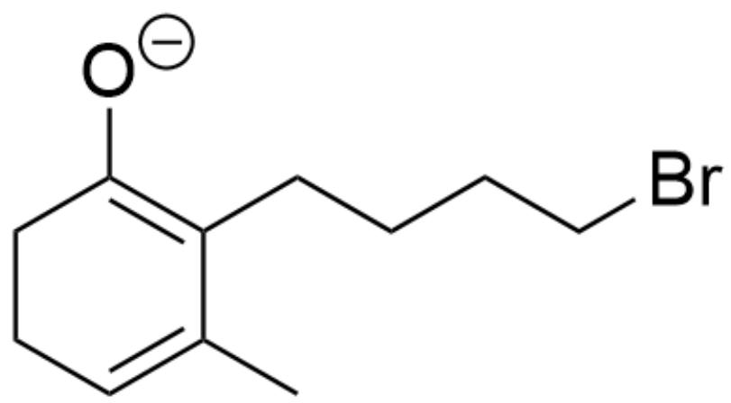

Intermediate 5: [O-]C1=C(CCCCCBr)C(C)=CCC1

# CHECKPOINT

1 PTS

Intermediate 5: [O-]C1=C(CCCCCBr)C(C)=CCC1

For intermediate 5, since the carbon-end nucleophilicity is stronger than the oxygen-end, the product C containing a five-membered ring is preferentially obtained.

# CHECKPOINT

1 PTS

For intermediate 5, since the carbon-end nucleophilicity is stronger than the oxygen-end, the product C containing a five-membered ring is preferentially obtained

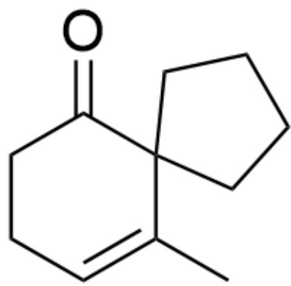  
Product C: O=C1C2(CCCC2)C(C)=CCC1

# CHECKPOINT

1 PTS

Product C: O=C1C2(CCCC2)C(C)=CCC1

For intermediate 4, since the four-membered ring formed by carbon-end nucleophilic attack is unstable, it tends to use oxygen-end nucleophilic attack to form product B containing two six-membered rings.

# CHECKPOINT

1 PTS

For intermediate 4, since the four-membered ring formed by carbon-end nucleophilic attack is unstable, it tends to use oxygen-end nucleophilic attack to form product B containing two six-membered rings

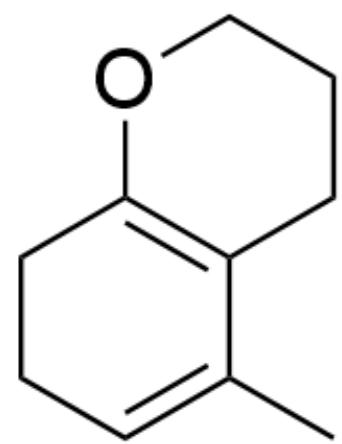  
Product B: CC1=CCCC2=C1CCCCO2

# CHECKPOINT

1 PTS

Product B: CC1=CCCC2=C1CCCO2