# 题目

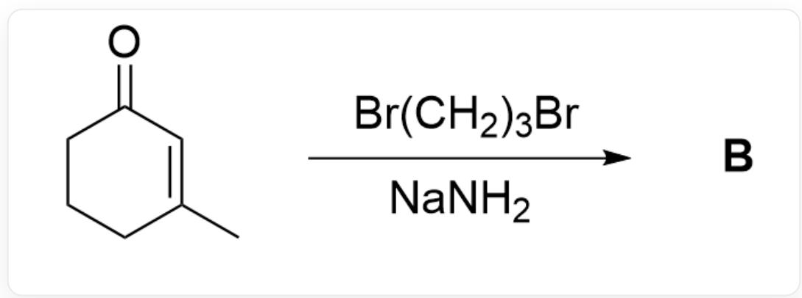

$\mathrm{O = C1C = C(C)CCC1 > BrCCCBr.}$  [Na]N>[B],B是产物

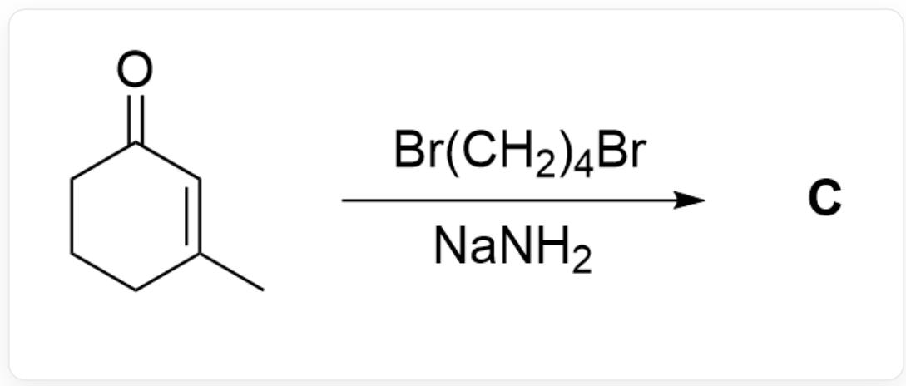

$\mathrm{O = C1C = C(C)CCC1 > BrCCCCBr.}$  [Na]N>[C],C是产物

已知在氨基钠的液氨溶液中, 反应得到的产物  $\mathrm{B}$  和  $\mathrm{C}$  略有不同, 在不考虑对映异构的条件下, 试分别给出产物  $\mathrm{B}$  和  $\mathrm{C}$  的结构式

A. 其他选项均不正确  
B.

CC1=CCCC2=C1CCCCO2

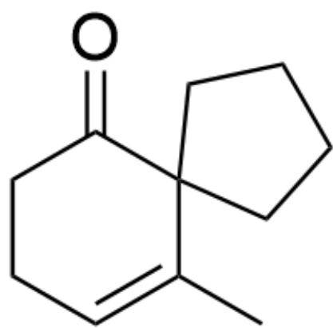

$\mathrm{O = C1C2(CCCC2)C(C) = CCC1}$

C.

CC1=CCCC2=C1CCCCO2

CC1=CCCC2=C1CCCCO2

D.

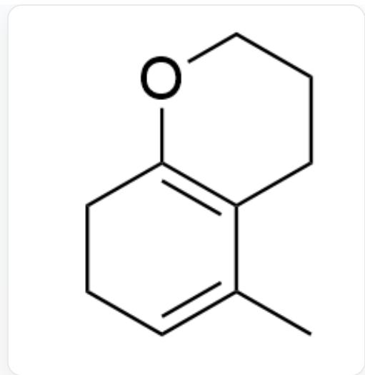  
CC1=CCCC2=C1CCCCO2

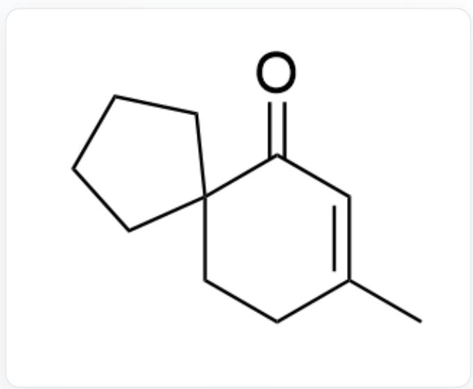  
$\mathrm{O = C1C = C(C)CCC12CCCC}$

E.

CC1=CCCC2=C1CCCCO2

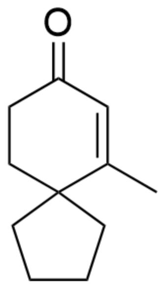

$\mathrm{O = C1C = C(C)C2(CCCC2)CC1}$

F.

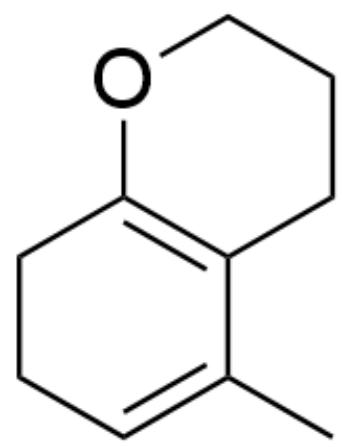

CC1=CCCC2=C1CCCCO2

CC1=CC(OCCCC2)=C2CC1

G.

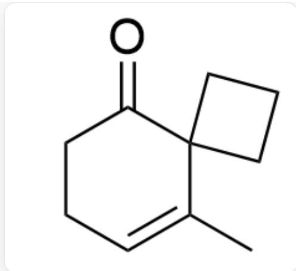  
$\mathrm{O = C1C2(CCC2)C(C) = CCC1}$

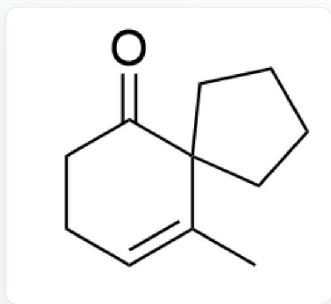  
$\mathrm{O = C1C2(CCCC2)C(C) = CCC1}$

H.

  
$\mathrm{O = C1C2(CCC2)C(C) = CCC1}$

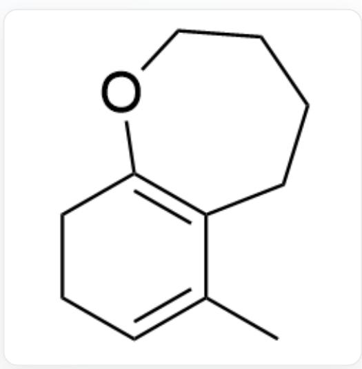  
CC1=CCCCC2=C1CCCCCO2

1.

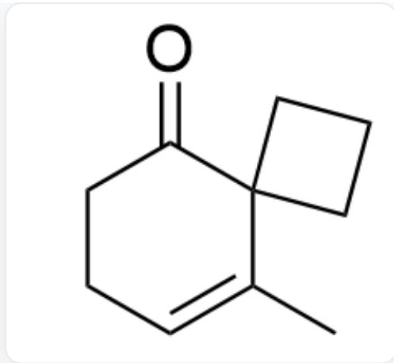  
$\mathrm{O = C1C2(CCC2)C(C) = CCC1}$

  
$\mathrm{O = C1C = C(C)CCC12CCCCC2}$

J.

  
$\mathrm{O = C1C2(CCC2)C(C) = CCC1}$

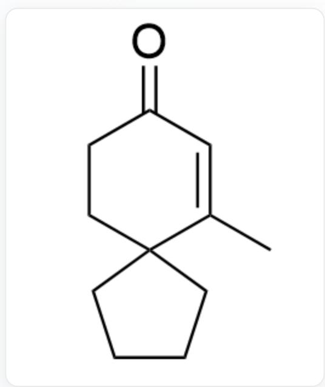  
$\mathrm{O = C1C = C(C)C2(CCCC2)CC1}$

K.

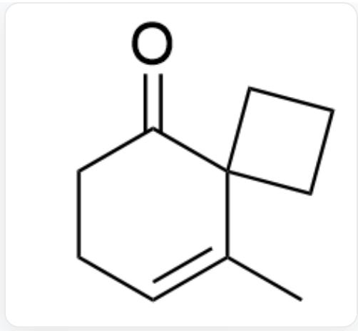  
$\mathrm{O = C1C2(CCC2)C(C) = CCC1}$

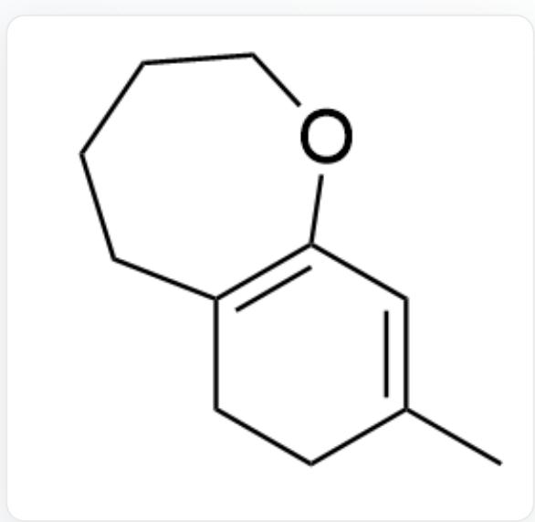  
CC1=CC(OCCCC2)=C2CC1

L.

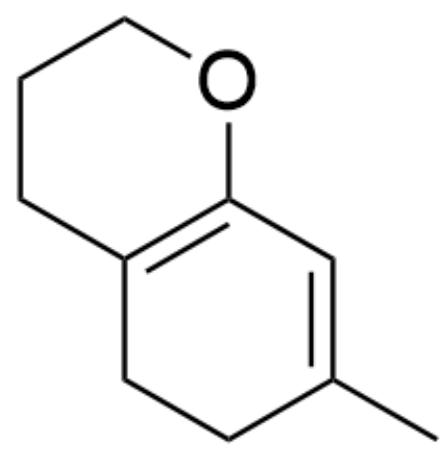

CC1=CC(OCCC2)=C2CC1

$\mathrm{O = C1C2(CCCC2)C(C) = CCC1}$

M.

CC1=CC(OCCC2)=C2CC1

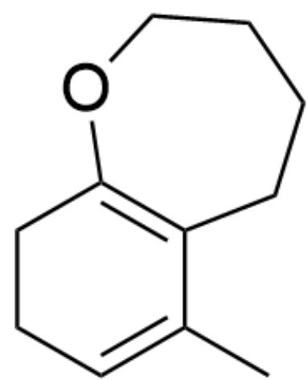

CC1=CCCCC2=C1CCCCCO2

N.

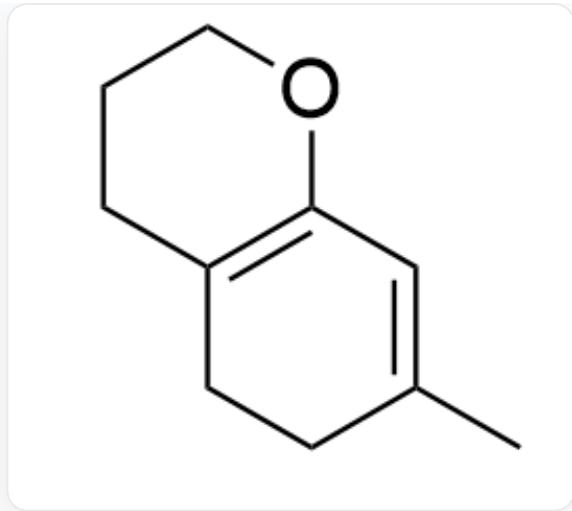  
CC1=CC(OCCC2)=C2CC1

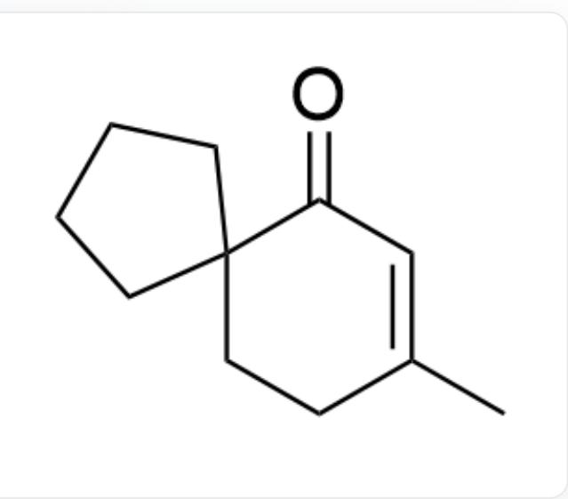  
$\mathrm{O = C1C = C(C)CCC12CCCC2}$

0.

CC1=CC(OCCC2)=C2CC1

$\mathrm{O = C1C = C(C)C2(CCCC2)CC1}$

P.

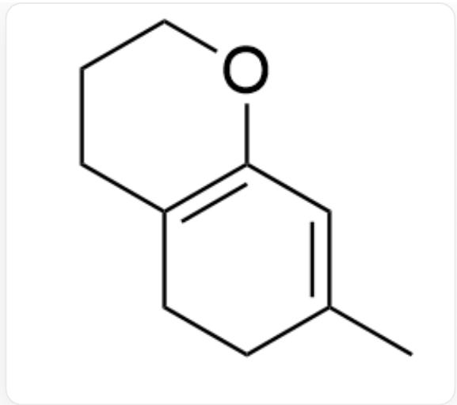  
CC1=CC(OCCC2)=C2CC1

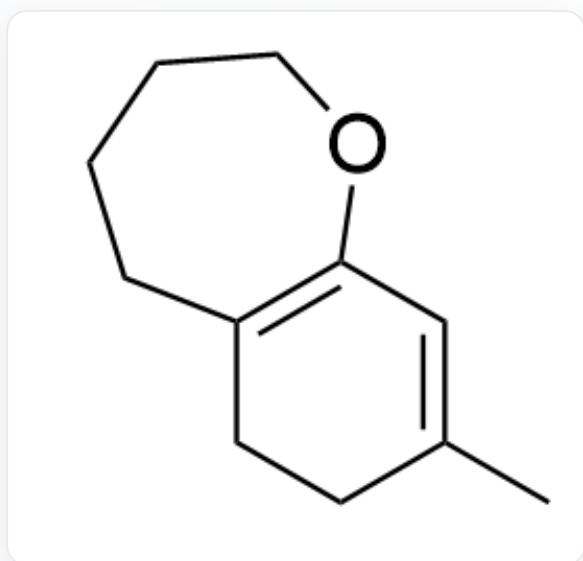  
CC1=CC(OCCCC2)=C2CC1

# 答案

正确答案: B

# 详细解析

首先，在液氨体系中，倾向于优先形成热力学稳定的线性共轭阴离子中间体1

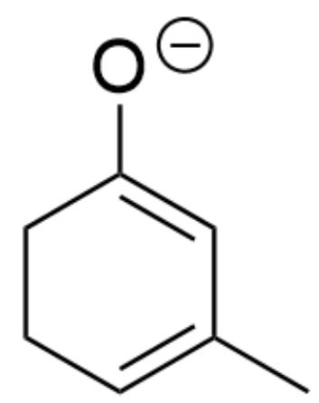  
[ \mathrm{[O - ]C1 = CC(C) = CCC1} ]

CHECKPOINT

1 PTS

阴离子中间体1：[O-]C1=CC(C)=CCC1

对于生成产物B和C的反应，由于碳负离子在羰基  $\alpha$  位更加稳定，因此首先都与相应的卤代烷反应分别得到中间体2和中间体3

# CHECKPOINT

1 PTS

由于碳负离子在羰基  $\alpha$  位更加稳定，因此首先都与相应的卤代烷反应分别得到中间体2和中间体3

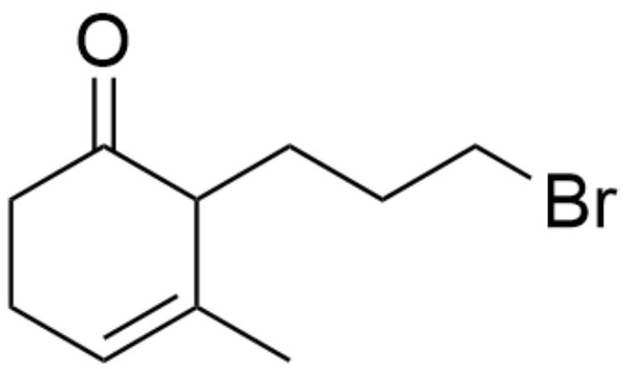  
中间体2：O=C1C(CCCBr)C(C)=CCC1

# CHECKPOINT

1 PTS

中间体2：O=C1C(CCCBr)C(C)=CCC1

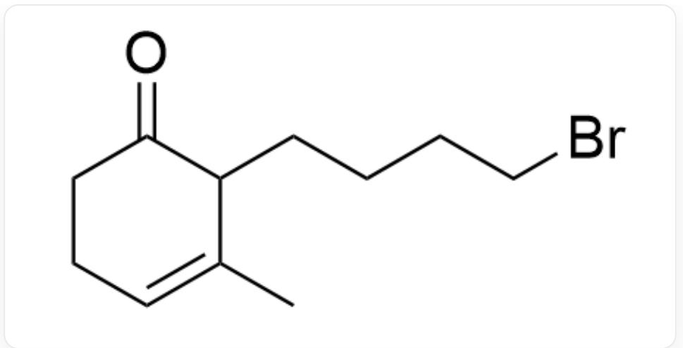  
中间体3：O=C1C(CCCCCBr)C(C)=CCC1

# CHECKPOINT

1 PTS

中间体3：O=C1C(CCCCBr)C(C)=CCC1

接着再被碱攫取一个质子分别得到中间体4和中间体5

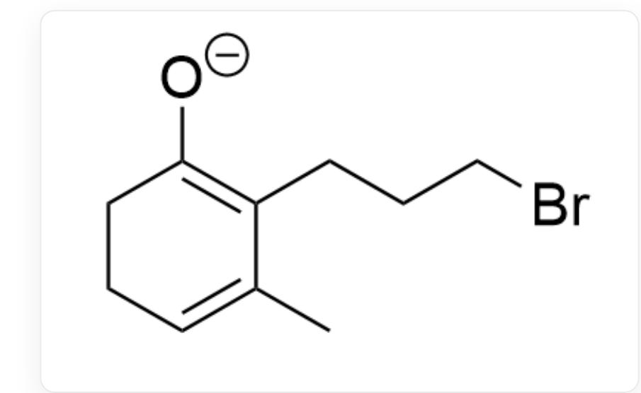  
中间体4：[O-]C1=C(CCCBr)C(C)=CCC1

# CHECKPOINT

1 PTS

中间体4：[O-]C1=C(CCCBr)C(C)=CCC1

  
中间体5：[O-]C1=C(CCCCCBr)C(C)=CCC1

# CHECKPOINT

1 PTS

中间体5：[O-]C1=C(CCCCBr)C(C)=CCC1

对于中间体5，由于碳端亲核能力强于氧端，因此优先得到含五元环的产物C

# CHECKPOINT

1 PTS

对于中间体5，由于碳端亲核能力强于氧端，因此优先得到含五元环的产物C

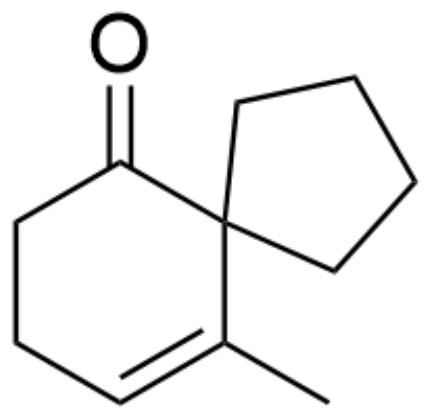

产物C：O=C1C2(CCCC2)C(C)=CCC1

# CHECKPOINT

1 PTS

产物C：O=C1C2(CCCC2)C(C)=CCC1

而对于中间体4，由于碳端亲核形成的四元环不稳定，因此倾向于用氧端亲核，形成含两个六元环的产物B

# CHECKPOINT

1 PTS

而对于中间体 4 , 由于碳端亲核形成的四元环不稳定, 因此倾向于用氧端亲核, 形成含两个六元环的产物  $\mathbf{B}$

产物B：CC1=CCCC2=C1CCCCO2

CHECKPOINT

1 PTS

产物B：CC1=CCCCC2=C1CCCO2