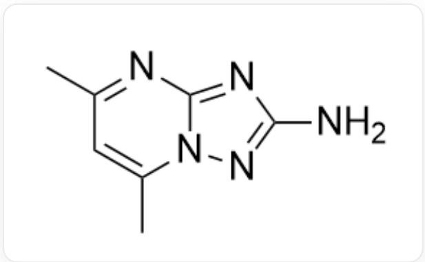

# Question

Mix a dilute hydrochloric acid solution of ruthenium trichloride with an ethanol solution of  $\mathbf{L}$  (structure shown below), gently heat at  $75^{\circ}C$  for  $3h$ , and brick-red powder precipitates;

  
NC1=NN2C(N=C(C)C=C2C)=N1

The powder is recrystallized with an acetone-water mixed solvent, yielding orange-red crystals A. The following characterization results are obtained for A:

(1) Magnetic moment measurements show that the magnetic moment of  $\mathbf{A}$  at  $20^{\circ}C$  is  $\mu = 1.9\mu_{B}$ .  
(2) Elemental analysis indicates the mass fractions of elements in A are:  $C, 29.52\%$ ;  $H, 3.86\%$ ;  $N, 24.58\%$ .  
(3) X-ray diffraction reveals that two types of molecules exist in the crystal of A: one is a mononuclear octahedral ruthenium complex molecule, which contains 4 hydrogen bonds, with L coordinating via the nitrogen atoms linked to two carbon atoms on the five-membered ring; the other is a solvent molecule.  
(4) The  $^{1}H$  NMR spectrum of  $\mathbf{A}$  in acetone shows that ligand  $\mathbf{L}$  has only one chemical environment.

Which of the following statements about crystal A are correct?

1. The electron configuration of  $Ru$  in  $\mathbf{A}$  in the octahedral field is  $t_{2g}^{3}e_{g}^{2}$ .  
2. The chemical formula of crystal  $\mathbf{A}$  is  $RuC_{14}H_{22}O_{2}N_{10}Cl_{3}$ .  
3. A contains neither acetone nor ethanol molecules.

4. The complex contains  $N - H\ldots Cl$  hydrogen bonds.  
5. The complex contains  $N - H\ldots O$  hydrogen bonds.

A. 1,2,3,4,5  
B. 1,2,3,4  
C. 1,2,3,5  
D. 1,2,4,5  
E. 1,3,4,5  
F. 2,3,4,5  
G. 1,2,3  
H. 1,2,4  
1. 1,2,5  
J. 1,3,4  
K. 1,3,5  
L. 1,4,5

M. 2,3,4  
N. 2,3,5  
O. 2,4,5  
P. 3,4,5  
Q. None of the above

# Answer

Correct Answer: M

# Detailed Explanation

From the magnetic moment  $\mu = \sqrt{n(n + 2)} = 1.9\mu_{B}$ , we can obtain the number of unpaired electrons as  $n = 1$ , so  $Ru$  is low spin; the valence electron configuration is  $t_{2g}^{5}e_{g}^{0}$ , statement 1 is incorrect.

# CHECKPOINT

1 PTS

$Ru$  valence electron configuration is  $t_{2g}^{5}e_{g}^{0}$ , statement 1 is incorrect

The ratio of  $C, H, N$  in  $\mathbf{A}$  is: (29.52/12.01): (3.86/1.008): (24.58/14.01) ≈ 7:11:5. In L,  $C: N = 7:5$ . Ethanol and acetone contain carbon but not nitrogen, so  $\mathbf{A}$  does not contain acetone or ethanol. The source of the extra hydrogen should be water;

Therefore,  $\mathbf{A}$  contains  $Ru$ ,  $\mathbf{L}$ ,  $H_2O$ , and may contain  $Cl$  and  $OH$  ligands.

# CHECKPOINT

1 PTS

The ratio of  $C, H, N$  in  $\mathbf{A}$  is:  $7:11:5$ , from which it is determined that  $\mathbf{A}$  does not contain acetone or ethanol, and contains water molecules

Let the chemical formula of  $\mathbf{A}$  have  $n$  ligands  $\mathbf{L}$ , then the molar mass of  $\mathbf{A}$  is:

$$
M (A) = 12.01 \mathrm {g} \cdot \mathrm {mol} ^ {- 1} \times 7 n / 29.52 \% = 284.8 n \mathrm {g} \cdot \mathrm {mol} ^ {- 1}
$$

When  $n = 1$ , the molar mass of 1 ligand L and 1 Ru has already reached  $264.3\mathrm{g}\cdot \mathrm{mol}^{-1}$ , which is unreasonable;

When  $n = 2$ , the molar mass  $M = 569.6\mathrm{g}\cdot \mathrm{mol}^{-1}$ ; since  $Ru$  is in the  $+3$  oxidation state, there are 3 OH and Cl ligands in total; since  $Ru$  is 6-coordinate and L is a monodentate ligand, there should be 1 water molecule within the coordination sphere, so the chemical formula of A can be expressed as:  $RuL_{2}Cl_{3 - x}(OH)_{x}(H_{2}O)_{n}$

In  $\mathbf{L}$ ,  $C:H = 7:11$ , so  $x + 2n = 4$ ; substitute  $x = 2$ ,  $n = 1$  and  $x = 0$ ,  $n = 2$  into the chemical formula in turn, and calculate the molar mass: when  $x = 0$ ,  $n = 2$ , the molar mass is  $569.8\mathrm{g} \cdot \mathrm{mol}^{-1}$ , which is consistent with the question, i.e.,  $\mathbf{A}$  is  $RuL_{2}Cl_{3}(H_{2}O)_{2}$ ; then statements 2 and 3 are correct.

# CHECKPOINT

3 PTS

A is  $RuL_{2}Cl_{3}(H_{2}O)_{2}$

The actual structure should be  $[RuL_{2}Cl_{3}(H_{2}O)]\cdot H_{2}O$ . The structure of the complex is

SMILES:

$$
\mathrm {C l} [ \mathrm {R u} - 3 ] ([ \mathrm {N} + ] 1 = \mathrm {C 2 N} (\mathrm {C} (\mathrm {C}) = \mathrm {C C} (\mathrm {C}) = \mathrm {N} 2) \mathrm {N} = \mathrm {C 1 N} ([ \mathrm {H} ]) [ \mathrm {H} ]) ([ \mathrm {O} + ] ([ \mathrm {H} ]) [ \mathrm {H} ]) (\mathrm {C l}) (\mathrm {C l})
$$

$$
[ \mathrm {N} + ] 3 = \mathrm {C} (\mathrm {N} = \mathrm {C} (\mathrm {C}) \mathrm {C} = \mathrm {C} 4 \mathrm {C}) \mathrm {N} 4 \mathrm {N} = \mathrm {C} 3 \mathrm {N} ([ \mathrm {H} ]) [ \mathrm {H} ]
$$

According to the description of the NMR test in the question, the amino group in  $\mathbf{L}$  can form  $N - H\ldots Cl$  hydrogen bonds with chlorine atoms, and the water molecule as a ligand can form  $O - H\ldots N$  hydrogen bonds with the six-membered ring nitrogen atom in  $\mathbf{L}$ . Therefore, there are  $N - H\ldots Cl$  and  $O - H\ldots N$  hydrogen bonds in the complex, statement 4 is correct, and 5 is incorrect.

# CHECKPOINT

1 PTS

There are  $N - H\ldots Cl$  hydrogen bonds, statement 4 is correct.

# CHECKPOINT

1 PTS

There are  $O - H\ldots N$  hydrogen bonds, statement 5 is incorrect

Therefore, choose option M.