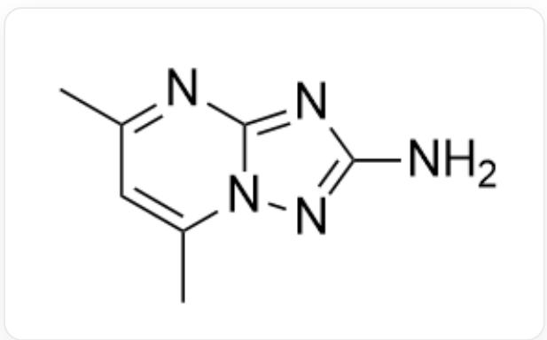

# 题目

将三氯化钌的稀盐酸溶液与L（结构如下图所示）的乙醇溶液混合，在  $75^{\circ}C$  下温和加热  $3h$  ，析出砖红色粉末；

  
NC1=NN2C(N=C(C)C=C2C)=N1

该粉末经丙酮-水混合溶剂重结晶, 析出橙红色晶体A。对A有如下表征结果:

(1) 磁矩测定实验表明, A在  $20^{\circ} C$  下的磁矩为  $\mu = 1.9 \mu_{B}$  。  
(2) 元素分析表明, A中各元素的含量(质量分数)为:  $C, 29.52\%$ ;  $H, 3.86\%$ ;  $N, 24.58\%$  。  
(3) X-射线衍射表明, A的晶体中存在两种分子:一种是钌的单核八面体配合物分子, 分子中存在 4 根氢键, L用五元环上与两个碳原子相连的氮原子配位; 另一种是溶剂分子。  
(4) A的丙酮溶液的核磁共振氢谱表明, 配体L仅有一种化学环境。

以下有关A晶体的说法中，哪几项是正确的？

1. A中  $R u$  在八面体场中的电子排布为  $t_{2 g}^{3} e_{g}^{2}$  
2. A晶体的化学式为  $R u C_{14} H_{22} O_{2} N_{10} C l_{3}$  
3. A中不含丙酮分子或乙醇分子  
4. 配合物中含有  $N - H \dots C l$  氢键

5. 配合物中含有  $N - H\dots O$  氢键

A. 1,2,3,4,5  
B. 1,2,3,4  
C. 1,2,3,5  
D. 1,2,4,5  
E. 1,3,4,5  
F. 2,3,4,5  
G. 1,2,3  
H. 1,2,4  
1,2,5  
J. 1,3,4  
K. 1,3,5  
L. 1,4,5  
M. 2,3,4

N. 2,3,5  
O. 2,4,5  
P. 3,4,5  
Q. 以上都不对

# 答案

正确答案: M

# 详细解析

由磁矩  $\mu = \sqrt{n(n + 2)} = 1.9\mu_{B}$  可得单电子数为  $n = 1$  ，则  $Ru$  为低自旋;价电子排布为  $t_{2g}^{5}e_{g}^{0}$  ，说法1错误

# CHECKPOINT

1 PTS

$Ru$  价电子排布为  $t_{2g}^{5}e_{g}^{0}$ , 说法1错误

A 中  $C, H, N$  数目比为:  $(29.52 / 12.01):(3.86 / 1.008):(24.58 / 14.01) \approx 7:11:5 \mathrm{~L}$  中的  $C:N = 7:5$ ,乙醇和丙酮中含碳而不含氮, 因此 A 中无丙酮或乙醇, 多余的氢的来源应为水;

因此  $\mathbf{A}$  中含有  $R u, \mathrm{L}, H_{2}O$  ，可能含有  $Cl$  和  $OH$  配体.

# CHECKPOINT

1 PTS

A 中  $C, H, N$  数目比为:  $7: 11: 5$ , 由此判断  $\mathbf{A}$  中无丙酮或乙醇, 且含有水分子

设  $\mathbf{A}$  的化学式中有  $n$  个配体  $\mathbf{L}$ , 则  $\mathbf{A}$  的摩尔质量为:

$$
M (A) = 12.01 \mathrm {g} \cdot \mathrm {mol} ^ {- 1} \times 7 n / 29.52 \% = 284.8 n \mathrm {g} \cdot \mathrm {mol} ^ {- 1}
$$

当  $n = 1$  时, 1 个配体  $\mathbf{L}$  和 1 个  $Ru$  的摩尔质量就已达到  $264.3\mathrm{g} \cdot \mathrm{mol}^{-1}$ , 不合理;

当  $n = 2$  时, 摩尔质量  $M = 569.6 \mathrm{~g} \cdot \mathrm{mol}^{-1}$ ; 由于  $Ru$  为 +3 氧化态, 因此  $OH$  配体和  $Cl$  配体共有 3 个; 又因为  $Ru$  为 6 配位,  $\mathbf{L}$  为单齿配体, 因此配合物内界应有 1 个水分子, 故  $\mathbf{A}$  的化学式可表示为:

$$
R u L _ {2} C l _ {3 - x} (O H) _ {x} (H _ {2} O) _ {n}
$$

$\mathbf{L}$  中的  $C:H = 7:11$  ，得  $x + 2n = 4$  ；依次将  $x = 2, n = 1$  和  $x = 0, n = 2$  代入化学式中，计算摩尔质量得： $x = 0, n = 2$  时摩尔质量为  $569.8 \mathrm{~g} \cdot \mathrm{mol}^{-1}$ ，符合题意，即  $\mathbf{A}$  为  $RuL_{2}Cl_{3}(H_{2}O)_{2}$ ；则说法23正确。

# CHECKPOINT

3 PTS

A 为  $R u L_{2} C l_{3}(H_{2}O)_{2}$

实际结构应为  $[RuL_{2}Cl_{3}(H_{2}O)]\cdot H_{2}O.$  配合物的结构为

SMILES:

$$
\begin{array}{l} \mathrm {C l} [ \mathrm {R u} - 3 ] ([ \mathrm {N} + ] 1 = \mathrm {C} 2 \mathrm {N} (\mathrm {C} (\mathrm {C}) = \mathrm {C C} (\mathrm {C}) = \mathrm {N} 2) \mathrm {N} = \mathrm {C} 1 \mathrm {N} ([ \mathrm {H} ]) [ \mathrm {H} ]) ([ \mathrm {O} + ] ([ \mathrm {H} ]) [ \mathrm {H} ]) (\mathrm {C l}) (\mathrm {C l}) \\ [ \mathrm {N} + ] 3 = \mathrm {C} (\mathrm {N} = \mathrm {C} (\mathrm {C}) \mathrm {C} = \mathrm {C} 4 \mathrm {C}) \mathrm {N} 4 \mathrm {N} = \mathrm {C} 3 \mathrm {N} ([ \mathrm {H} ]) [ \mathrm {H} ] \\ \end{array}
$$

根据题目NMR测试的描述，L中氨基可以与氯原子形成  $N - H\dots Cl$  氢键，而作为配体的水分子可以与L中的六元环氮原子形成  $O - H\dots N$  氢键.因此配合物中存在  $N - H\dots Cl$  氢键与  $O - H\dots N$  氢键,说法4正确,5错误.

# CHECKPOINT

1 PTS

存在  $N - H\ldots Cl$  氢键, 说法4正确

# CHECKPOINT

1 PTS

存在  $O - H\ldots N$  氢键, 说法5错误

因此选择选项M.