# Question

A.  
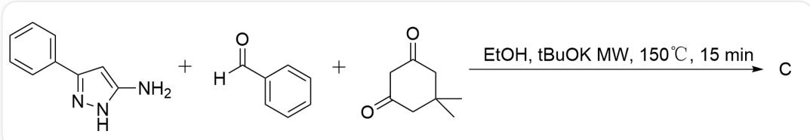  
NC1=CC(C2=CC=CC=C2)=NN1.O=C(C1=CC=CC=C1)[H].O=C1CC(C)(C)CC(C1)=O>EtOH, tBuOK MW,  $150^{\circ}\mathrm{C}$ , 15 min>C

Without considering enantiomers, please predict the product C of this reaction (molecular formula:  $\mathrm{C_{24}H_{25}N_3O_2}$ ), and indicate how many rings are in this structure.

B.  
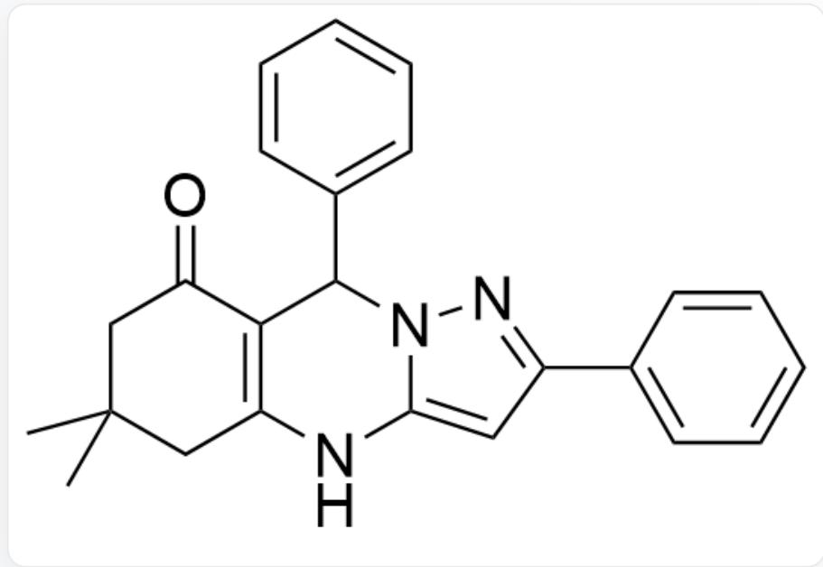  
O=C1C2=C(NC3=CC(C4=CC=CC=C4)=NN3C2C5=CC=CC=C5)CC(C)(C)C1

This structure contains 6 rings

C.  
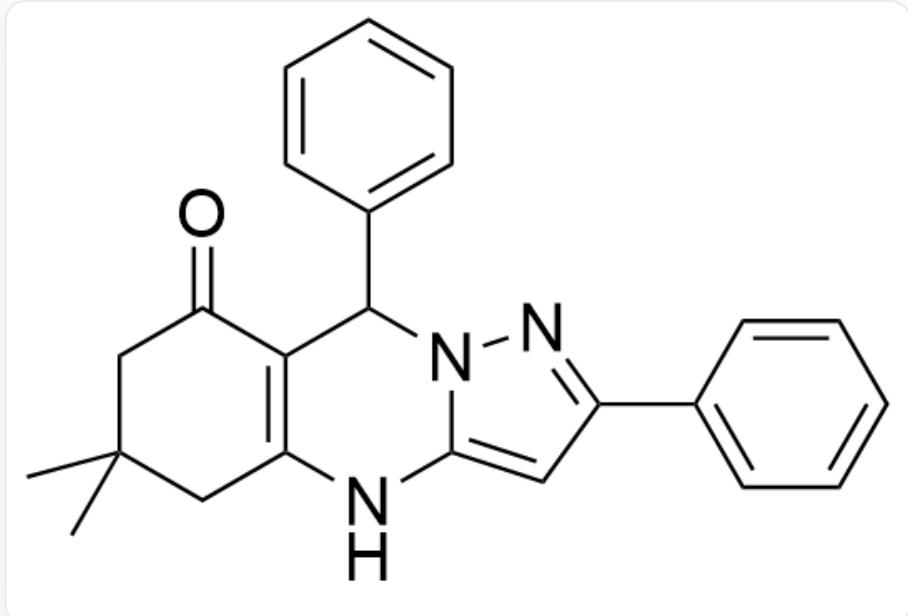  
O=C1C2=C(NC3=CC(C4=CC=CC=C4)=NN3C2C5=CC=CC=C5)CC(C)(C)C1

This structure contains 5 rings

D.  
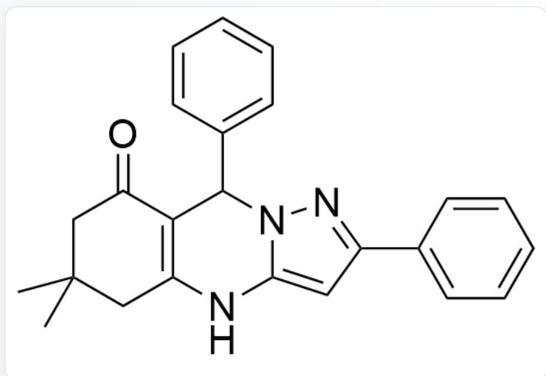  
O=C1C2=C(NC3=CC(C4=CC=CC=C4)=NN3C2C5=CC=CC=C5)CC(C)(C)C1

There are 8 rings in this structure

E.  
  
O=C1C2=C(NC(NN=C3C4=CC=CC=C4)=C3C2C5=CC=CC=C5)CC(C)(C)C1

There are 6 rings in this structure

F.  
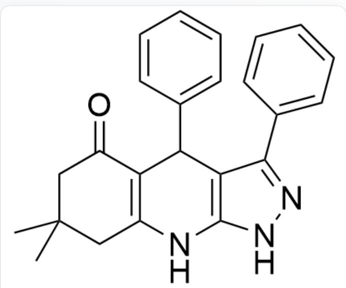  
O=C1C2=C(NC(NN=C3C4=CC=CC=C4)=C3C2C5=CC=CC=C5)CC(C)(C)C1

This structure contains 5 rings

  
G.

O=C1C2=C(NC(NN=C3C4=CC=CC=C4)=C3C2C5=CC=CC=C5)CC(C)(C)C1

This structure contains 8 rings

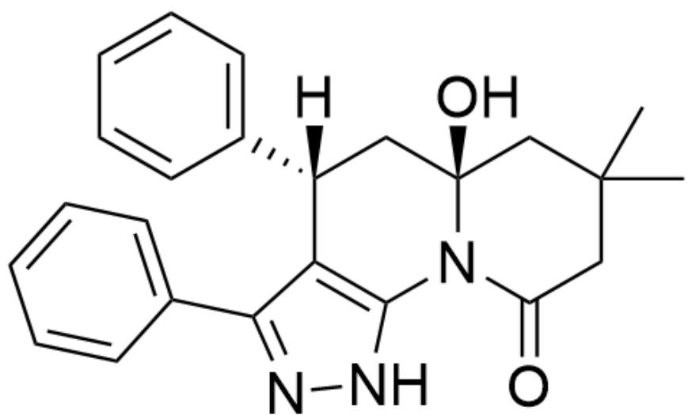  
H.

$\mathrm{O = C1N2C3 = C(C(C4 = CC = CC = C4) = NN3)[C@]([H])}$ $(\mathrm{C5 = CC = CC = C5})\mathrm{C}[\mathrm{C@}]2(\mathrm{O})\mathrm{CC}(\mathrm{C})(\mathrm{C})\mathrm{C}1$

There are 6 rings in this structure

  
1.

O=C1N2C3=C(C(C4=CC=CC=C4)=NN3)[C@]([H])(C5=CC=CC=C5)C[C@]2(O)CC(C)(C)C1

There are 5 rings in this structure

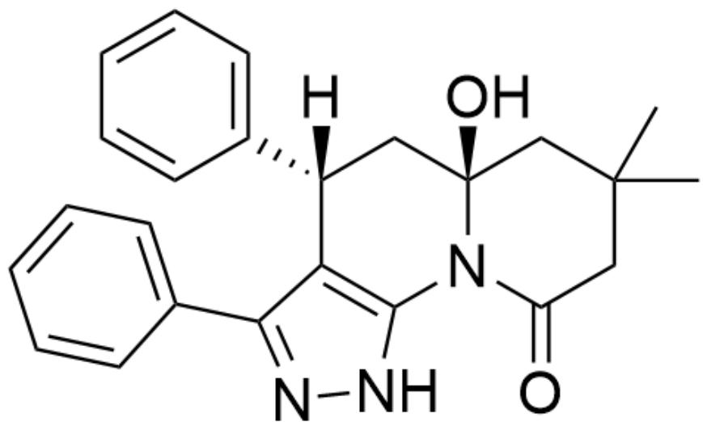  
J.

O=C1N2C3=C(C(C4=CC=CC=C4)=NN3)[C@]([H])(C5=CC=CC=C5)C[C@]2(O)CC(C)(C)C1

There are 8 rings in this structure

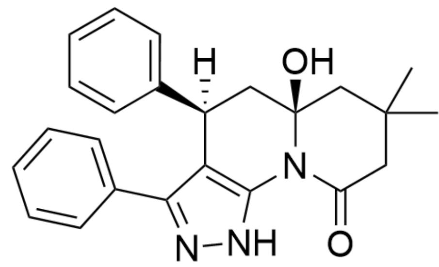  
K.

O=C1N2C3=C(C(C4=CC=CC=C4)=NN3)[C@@]([H])(C5=CC=CC=C5)C[C@]2(O)CC(C)(C)C1

This structure contains 6 rings

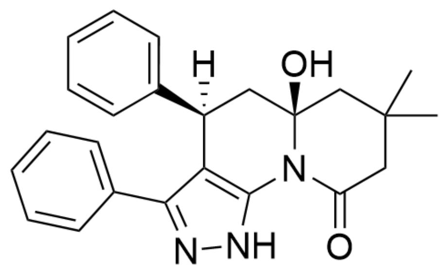  
L.

O=C1N2C3=C(C(C4=CC=CC=C4)=NN3)[C@@]([H])(C5=CC=CC=C5)C[C@]2(O)CC(C)(C)C1

There are 5 rings in this structure

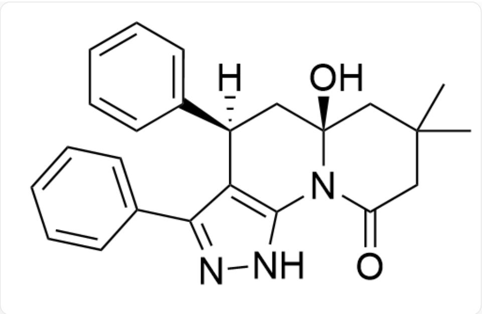  
$\mathrm{O = C1N2C3 = C(C(C4 = CC = CC = C4) = NN3)[C@@]([H])(C5 = CC = CC = C5)C[C@]2(O)CC(C)(C)C1}$

This structure contains 8 rings

# Answer

Correct Answer: H

# Detailed Explanation

The reaction yields thermodynamically stable products under the condition of  $150^{\circ}\mathrm{C}$

# CHECKPOINT

1 PTS

The reaction yields thermodynamically stable products under the condition of  $150^{\circ}\mathrm{C}$

The carbon-carbon single bond is more stable than the carbon-nitrogen single bond during ring formation.

# CHECKPOINT

1 PTS

The carbon-carbon single bond is more stable than the carbon-nitrogen single bond during ring formation

Thus, the reaction initially forms an intermediate.

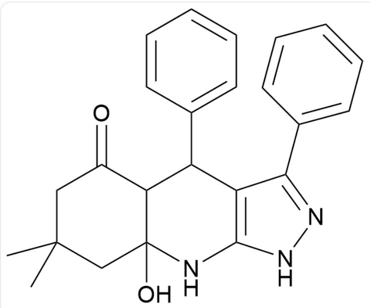

O=C1C2C(NC(NN=C3C4=CC=CC=C4)=C3C2C5=CC=CC=C5)(O)CC(C)(C)C1

# CHECKPOINT

1 PTS

Thus, the reaction initially forms an intermediate

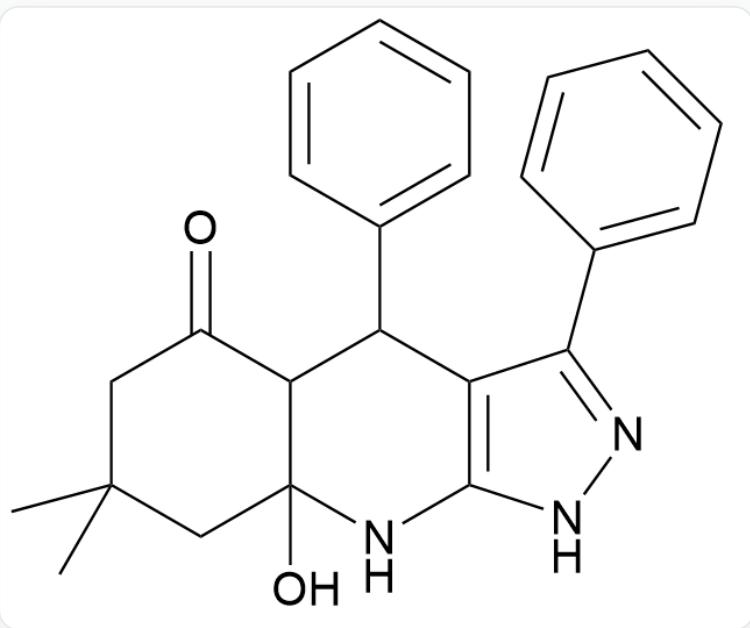

O=C1C2C(NC(NN=C3C4=CC=CC=C4)=C3C2C5=CC=CC=C5)(O)CC(C)(C)C1

Subsequently, under the action of a strong base,  $tBuO^{-}$  or  $EtO^{-}$  nucleophilically attacks the carbonyl group, leading to ring opening.

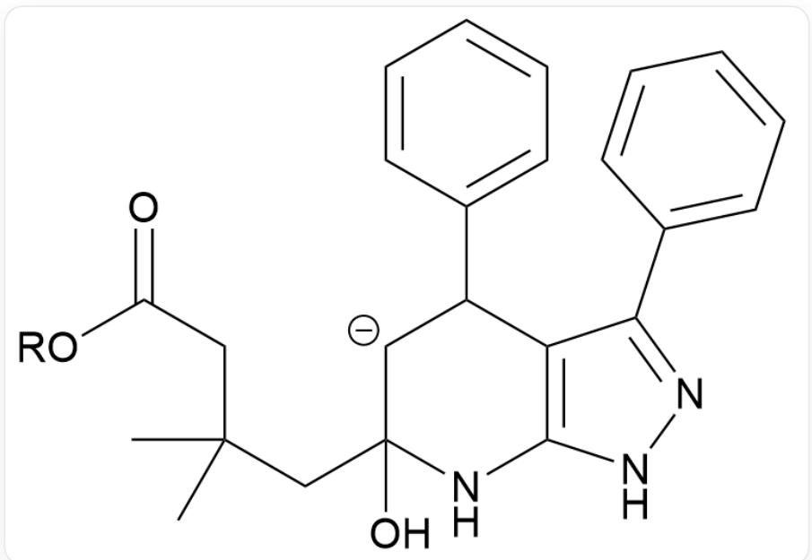

CC(CC1(O)[CH-]C(C2=CC=CC=C2)C3=C(NN=C3C4=CC=CC=C4)N1)(C)CC(O[R])=O

# CHECKPOINT

1 PTS

Subsequently, under the action of a strong base,  $tBuO^{-}$  or  $EtO^{-}$  nucleophilically attacks the carbonyl group, leading to ring opening

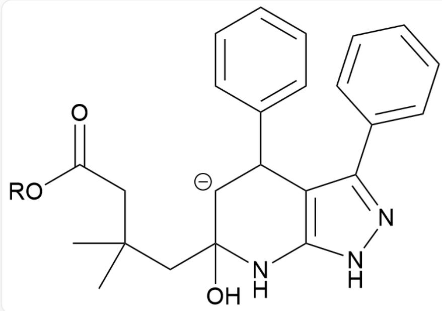  
CC(CC1(O)[CH-]C(C2=CC=CC=C2)C3=C(NN=C3C4=CC=CC=C4)N1)(C)CC(O[R])=O

After proton exchange, further ring closure forms a stable lactam product.

# CHECKPOINT

1 PTS

After proton exchange, further ring closure forms a stable lactam product

# CHECKPOINT

1 PTS

The phenyl group in the equatorial position is the thermodynamically stable product

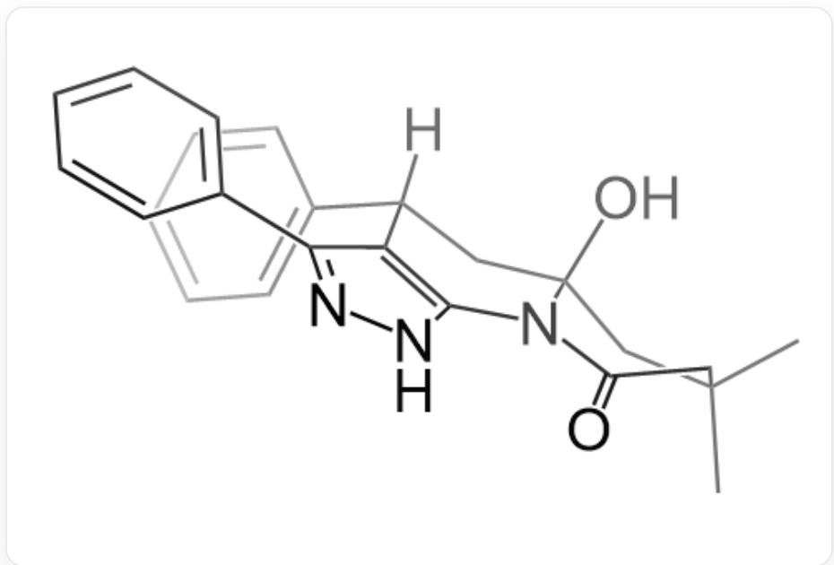

O=C1N2C3=C(C(C4=CC=CC=C4)=NN3)[C@]([H])(C5=CC=CC=C5)C[C@]2(O)CC(C)(C)C1