# 题目

A.  
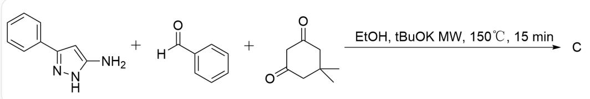  
NC1=CC(C2=CC=CC=C2)=NN1.O=C(C1=CC=CC=C1)[H].O=C1CC(C)(C)CC(C1)=O>EtOH, tBuOK MW,  $150^{\circ}\mathrm{C}$ , 15 min>C

不考虑对映异构体的情况下请预测该反应的产物C（分子式： $\mathrm{C}_{24} \mathrm{H}_{25} \mathrm{~N}_{3} \mathrm{O}_{2}$ ），并指出该结构中有几个环

B.  
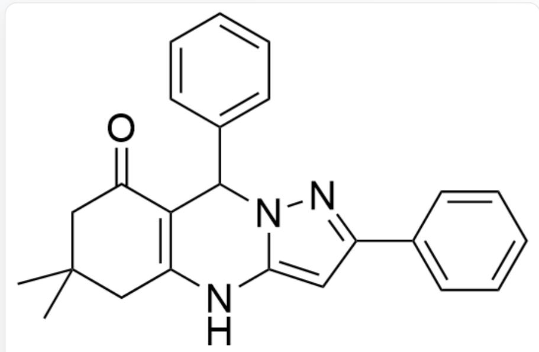  
O=C1C2=C(NC3=CC(C4=CC=CC=C4)=NN3C2C5=CC=CC=C5)CC(C)(C)C1

该结构中有6个环

C.  
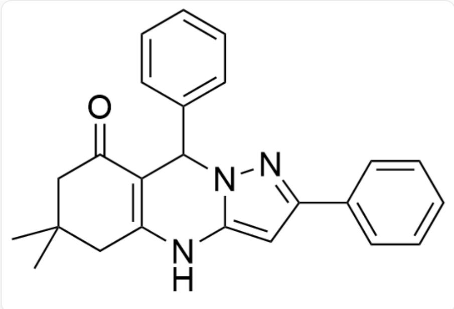  
O=C1C2=C(NC3=CC(C4=CC=CC=C4)=NN3C2C5=CC=CC=C5)CC(C)(C)C1

该结构中有5个环

D.  
  
O=C1C2=C(NC3=CC(C4=CC=CC=C4)=NN3C2C5=CC=CC=C5)CC(C)(C)C1

该结构中有8个环

E.  
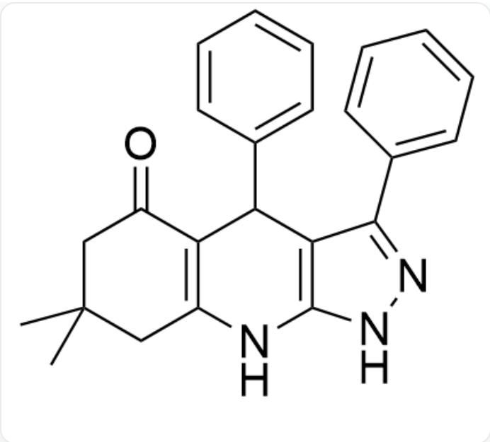  
O=C1C2=C(NC(NN=C3C4=CC=CC=C4)=C3C2C5=CC=CC=C5)CC(C)(C)C1

该结构中有6个环

F.  
  
O=C1C2=C(NC(NN=C3C4=CC=CC=C4)=C3C2C5=CC=CC=C5)CC(C)(C)C1

该结构中有5个环

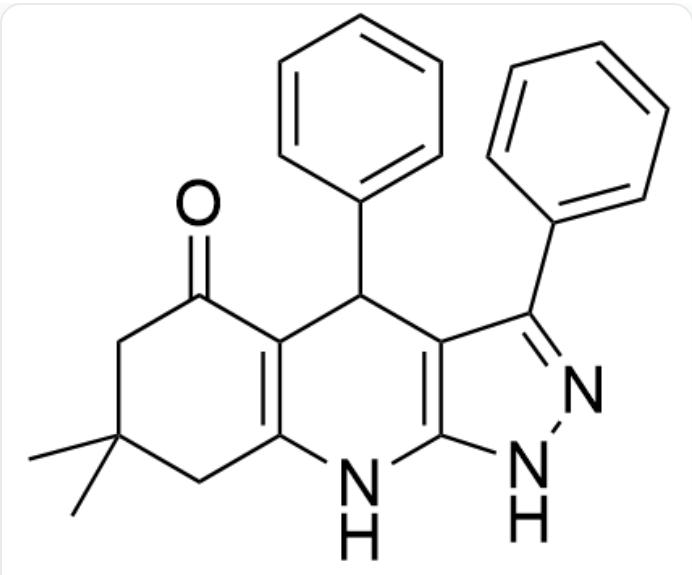  
G.

O=C1C2=C(NC(NN=C3C4=CC=CC=C4)=C3C2C5=CC=CC=C5)CC(C)(C)C1

该结构中有8个环

  
H.

$\mathrm{O = C1N2C3 = C(C(C4 = CC = CC = C4) = NN3)[C@]([H])}$ $(\mathrm{C5 = CC = CC = C5})\mathrm{C}[\mathrm{C@}]2(\mathrm{O})\mathrm{CC}(\mathrm{C})(\mathrm{C})\mathrm{C}1$

该结构中有6个环

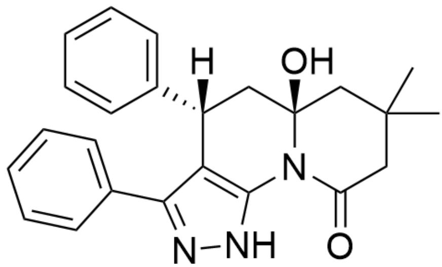

O=C1N2C3=C(C(C4=CC=CC=C4)=NN3)[C@]([H])(C5=CC=CC=C5)C[C@]2(O)CC(C)(C)C1

该结构中有5个环

1.

O=C1N2C3=C(C(C4=CC=CC=C4)=NN3)[C@]([H])(C5=CC=CC=C5)C[C@]2(O)CC(C)(C)C1

该结构中有8个环

J.

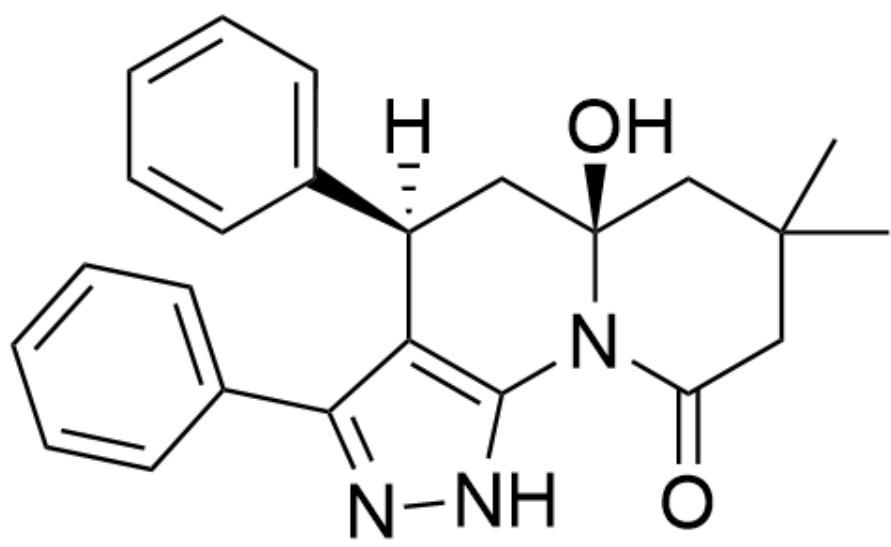  
K.

O=C1N2C3=C(C(C4=CC=CC=C4)=NN3)[C@@]([H])(C5=CC=CC=C5)C[C@]2(O)CC(C)(C)C1

该结构中有6个环

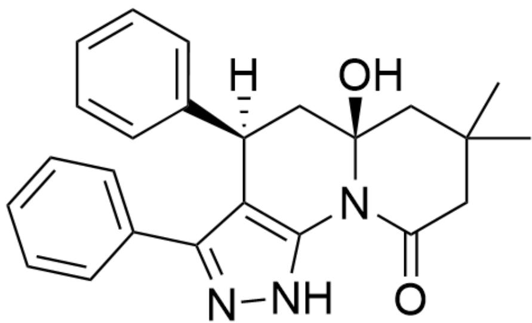  
L.

O=C1N2C3=C(C(C4=CC=CC=C4)=NN3)[C@@]([H])(C5=CC=CC=C5)C[C@]2(O)CC(C)(C)C1

该结构中有5个环

  
O=C1N2C3=C(C(C4=CC=CC=C4)=NN3)[C@@]([H])(C5=CC=CC=C5)C[C@]2(O)CC(C)(C)C1

该结构中有8个环

# 答案

正确答案: H

# 详细解析

该反应在  $150^{\circ} \mathrm{C}$  条件下, 生成热力学稳定的产物

# CHECKPOINT

1 PTS

该反应在  $150^{\circ} \mathrm{C}$  条件下，生成热力学稳定的产物

成环时碳碳单键比碳氮单键更加稳定

# CHECKPOINT

1 PTS

成环时碳碳单键比碳氮单键更加稳定

因此首先反应形成中间体

O=C1C2C(NC(NN=C3C4=CC=CC=C4)=C3C2C5=CC=CC=C5)(O)CC(C)(C)C1

# CHECKPOINT

1 PTS

因此首先反应形成中间体

O=C1C2C(NC(NN=C3C4=CC=CC=C4)=C3C2C5=CC=CC=C5)(O)CC(C)(C)C1

随后在强碱的作用下， $tBuO^{-}$ 或者  $EtO^{-}$ 会对羰基进行亲核进攻后开环

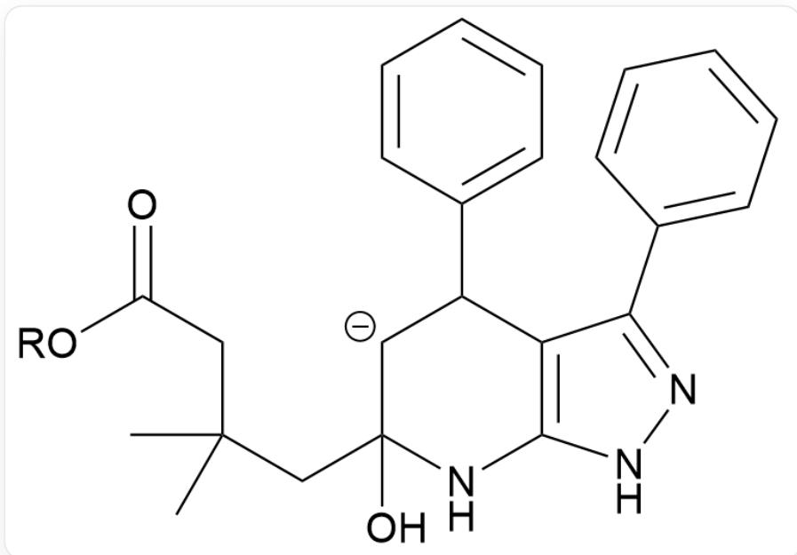

CC(CC1(O)[CH-]C(C2=CC=CC=C2)C3=C(NN=C3C4=CC=CC=C4)N1)(C)CC(O[R])=O

# CHECKPOINT

1 PTS

随后在强碱的作用下， $tBuO^{-}$ 或者  $EtO^{-}$ 会对羰基进行亲核进攻后开环

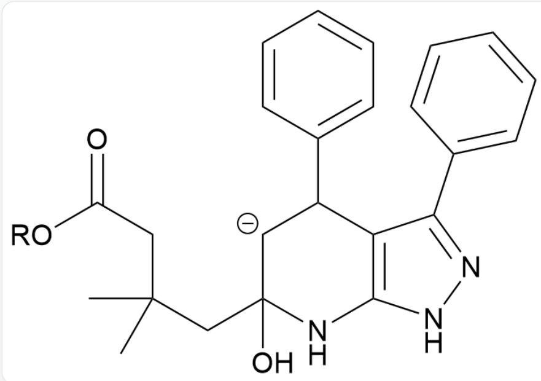  
CC(CC1(O)[CH-]C(C2=CC=CC=C2)C3=C(NN=C3C4=CC=CC=C4)N1)(C)CC(O[R])=O

质子交换之后进一步成环形成稳定的内酰胺产物

# CHECKPOINT

1 PTS

质子交换之后进一步成环形成稳定的内酰胺产物

# CHECKPOINT

1 PTS

苯基位于平伏键时为热力学稳定的产物

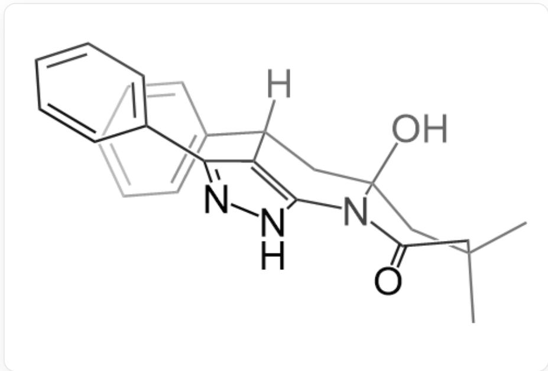

$\mathrm{O = C1N2C3 = C(C(C4 = CC = CC = C4) = NN3)[C@]([H])(C5 = CC = CC = C5)C[C@]2(O)CC(C)(C)C1}$