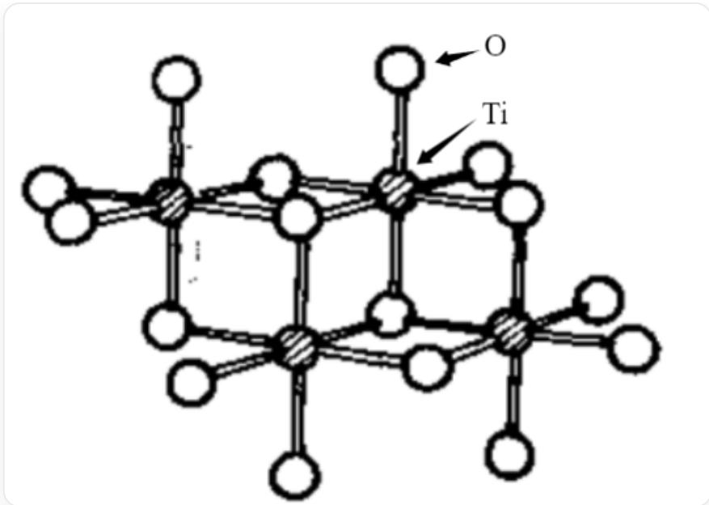
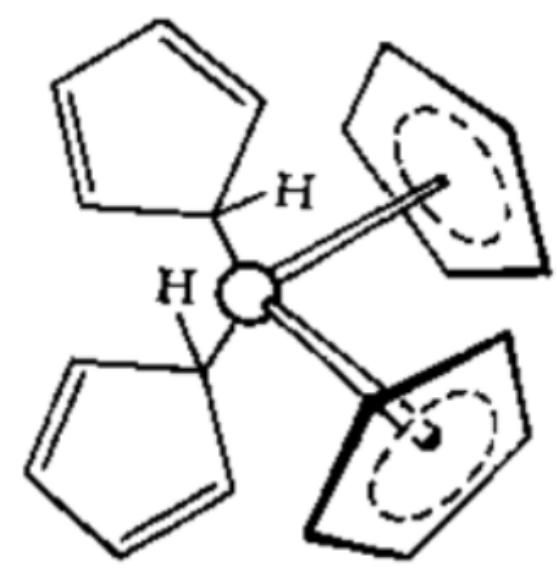
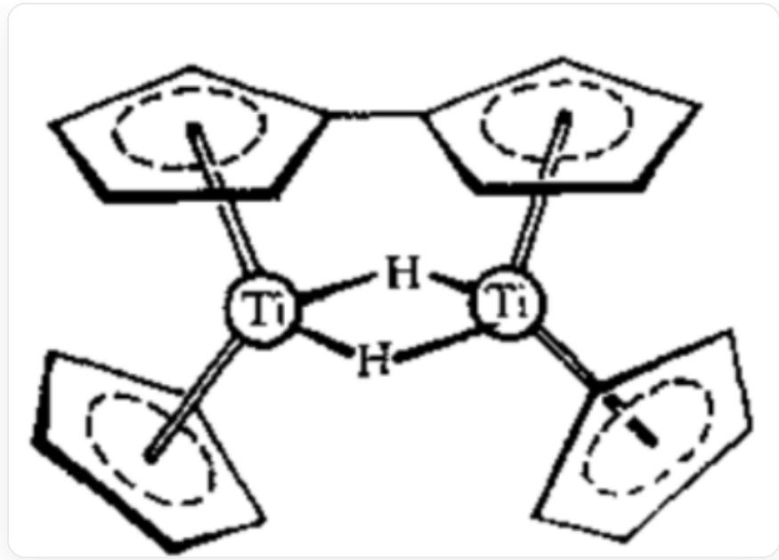

# Question

Transition metal  $\mathbf{M}$  is difficult to extract due to its dispersed presence in nature. The highest-valent oxide  $\mathbf{A}$  of  $\mathbf{M}$  reacts with coke and chlorine gas at high temperature to produce  $\mathbf{B}$ .  $\mathbf{B}$  reacts with  $\mathbf{M}$  to produce  $\mathbf{C}$ .  $\mathbf{C}$  is often used to catalyze ethylene polymerization. Pyrolysis of  $\mathbf{C}$  can yield  $\mathbf{B}$  and  $\mathbf{D}$ . The crystal of  $\mathbf{D}$  has a layered structure, in which all  $\mathbf{M}$  are octahedrally coordinated, and all octahedra are connected to six adjacent octahedra by edge-sharing. Heating  $\mathbf{D}$  can also yield  $\mathbf{M}$  and  $\mathbf{B}$ .  $\mathbf{B}$  reacts with excess ethanol to produce  $\mathbf{F}$ .  $\mathbf{F}$  is a tetramer, and the ratio of oxygen atoms with different coordination numbers is 1:2:5.  $\mathbf{B}$  reacts with excess  $\mathrm{NaCp} (\mathrm{Cp} = \mathrm{C}_5\mathrm{H}_5)$  to produce  $\mathbf{G}$  or  $\mathbf{H}$ . Heating  $\mathbf{G}$  can also produce  $\mathbf{H}$ .  $\mathbf{G}$  satisfies the 16-electron rule, while  $\mathbf{H}$  contains two bridging hydrogen atoms.

The following statements are made:

1. The minimum mass fraction of  $\mathbf{M}$  in  $\mathbf{A} - \mathbf{D}$  is less than  $25\%$ .  
2. Ignoring carbon and hydrogen atoms, the point group of  $\mathbf{F}$  is  $D_{2h}$ .  
3. There are four chemically distinct types of hydrogen in  $\mathbf{G}$  
4.  $\mathbf{M}$  in  $\mathbf{H}$  satisfies the 18-electron rule.

Then the following options contain all the correct statements:

A. All other options are incorrect  
B. 1  
C. 2  
D. 3  
E. 4

F. 1, 2  
G. 1, 3  
H. 1, 4  
1. 2,3  
J. 2,4  
K. 3, 4  
L. 1,2,3  
M. 1, 2, 4  
N. 1,3，4  
O. 2,3,4  
P. 1, 2, 3, 4

# Answer

Correct Answer: D

# Detailed Explanation

Based on the fact that  $\mathbf{C}$  is often used to catalyze ethylene polymerization, it can be inferred that the core element of this question is Ti.

# CHECKPOINT

1 PTS

M is Ti

Therefore, it can be immediately obtained that  $\mathbf{A}$  is  $\mathrm{TiO}_2$ ,  $\mathbf{B}$  is  $\mathrm{TiCl}_4$ ,  $\mathbf{C}$  is  $\mathrm{TiCl}_3$ , and  $\mathbf{D}$  is  $\mathrm{TiCl}_2$ . Among them, the mass fraction of  $\mathrm{Ti}$  is the smallest in  $\mathrm{TiCl}_4$ , which is  $25.23\%$ .

# CHECKPOINT

1 PTS

The minimum mass fraction of  $\mathbf{M}$  in  $\mathbf{A} - \mathbf{D}$  is  $25.23\%$

B reacts with excess ethanol to generate F. F is a tetramer. Based on the oxygen atom ratio, it can be deduced that F is a tetramer of  $\mathrm{Ti(C_2H_5O)_4}$ . From the oxygen atom ratio, it can be deduced that the structure of F is (carbon and hydrogen atoms are omitted in the figure):

  
CCO1[Ti]2(OCC)(OCC)(O([Ti]3(OCC)(O4CC)(O2([Ti]15(OCC)(O([Ti]4(OCC)(OCC) (O53CC)OCC)CC)OCC)CC)OCC

This structure has a  $C_2$  axis and a mirror plane perpendicular to it, with  $C_{2h}$  symmetry.

# CHECKPOINT

1 PTS

Ignoring carbon and hydrogen atoms, the point group to which  $\mathbf{F}$  belongs is  $C_{2h}$

B reacts with excess NaCp to generate G or H. G should be a mononuclear complex, so it is speculated that G is TiCp4. Since G satisfies the 16-electron rule, it can be obtained that two Cp provide 6 electrons and two Cp provide 2 electrons. Its structure is easily obtained as:

The figure shows the structure of  $\mathrm{TiCp_4}$ , where two Cp ligands provide 6-electron coordination and two Cp ligands provide 2-electron coordination.

There are 4 kinds of hydrogen with different chemical environments.

# CHECKPOINT

1 PTS

There are four kinds of hydrogen with different chemical environments in  $\mathbf{G}$

G can also generate H upon thermal decomposition. There are two hydrogen bridge bonds in H, so it can be inferred that a dehydrogenative coupling reaction of Cp has occurred. Therefore, the chemical formula of H can be obtained as  $\mathrm{Ti}_2(\mathrm{Cp} - \mathrm{Cp})\mathrm{Cp}_2\mathrm{H}_2$  , and its structure is:

The figure shows the structure of  $\mathrm{Ti}_{2}(\mathrm{Cp} - \mathrm{Cp})\mathrm{Cp}_{2}\mathrm{H}_{2}$ , where two Cp rings in  $\mathrm{Cp} - \mathrm{Cp}$  provide 6-electron coordination to the two Ti respectively to form a bridge, two Cp provide 6-electron coordination to the two Ti, and two H both connect the two Ti as bridging ligands.

The number of electrons around Ti is 17, which does not satisfy the 18-electron rule.

# CHECKPOINT

1 PTS

$\mathbf{M}$  in  $\mathbf{H}$  does not satisfy the 18-electron rule.