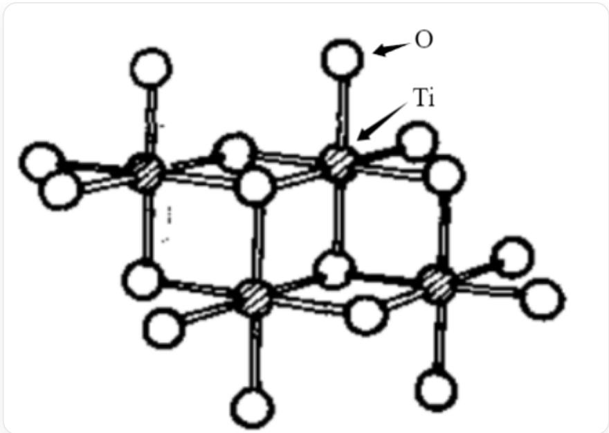
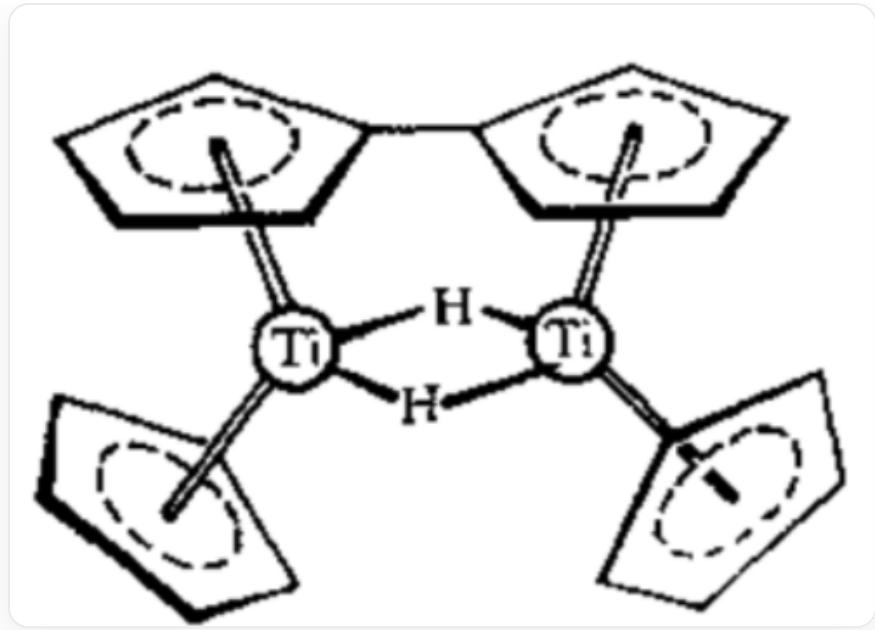

# 题目

过渡金属 M 由于在自然界中存在分散而较难提取。M 的最高价氧化物 A 在高温下与焦炭和氯气反应生成 B，B 与 M 反应生成 C，C 常用于催化乙烯聚合。C 热解可以得到 B 和 D，D 的晶体为层状结构，其中 M 均为八面体配位，所有八面体均与相邻的六个八面体共棱连接。D 加热又可得到 M 和 B。B 与足量乙醇反应生成 F，F 为四聚体，不同配位数的氧原子的比例为  $1:2:5$ 。B 与足量  $\mathrm{NaCp}$ （ $\mathrm{Cp} = \mathrm{C}_{5} \mathrm{H}_{5}$ ）反应，生成 G 或 H，G 受热分解也可以产生 H。G 满足 16 电子规则，而 H 中存在两个氢桥键。

有下列说法：

1.  $\mathbf{A} - \mathbf{D}$  中  $\mathbf{M}$  的质量分数的最小值小于  $25\%$  
2. 忽略碳原子与氢原子，则  $\mathbf{F}$  所属点群为  $D_{2h}$  。  
3. G 中有四种化学环境的氢。  
4. H 中 M 满足 18 电子规则。

则下列选项中包含所有正确说法的是：

A. 其他选项均不正确  
B. 1  
C. 2  
D. 3  
E. 4

F. 1, 2  
G. 1, 3  
H. 1, 4  
1. 2,3  
J. 2,4  
K. 3, 4  
L. 1,2,3  
M. 1, 2, 4  
N. 1,3，4  
O. 2,3,4  
P. 1, 2, 3, 4

# 答案

正确答案: D

# 详细解析

根据 C 常用于催化乙烯聚合可以推测该题核心元素为 Ti。

# CHECKPOINT

1 PTS

M为Ti

从而立即得到  $\mathbf{A}$  为  $\mathrm{TiO_2}$ ,  $\mathbf{B}$  为  $\mathrm{TiCl_4}$ ,  $\mathbf{C}$  为  $\mathrm{TiCl_3}$ ,  $\mathbf{D}$  为  $\mathrm{TiCl_2}$  。其中  $\mathrm{Ti}$  质量分数最小的为  $\mathrm{TiCl_4}$ , 为  $25.23\%$  。

# CHECKPOINT

1 PTS

A - D 中 M 的质量分数的最小值  $25.23\%$

B 与足量乙醇反应生成 F，F 为四聚体，根据氧原子比例可以推出 F 为  $\mathrm{Ti}(\mathrm{C}_2\mathrm{H}_5\mathrm{O})_4$  的四聚体，从氧原子比例可以推出 F 的结构为（图中省略碳氢原子）：

  
CCO1[Ti]2(OCC)(OCC)(O([Ti]3(OCC)(O4CC)(O2([Ti]15(OCC)(O([Ti]4(OCC)(OCC) (O53CC)OCC)CC)OCC)CC)OCC

该结构具有一根  $C_2$  轴和一个与其垂直的镜面，具有  $C_{2h}$  对称性。

# CHECKPOINT

1 PTS

忽略碳原子与氢原子，则  $\mathbf{F}$  所属点群为  $C_{2h}$

B 与足量  $\mathrm{NaCp}$  反应，生成 G 或 H，G 应为单核配合物，因此推测 G 为  $\mathrm{TiCp}_4$  ，由于 G 满足16电子规则，因此可以得到两个 Cp 提供6电子，两个 Cp 提供2电子，易得其结构为：

  
图中展示了  $\mathrm{TiCp_4}$  的结构，两个 Cp 提供 6 电子配位，两个 Cp 提供 2 电子配位。

其中有4种化学环境的氢。

# CHECKPOINT

1 PTS

G 中有四种化学环境的氢。

G 受热分解也可以产生 H，H 中存在两个氢桥键，因此可以推断发生了 Cp 的脱氢偶联反应，因此可以得 H 的化学式为  $\mathrm{Ti}_{2}(\mathrm{Cp}-\mathrm{Cp}) \mathrm{Cp}_{2} \mathrm{H}_{2}$ ，其结构为：

  
图中展示了  $\mathrm{Ti}_{2}(\mathrm{Cp}-\mathrm{Cp}) \mathrm{Cp}_{2} \mathrm{H}_{2}$  的结构， $\mathrm{Cp}-\mathrm{Cp}$  中的两个  $\mathrm{Cp}$  环分别对两个  $\mathrm{Ti}$  提供6电子配位从而形成桥连，两个  $\mathrm{Cp}$  对两个  $\mathrm{Ti}$  提供6电子配位，两个  $\mathrm{H}$  均作为桥连配体连接两个  $\mathrm{Ti}$ 。

其中 Ti 周围的电子数为 17，不满足 18 电子规则。

# CHECKPOINT

1 PTS

H 中 M 不满足 18 电子规则。