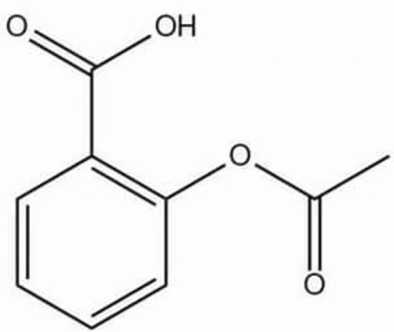

# Question

The molecular structure of the drug in a certain tablet is shown in the following figure:

$$
O = C (C 1 = C (O C (C) = O) C = C C = C 1) O
$$

The method for determining the drug content is as follows: Weigh  $1.03\mathrm{g}$  of tablet powder, add  $15\mathrm{mL}$  of water and shake well, then extract four times with  $50\mathrm{mL}$  of solvent A, wash and evaporate to dryness, dissolve the residue with  $25\mathrm{mL}$  of solvent B, add 3 drops of indicator, cool the conical flask to  $T^{\circ}C$ , and titrate to the endpoint with  $\mathrm{NaOH}$  solution with a concentration of  $0.05034\mathrm{mol}\cdot \mathrm{L}^{-1}$ , consuming  $24.78\mathrm{mL}$ . Based on this, the following statement that is correct is:

A. All other options are incorrect  
B. Due to the ester group hydrolyzing under alkaline conditions, consuming 3 equivalents of NaOH, the mass fraction of the drug in the tablet is  $7.27\%$  
C. Titration endpoint has a relatively strong alkalinity, thymolphthalein can be selected as an indicator.

D. The drug molecule is highly polar, and highly polar DMF can be selected as solvent A for extraction.  
E. Molecules of drugs possess intermolecular hydrogen bonds; protic solvent methanol can be selected as solvent B during titration.  
F. To make the titration more accurate, the temperature T can be maintained at around 45 degrees Celsius to promote rapid reaction.

# Answer

Correct Answer: E

# Detailed Explanation

This question examines acid-base titration related content. First, calculate the amount of substance of NaOH consumed in the titration:  $0.05034 \times 24.78 \times 10^{-3} = 1.247 \times 10^{-3}$  mol. Considering the reaction ratio of acetylsalicylic acid and NaOH, first, the carboxyl group in the molecule will react with 1 NaOH. At the same time, the system maintains an acidic to weakly alkaline environment, the alkalinity of this system is not so strong, and the time of titration is normally short, so the ester group will not be completely hydrolyzed.

# CHECKPOINT

1 PTS

Ester group will not be completely hydrolyzed

Therefore, acetylsalicylic acid and NaOH react in a  $1:1$  ratio, so option B is incorrect.

# CHECKPOINT

1 PTS

Acetylsalicylic acid and NaOH react in a  $1:1$  ratio

Therefore, the amount of substance of acetylsalicylic acid in the sample is  $1.247 \times 10^{-3} \mathrm{~mol}$ , the molecular weight of acetylsalicylic acid is  $180.159 \mathrm{~g} / \mathrm{mol}$ , and the mass of acetylsalicylic acid is  $180.159 \times 1.247 \times 10^{-3} = 0.2247 \mathrm{~g}$

The correct mass fraction should be  $0.2247 \div 1.03 \times 100\% = 21.8\%$

# CHECKPOINT

1 PTS

Mass fraction is  $21.8\%$

The pKa of aspirin is approximately 3.5, and it can be calculated that the pH at the endpoint is approximately 8, which is weakly alkaline.

# CHECKPOINT

1 PTS

Endpoint pH is approximately 8

The color change range of thymolphthalein is 9.3-10.5

# CHECKPOINT

1 PTS

Color change range of thymolphthalein is 9.3-10.5

Therefore, thymolphthalein cannot be selected as an indicator.

# CHECKPOINT

1 PTS

Thymolphthalein cannot be selected as an indicator

The requirement for solvent A is that it has good solubility for aspirin and is easy to separate by rotary evaporation, that is, it has a lower boiling point.

# CHECKPOINT

2 PTS

Boiling point of solvent A needs to be low

Solvent A cannot be DMF, which has a high boiling point and is miscible with water.

# CHECKPOINT

1 PTS

Solvent A cannot be DMF

Solvent B is required to be usable for acid-base titration, that is, it must be a protic solvent.

# CHECKPOINT

1 PTS

Solvent B is a protic solvent

And in order to prevent partial hydrolysis of the ester group from producing acidic carboxyl groups, which would affect the titration results, solvent B cannot be water.

# CHECKPOINT

1 PTS

Solvent B cannot be water

Therefore, solvent B can be methanol, and even if transesterification occurs, it will not affect the titration results. Option E is reasonable.

# CHECKPOINT

1 PTS

Solvent B can be methanol

Acid-base neutralization reactions are very fast and generally do not require heating to promote them.

# CHECKPOINT

1 PTS

Neutralization reaction is fast, no heating required

Heating will instead promote the reaction between the water formed during the titration process and the ester group to produce acidic carboxyl groups, which will affect the titration results.

# CHECKPOINT

1 PTS

Heating will promote ester hydrolysis, affecting titration

Therefore, the entire titration process must be kept at a low temperature and cannot be carried out at 45 degrees Celsius. Option F is incorrect.

# CHECKPOINT

1 PTS

Titration cannot be carried out at 45 degrees Celsius