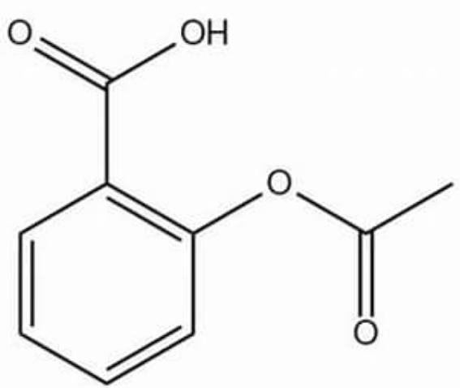

# 题目

某药片中的药物分子结构如下图：

$$
O = C (C 1 = C (O C (C) = O) C = C C = C 1) O
$$

测定药物含量的方法如下：称取 1.03 克药片粉末，加入  $15 \mathrm{~mL}$  水后摇匀，再用  $50 \mathrm{~mL}$  溶剂A分四次提取，洗涤后蒸干，用  $25 \mathrm{~mL}$  溶剂B溶解残渣，加入指示剂3滴，冷却锥形瓶至  $T^{\circ} C$  ，用浓度为  $0.05034 \mathrm{~mol} \cdot \mathrm{L}^{-1}$  的  $\mathrm{NaOH}$  溶液滴定至终点，消耗  $24.78 \mathrm{~mL}$ ，据此判断下列说法中正确的是：

A. 其他选项均不正确  
B. 由于酯基会在碱性条件下会水解, 消耗3当量NaOH, 因此药片中药品的质量分数为  $7.27\%$  
C. 滴定终点碱性较强, 可选用百里酚酞作指示剂  
D. 药物分子极性较大, 可选用高极性的DMF作为萃取用的溶剂A  
E. 药物分子存在分子间氢键, 可选用质子溶剂甲醇作为滴定时的溶剂  $\mathrm{B}$

F. 为了使滴定更加准确, 温度  $T$  可以维持在 45 摄氏度左右以促进反应快速发生

# 答案

正确答案: E

# 详细解析

本题目考察酸碱滴定相关内容，首先要计算出滴定消耗的  $\mathrm{NaOH}$  的物质的量为  $0.05034 \times 24.78 \times 10^{-3} = 1.247 \times 10^{-3} \mathrm{~mol}$ ，考虑乙酰水杨酸和  $\mathrm{NaOH}$  的反应比例，首先分子中的羧基会和1个  $\mathrm{NaOH}$  反应，同时体系一直维持酸性至弱碱性环境，体系碱性不强，滴定时间也较短，酯基不会完全水解。

# CHECKPOINT

1 PTS

酯基不会完全水解

所以乙酰水杨酸和NaOH以1：1的比例反应，B选项错误。

# CHECKPOINT

1 PTS

乙酰水杨酸和NaOH1:1反应

所以样品中的乙酰水杨酸的物质的量为  $1.247 \times 10^{-3} \mathrm{~mol}$ ，乙酰水杨酸的分子量为  $180.159 \mathrm{~g} / \mathrm{mol}$ ，乙酰水杨酸的质量为  $180.159 \times 1.247 \times 10^{-3} = 0.2247 \mathrm{~g}$

正确的质量分数应为  $0.2247 \div 1.03 \times 100\% = 21.8\%$

# CHECKPOINT

1 PTS

质量分数为  $21.8\%$

阿司匹林的pKa约为3.5，可算出终点的pH约为8，属于弱碱性。

# CHECKPOINT

1 PTS

终点pH约为8

百里酚酞的变色范围为9.3-10.5

# CHECKPOINT

1 PTS

百里酚酞的变色范围为9.3-10.5

因此指示剂不可选择百里酚酞

# CHECKPOINT

1 PTS

指示剂不可选百里酚酞

溶剂A的要求为对阿司匹林溶解性好且易于旋蒸分离，即沸点较低

# CHECKPOINT

2 PTS

溶剂A沸点需较低

溶剂A不可选择高沸点且与水混溶的DMF

# CHECKPOINT

1 PTS

溶剂A不可选择DMF

溶剂B要求为可用于酸碱滴定，即须为质子溶剂。

# CHECKPOINT

1 PTS

溶剂B为质子溶剂

且为了防止酯基部分水解产生酸性羧基，影响滴定结果，溶剂B不能是水。

# CHECKPOINT

1 PTS

溶剂B不可为水

所以溶剂B可以选择甲醇，即使发生酯交换也不影响滴定结果，E选项合理。

# CHECKPOINT

1 PTS

溶剂B可以是甲醇

酸碱中和反应非常快，一般不需要加热促进。

# CHECKPOINT

1 PTS

中和反应快，无需加热

加热反而会促进滴定过程中形成的水和酯基反应产生酸性羧基，影响滴定结果。

# CHECKPOINT

1 PTS

加热会促进酯基水解，影响滴定

因此滴定全程需保持较低温度，不可在45摄氏度进行。F选项错误

# CHECKPOINT

1 PTS

滴定不可在45摄氏度进行