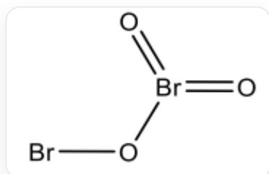
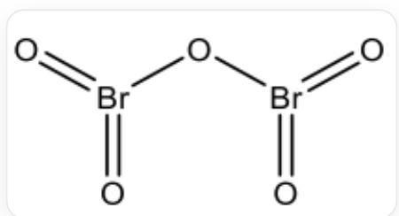

# Question

The reddish-brown element  $\mathbf{X}$  's allotrope  $\mathbf{Y}$  is oxidized by  $\mathrm{O}_3$  at  $195\mathrm{K}$  to produce an orange oxide  $\mathbf{A}$ , and further oxidation yields a colorless oxide  $\mathbf{B}$ . It is known that the mass fractions of oxygen in  $\mathbf{A}$  and  $\mathbf{B}$  are 0.2310 and 0.3336 respectively, and the oxidation states of element  $\mathbf{X}$  in  $\mathbf{A}$  are different, and the  $\mathbf{X}$  atoms are not adjacent.

$\mathbf{Y}$  can react with  $\mathrm{SbF}_5$  in  $\mathbf{X}\mathbf{F}_5$  solvent to obtain an ionic compound  $\mathbf{C}$  with a single charge on both the cation and anion. The coordination number of all Sb atoms in  $\mathbf{C}$  is 6. The cation has a linear structure, the mass fraction of Sb in the anion is 0.5458, the anion does not contain element  $\mathbf{X}$ , and the cation does not contain element F.

Regarding the above compounds, the correct statement is:

1. The oxidation states of element  $\mathbf{X}$  in  $\mathbf{A}$  differ by 4.  
2. The chemical environments of element  $\mathbf{X}$  in  $\mathbf{B}$  are different.  
3. The number of element  $\mathbf{X}$  in the chemical formulas of  $\mathbf{A}$  and  $\mathbf{B}$  are different.  
4. The cation in  $\mathbf{C}$  is composed of only one element.  
5. The element composition ratio in the chemical formula of the anion in  $\mathbf{C}$  is  $4:21$ .

A. 1,2  
B. 1,3  
C. 1,4  
D. 1,5  
E. 2,4

F. 2,5  
G. 3, 4  
H. 4,5

# Answer

Correct Answer: C

# Detailed Explanation

Based on the reddish-brown element  $\mathbf{Y}$  and the orange oxide  $\mathbf{A}$  and colorless oxide  $\mathbf{B}$ , it can be inferred that  $\mathbf{X}$  is the element  $\mathrm{Br}$ ;  $\mathbf{Y}$  is the element  $\mathrm{Br}_2$ ;  $\mathbf{A}$  is  $\mathrm{Br}_2\mathrm{O}_3$ ;  $\mathbf{B}$  is  $\mathrm{Br}_2\mathrm{O}_5$ . The calculated mass fraction of oxygen element is consistent with the question, which can be verified.

# CHECKPOINT

1 PTS

X is the element Br

# CHECKPOINT

1 PTS

$\mathbf{Y}$  is the element  $\mathrm{Br}_2$

# CHECKPOINT

1 PTS

A is  $\mathrm{Br}_2\mathrm{O}_3$

# CHECKPOINT

1 PTS

B is  $\mathrm{Br}_2\mathrm{O}_5$

The structure of  $\mathbf{A}$  is:

Structure of  $\mathrm{Br}_2\mathrm{O}_3$ : One Br is connected to O through two bromine-oxygen double bonds and one bromine-oxygen single bond; the other Br is connected to O through a bromine-oxygen single bond; two Br are separated by one O

The structure of  $\mathbf{B}$  is:

Structure of  $\mathrm{Br}_2\mathrm{O}_5$ : Two Br are each connected to O through two bromine-oxygen double bonds and one bromine-oxygen single bond; two Br are separated by one O

# CHECKPOINT

1 PTS

In A, one Br is connected to O through two bromine-oxygen double bonds and one bromine-oxygen single bond; the other Br is connected to O through a bromine-oxygen single bond; two Br are separated by one O

# CHECKPOINT

1 PTS

In B, two Br are each connected to O through two bromine-oxygen double bonds and one bromine-oxygen single bond; two Br are separated by one O

Therefore, statement 1 is correct; statements 2 and 3 are incorrect.

It is known that the anion in  $\mathbf{C}$  does not contain the Br element and contains the Sb element, so it can be known that the anion is composed of the Sb element and the F element. A typical anion family is Double subscripts: use braces to clarify. When  $m = 3$ , it meets the mass fraction of the Sb element in the question.

Therefore, the anion is  $\left[\mathrm{Sb}_{3} \mathrm{~F}_{16}\right]^{-}$ .

According to the cation not containing the F element and having a linear structure, it can be deduced that the cation is  $\left[\mathrm{Br}_2\right]^+$ .

C is  $\left[\mathrm{Br}_2\right]^{+}\left[\mathrm{Sb}_3\mathrm{F}_{16}\right]^{-}$ .

# CHECKPOINT

1 PTS

C is  $\left[\mathrm{Br}_{2}\right]^{+}\left[\mathrm{Sb}_{3} \mathrm{~F}_{16}\right]^{-}$

Therefore, statement 4 is correct and statement 5 is incorrect.

Select option C.