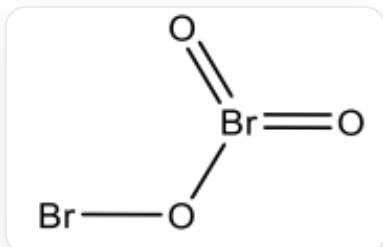
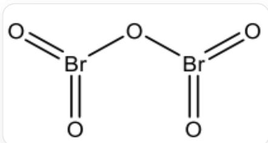

# 题目

某元素  $\mathbf{X}$  的红棕色单质  $\mathbf{Y}$  在  $195\mathrm{K}$  下, 被  $\mathrm{O}_3$  氧化生成一橙色氧化物  $\mathbf{A}$ , 继续氧化可得到无色的氧化物  $\mathbf{B}$  。已知  $\mathbf{A}$  、  $\mathbf{B}$  中氧元素质量分数分别为 0.2310 、 0.3336 , 且  $\mathbf{A}$  中  $\mathbf{X}$  元素氧化态不同、  $\mathbf{X}$  原子不相邻。

Y在  $\mathbf{X}\mathbf{F}_{5}$  溶剂中可与  $\mathrm{SbF}_5$  反应得到一阴阳离子均带一个电荷的离子化合物C，C中的Sb原子均为6配位。阳离子具有线性结构，阴离子中Sb元素的质量分数为0.5458，且阴离子中不含X元素，阳离子不含F元素。

关于以上化合物，说法正确的是：

1. A 中 X 元素氧化态相差 4 价。  
2. B 中 X 元素的化学环境不同。  
3. A 和 B 化学式中的 X 元素个数不同。  
4. C 中阳离子仅有一种元素组成。  
5. C 中阴离子化学式元素组成比为  $4:21$  。

A. 1,2  
B. 1,3  
C. 1,4  
D. 1,5  
E. 2,4  
F. 2,5

G. 3, 4  
H. 4,5

# 答案

正确答案: C

# 详细解析

根据红棕色单质  $\mathbf{Y}$  及橙色氧化物A和无色氧化物B，可猜测X为Br元素；Y为  $\mathrm{Br}_2$  单质；A为 $\mathrm{Br}_2\mathrm{O}_3$  ;B为  $\mathrm{Br}_2\mathrm{O}_5$  。对应计算得到的氧元素质量分数与题目相符，可验证。

CHECKPOINT

1 PTS

X为Br元素

CHECKPOINT

1 PTS

$\mathbf{Y}$  为  $\mathrm{Br}_2$  单质

CHECKPOINT

1 PTS

A 为  $\mathrm{Br}_2\mathrm{O}_3$

# CHECKPOINT

1 PTS

B 为  $\mathrm{Br}_2\mathrm{O}_5$

A 的结构为:

$\mathrm{Br}_2\mathrm{O}_3$  的结构式：一个  $\mathrm{Br}$  通过两个溴氧双键、一个溴氧单键与  $\mathrm{O}$  相连；另一个  $\mathrm{Br}$  通过溴氧单键与  $\mathrm{O}$  相连；两个  $\mathrm{Br}$  之间间隔一个  $\mathrm{O}$

B 的结构为:

$\mathrm{Br}_2\mathrm{O}_5$  的结构式：两个  $\mathrm{Br}$  分别通过两个溴氧双键、一个溴氧单键与  $\mathrm{O}$  相连；两个  $\mathrm{Br}$  之间间隔一个  $\mathrm{O}$

# CHECKPOINT

1 PTS

A 中一个 Br 通过两个溴氧双键、一个溴氧单键与 O 相连；另一个 Br 通过溴氧单键与 O 相连；两个 Br 之间间隔一个 O

# CHECKPOINT

1 PTS

B 中两个 Br 分别通过两个溴氧双键、一个溴氧单键与 O 相连；两个 Br 之间间隔一个 O

因此说法1正确；说法2,3错误。

已知 C 中阴离子不含 Br 元素且含有 Sb 元素，可知阴离子由 Sb 元素和 F 元素构成。典型的阴离子族为 Double subscripts: use braces to clarify 。当  $m = 3$  时，符合题中 Sb 元素质量分数。

因此，阴离子为  $\left[\mathrm{Sb}_{3} \mathrm{~F}_{16}\right]^{-}$ 。

根据阳离子不含F元素且为线性结构，可推出阳离子为  $\left[\mathrm{Br}_2\right]^+$  。

C 为  $\left[\mathrm{Br}_{2}\right]^{+} \left[\mathrm{Sb}_{3} \mathrm{~F}_{16}\right]^{-}$ 。

# CHECKPOINT

1 PTS

C 为  $\left[\mathrm{Br}_{2}\right]^{+} \left[\mathrm{Sb}_{3} \mathrm{~F}_{16}\right]^{-}$

因此说法4正确，说法5错误。

选择选项C。