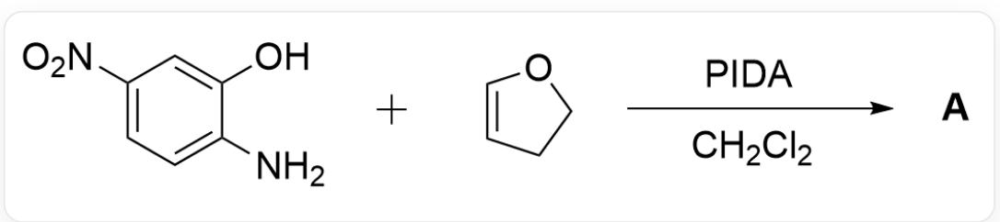
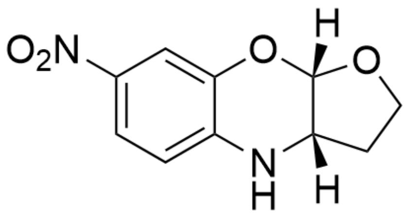
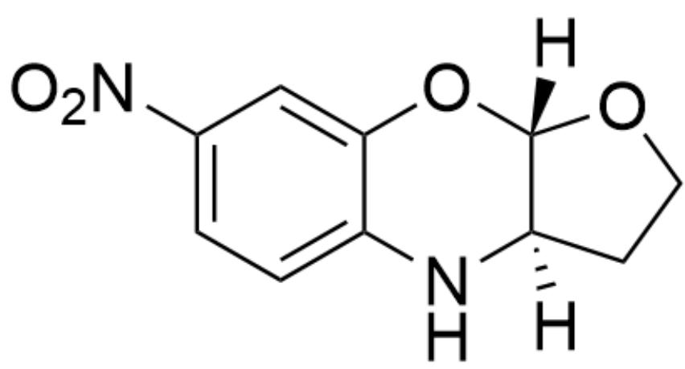
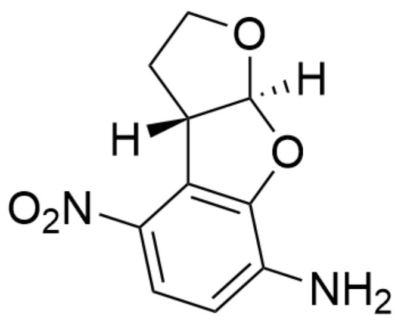
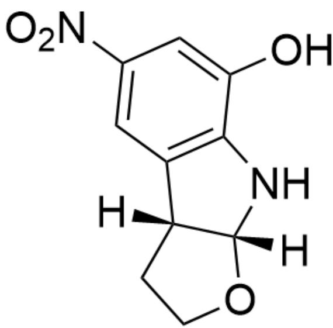
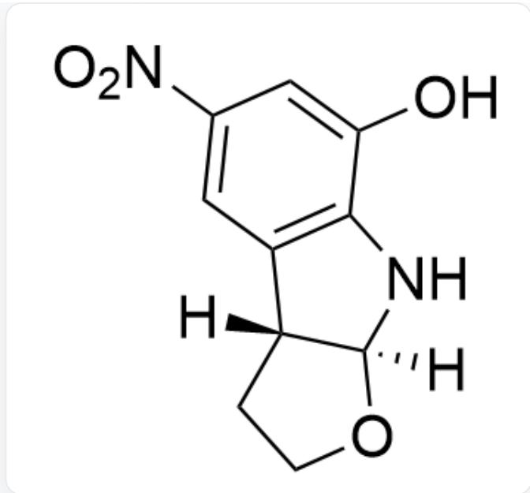
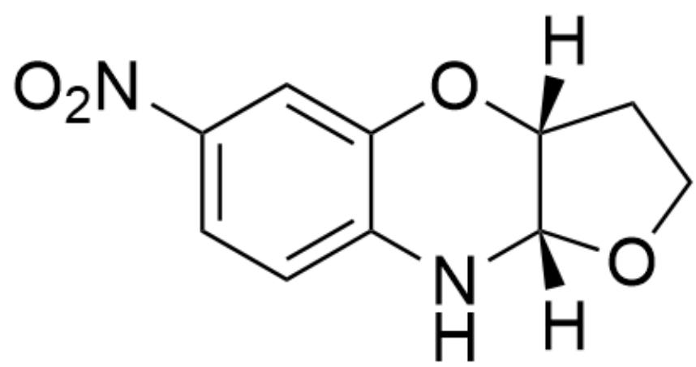
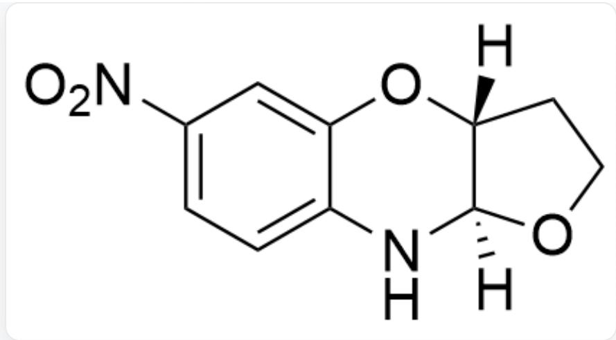
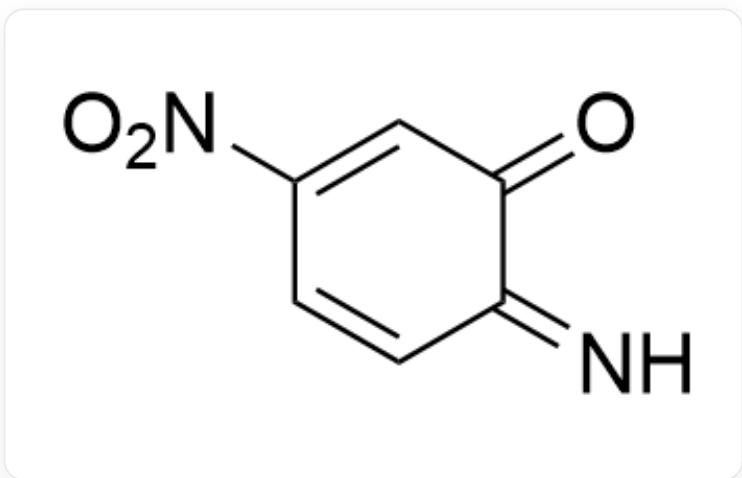
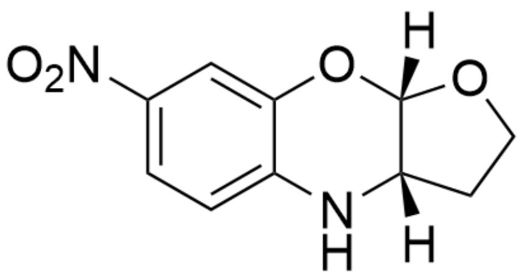

# Question

OC1=CC([N+]([O-])=O)=CC=C1N.C2=CCCO2> [PIDA].CICC> [A], A is the product

Given that the molecular formula of product  $\mathbf{A}$  is  $\mathrm{C_{10}H_{10}N_2O_4}$ , and it contains 3 rings. Without considering enantiomers, provide the structural formula of  $\mathbf{A}$ .

A. All other options are incorrect  
B.

[H][C@]12OC3=CC([N+][[O-])=O)=CC=C3N[C@@]1([H])CCO2

C.

  
[H][C@]12OC3=CC([N+]([O-])=O)=CC=C3N[C@]1([H])CC02

  
D.  
NC1=CC=C([N+]([O-])=O)C2=C1O[C@]3([H])[C@@]2([H])CC03  
E.

NC1=CC=C([N+]([O-])=O)C2=C1O[C@@]3([H])[C@@]2([H])CC03

F.

OC1=CC([N+]([O-])=O)=CC2=C1N[C@@]3([H])[C@]2([H])CC03

G.

  
OC1=CC([N+]([O-]=O)=CC2=C1N[C@]3([H])[C@]2([H])CC03

H.

  
[H][C@]12OC3=CC([N+]([O-])=O)=CC=C3N[C@@]1([H])OCC2

1.

[H][C@]12OC3=CC([N+]([O-])=O)=CC=C3N[C@]1([H])OCC2

# Answer

Correct Answer: B

# Detailed Explanation

First, based on the molecular formula  $\mathrm{C_{10}H_{10}N_2O_4}$  of product A, it can be deduced that the reaction consumes 1 equivalent of PIDA

# CHECKPOINT

1 PTS

First, based on the molecular formula  $\mathrm{C_{10}H_{10}N_2O_4}$  of product A, it can be deduced that the reaction consumes 1 equivalent of PIDA

First, PIDA oxidizes the substrate to obtain an intermediate.

$$
O = C 1 C (C = C C ([ N + ]) ([ O - ]) = O) = C 1) = N
$$

# CHECKPOINT

1 PTS

PIDA Oxidation intermediate:  $\mathrm{O} = \mathrm{C1}\mathrm{C}(\mathrm{C} = \mathrm{CC}([\mathrm{N} + ]([\mathrm{O} - ]) = \mathrm{O}) = \mathrm{C1}) = \mathrm{N}$

Then, the intermediate undergoes an inverse electron-demand D-A reaction with an electron-rich diene to obtain the product.

# CHECKPOINT

1 PTS

Then, the intermediate undergoes an inverse electron-demand D-A reaction with an electron-rich diene to obtain the cis-product.

For the diene, the electronegativity of O is greater than that of N, so the N-terminus is relatively more electron-deficient.

# CHECKPOINT

1 PTS

For the diene, the electronegativity of O is greater than that of N, so the N-terminus is relatively more electron-deficient.

For the dienophile, obviously the C at the meta-position of O is more electron-rich.

# CHECKPOINT

1 PTS

For the dienophile, obviously the C at the meta-position of O is more electron-rich.

Therefore, according to the electronegativity, options H and I can be excluded.

  
[H][C@]12OC3=CC([N+]([O-])=O)=CC=C3N[C@@]1([H])CCO2

# CHECKPOINT

1 PTS

Product A: [H][C@]12OC3=CC([N+]([O-])=O)=CC=C3N[C@@]1([H])CCO2