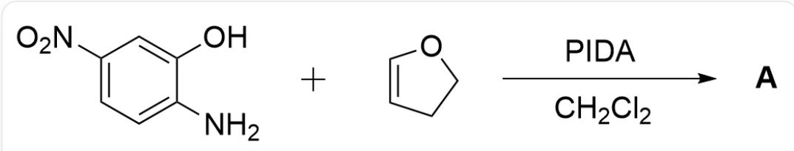
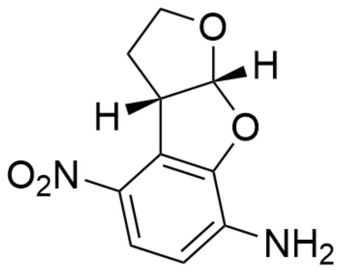
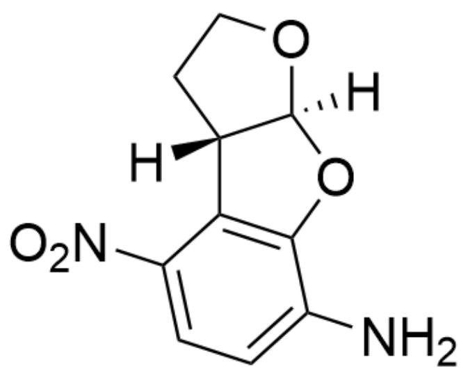
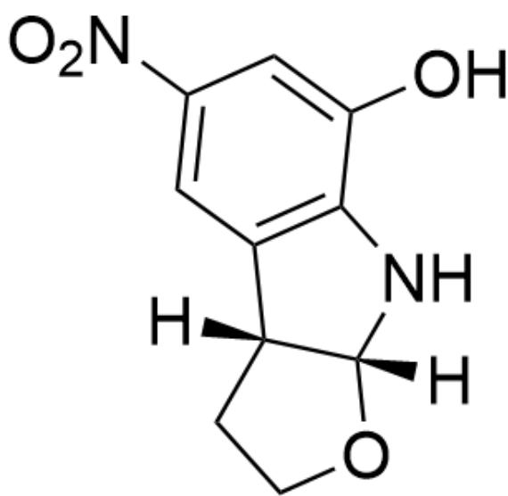
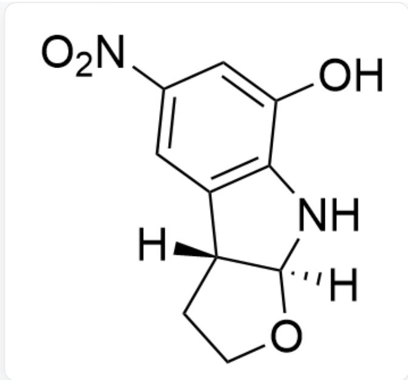
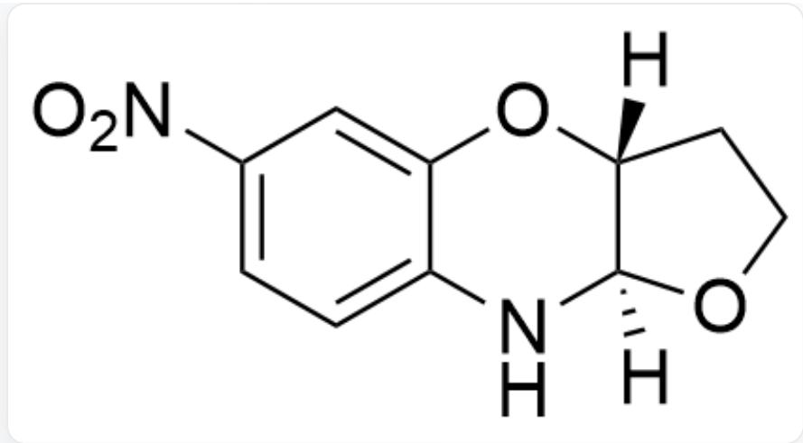
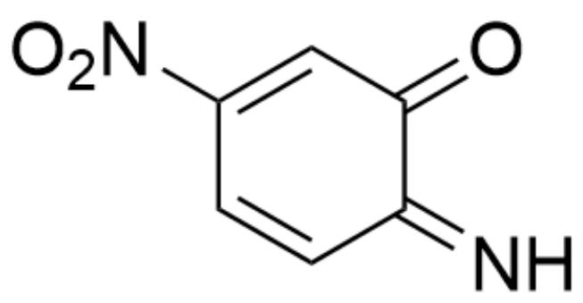
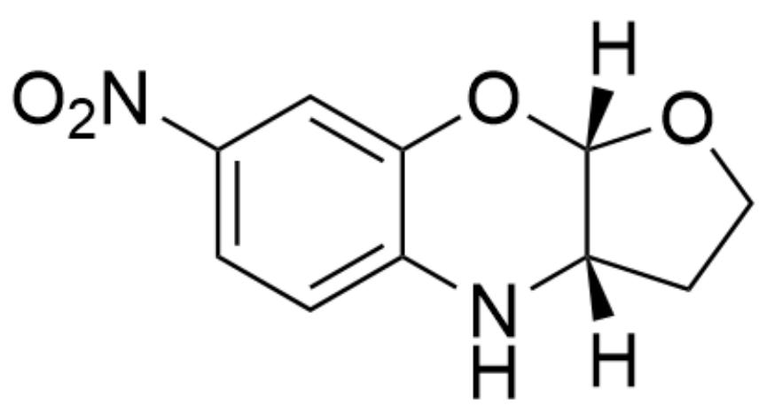

# 题目

OC1=CC([N+]([O-])=O)=CC=C1N.C2=CCCO2>[PIDA].CICC>[A],A是产物

已知产物  $\mathrm{A}$  的分子式为  $\mathrm{C}_{10} \mathrm{H}_{10} \mathrm{~N}_{2} \mathrm{O}_{4}$ , 且含有 3 个环。不考虑对映异构的条件下, 试给出  $\mathrm{A}$  的结构式。

A. 其他选项均不正确  
B.

[H][C@]12OC3=CC([N+][[O-])=O)=CC=C3N[C@@]1([H])CC02

C.

  
[H][C@]12OC3=CC([N+]([O-])=O)=CC=C3N[C@]1([H])CC02

  
D.  
NC1=CC=C([N+]([O-])=O)C2=C1O[C@]3([H])[C@@]2([H])CC03  
E.

NC1=CC=C([N+]([O-])=O)C2=C1O[C@@]3([H])[C@@]2([H])CC03

F.

OC1=CC([N+][[O-]]=[O)=CC2=C1N[C@@]3([H])[C@]2([H])CC03

G.

  
OC1=CC([N+]([O-]=O)=CC2=C1N[C@]3([H])[C@]2([H])CC03

H.

  
[H][C@]12OC3=CC([N+]([O-])=O)=CC=C3N[C@@]1([H])OCC2

1.

[H][C@]12OC3=CC([N+]([O-])=O)=CC=C3N[C@]1([H])OCC2

# 答案

正确答案: B

# 详细解析

首先根据产物A的分子式  $\mathrm{C_{10}H_{10}N_2O_4}$  可以推出该反应消耗了1当量的PIDA

# CHECKPOINT

1 PTS

首先根据产物  $\mathbf{A}$  的分子式  $\mathrm{C_{10}H_{10}N_2O_4}$  可以推出该反应消耗了1当量的PIDA

首先PIDA对底物进行氧化得到中间体

$\mathrm{O = C1C(C = CC([N + ])([O - ]) = O) = C1) = N}$

# CHECKPOINT

1 PTS

PIDA Oxidation intermediate:  $\mathrm{O} = \mathrm{C1}\mathrm{C}(\mathrm{C} = \mathrm{CC}([\mathrm{N} + ]([\mathrm{O} - ]) = \mathrm{O}) = \mathrm{C1}) = \mathrm{N}$

接着该中间体与富电子双烯体发生逆电子需求的D-A反应得到产物。

# CHECKPOINT

1 PTS

接着该中间体与富电子双烯体发生逆电子需求的D-A反应得到顺式产物。

对于双烯体而言，O的电负性大于N，因此在N端相对更加缺电子。

# CHECKPOINT

1 PTS

对于双烯体而言，O的电负性大于N，因此在N端相对更加缺电子。

而对于亲双烯体而言，显然O间位的C上更加富电子。

# CHECKPOINT

1 PTS

而对于亲双烯体而言，显然O间位的C上更加富电子。

因此根据电性可以排除选项H、I

[H][C@]12OC3=CC([N+]([O-])=O)=CC=C3N[C@@]1([H])CCO2

# CHECKPOINT

1 PTS

产物A：[H][C@]12OC3=CC([N+]([O-]=O)=CC=C3N[C@@]1([H])CCO2