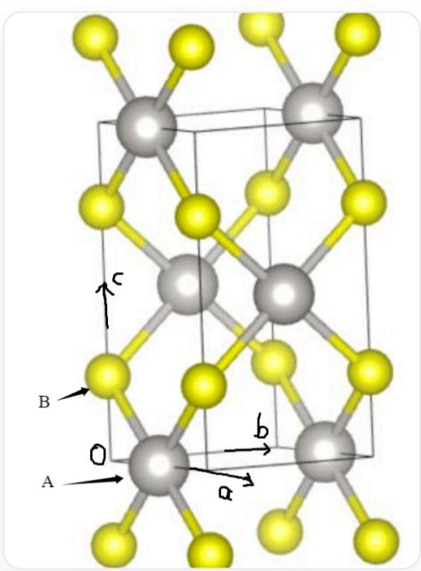

# Question

A crystalline compound with the chemical formula  $\mathbf{AB}$  belongs to the tetragonal crystal system and has a density of  $10.27\mathrm{g/cm^3}$ . Both  $\mathbf{A}$  and  $\mathbf{B}$  are 4-coordinated, and their coordination configurations are different. There is only one type of  $\mathbf{A} - \mathbf{B}$  bond length in the crystal, which is  $231.0~\mathrm{pm}$ . The structure can be regarded as an infinite chain structure of  $\mathbf{AB}_2$ . The chains in the same xy plane are parallel to each other. The chains can be regarded as ribbon-like chains extending in the a or b direction, with a certain width in the c direction. The chains in adjacent xy planes are perpendicular to each other and share vertices. The shortest  $\mathbf{A} - \mathbf{A}$  distance is  $347.0~\mathrm{pm}$ . There are the following statements:

1. The lattice type of the crystal is  $tI$ .  
2. All  $\mathbf{B}$  atoms in the crystal have the same spatial environment.  
3. The fourth-period element in the same group as  $\mathbf{A}$  exists in nature as a simple substance.

Then, all the correct options are:

A. All other options are incorrect  
B. 1  
C. 2  
D. 3  
E. 1,2  
F. 1,3  
G. 2,3

H. 1,2,3

# Answer

Correct Answer: D

# Detailed Explanation

From four coordination, it can be deduced that one atom should be square planar coordinated (forming  $\mathbf{AB}_4$  edge-sharing connections to produce  $\mathbf{AB}_2$ ), and the other atom should be tetrahedral. The unit cell is shown in the figure:

The image shows the unit cell of the compound, which is a tetragonal unit cell. The gray spheres represent  $A$  atoms with atomic coordinates  $(0.5,0,0)$  and  $(0,0.5,0.5)$ . The yellow spheres represent  $B$  atoms with atomic coordinates  $(0,0,0.25)$  and  $(0,0,0.75)$ . In addition, the image also shows parts of  $B$  atoms in the unit cells above and below the current unit cell

From the figure, it is easy to see that the lattice form of the crystal is  $tP$ .

# CHECKPOINT

1 PTS

The crystal lattice form is  $tP$

There are two orientations of  $\mathbf{A}$  atoms around the  $\mathbf{B}$  atom.

# CHECKPOINT

1 PTS

There are two spatial environments for  $\mathbf{B}$  atoms in the crystal

The unit cell parameters can be obtained through calculation:

$$
a = 3 4 7 \mathrm {p m}, c = 6 1 0 \mathrm {p m}
$$

Thus, we have the equation:

$$
\rho = \frac {Z M}{N _ {A} V} = \frac {2 M}{N _ {A} * 3 4 7 * 3 4 7 * 6 1 0 * 1 0 ^ {- 3 0} \mathrm {c m} ^ {3}} = 1 0. 2 7 \mathrm {g / c m ^ {3}}
$$

Solving for  $M = 227.1\mathrm{g / mol}$ , which leads to PtS, A is Pt, belonging to group VIII. The fourth-period elements in the same group are Fe, Co, Ni. Among them, Fe exists as native metal in meteorites in nature.

# CHECKPOINT

1 PTS

The fourth-period element Fe in the same group as A exists as native metal in meteorites in nature

Therefore, choose option D