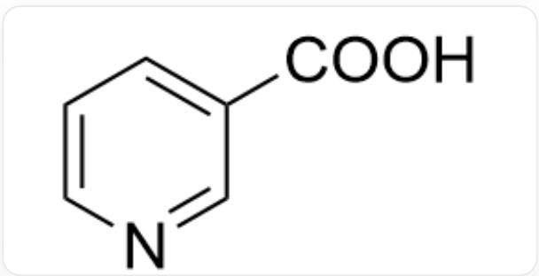
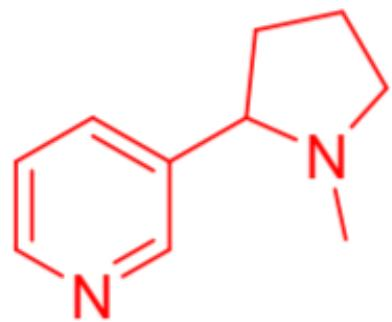
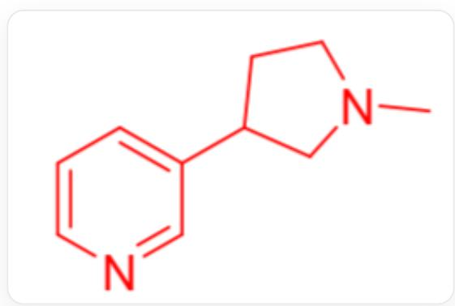

# Question

There is an unknown alkaloid with the chemical formula  $\mathrm{C_{10}H_{14}N_2}$ ; the unknown alkaloid can undergo the following reactions: (1) Heating the alkaloid in concentrated hydrochloric acid to  $200\sim 300^{\circ}\mathrm{C}$  produces  $\mathrm{CH}_3\mathrm{Cl}$ ; (2) Oxidizing the alkaloid with acidic potassium permanganate solution produces the product in Figure 1; (3) Reduction with sufficient hydrogen yields  $\mathrm{C_{10}H_{20}N_2}$ .

  
Fig. 1, the molecule in the figure is described by SMILES as:  $\mathrm{O} = \mathrm{C}\left( {\mathrm{C}1 = \mathrm{{CC}} = \mathrm{{CN}} = \mathrm{C}1}\right) \mathrm{O}$

Based on the above three reactions, what structural characteristics can be deduced for the alkaloid respectively? Further experiments show that the alkaloid has a five-membered ring. Deduce all possible structures of the alkaloid.

Which of the following option is correct:

A. All other options are incorrect  
B. The alkaloid is a secondary amine.  
C. The alkaloid molecule contains a fused ring system of a five-membered ring and a six-membered ring.  
D. This alkaloid has only one nitrogen atom with basicity.  
E. The alkaloid may have three possible structures.

F. In every possible structure of this alkaloid, calculate the shortest number of covalent bonds separating the two nitrogen atoms; then the sum of the shortest number of covalent bonds separating the two nitrogen atoms in these structures is 9.

# Answer

Correct Answer: F

# Detailed Explanation

(1) Hydrolysis with hydrochloric acid at high temperature yields  $\mathrm{CH}_3\mathrm{Cl}$ , this step is the acidolysis of the group connected to the amino group, indicating that the alkaloid amino group is connected to at least one methyl group;

# CHECKPOINT

1 PTS

The alkaloid amino group is connected to at least one methyl group

(2) Oxidation with acidic potassium permanganate can selectively oxidize carbon-containing groups on the pyridine ring, while preserving the pyridine ring structure. The structure in Figure 1 is obtained, indicating that the alkaloid skeleton is a 3-substituted pyridine, and the atom connected to the pyridine is carbon.

# CHECKPOINT

1 PTS

The alkaloid skeleton is a 3-substituted pyridine, and the atom connected to the pyridine is carbon

(3) Reduction with sufficient hydrogen can saturate all unsaturated bonds within the molecule. According to the change in the molecular formula before and after reduction, the number of unsaturated bonds in the molecule can be calculated to be 3, entirely originating from the pyridine ring, indicating that there are no other unsaturated bonds within the molecule that can be reduced by hydrogen. At the same time, based on the carbon-hydrogen ratio of the reduced chemical formula, it can be deduced that the molecule contains two rings.

# CHECKPOINT

1 PTS

There are no other unsaturated bonds within the molecule that can be reduced by hydrogen, contains two rings

Based on the presence of a five-membered ring within the molecule, 5 out of the 10 carbon atoms in the molecule come from the pyridine ring, one from the methyl group on the amino group, and four carbon atoms remain. According to the results of (2), the five-membered ring cannot be a fused ring, it can only be a five-membered heterocycle composed of the remaining four carbons and one amino nitrogen atom. All possible structures of this alkaloid are shown in Figure 2 and Figure 3.

# CHECKPOINT

1 PTS

The five-membered ring within the molecule is a nitrogen-containing five-membered ring

  
Fig. 2, The molecule in the figure is described in SMILES as: CN1CCCCC1C2=CC=CN=C2

# CHECKPOINT

1 PTS

The first possible structure is: CN1CCCCC1C2=CC=CN=C2

  
Fig. 3, The molecule in the figure is described in SMILES as: CN1CCC(C1)C2=CC=CN=C2

# CHECKPOINT

1 PTS

The second possible structure is:  $\mathrm{CN1CCC(C1)C2 = CC = CN = C2}$

This molecule is a tertiary amine, so option B is incorrect. The five-membered ring and the six-membered ring are not fused, so option C is incorrect. Both the pyridine nitrogen atom and the five-membered ring nitrogen atom are basic, so option D is incorrect. There are two possible structures, so option E is incorrect. In the two structures, the shortest number of covalent bonds between the two nitrogen atoms are 4 and 5, respectively, and the sum is 9, so option F is correct.