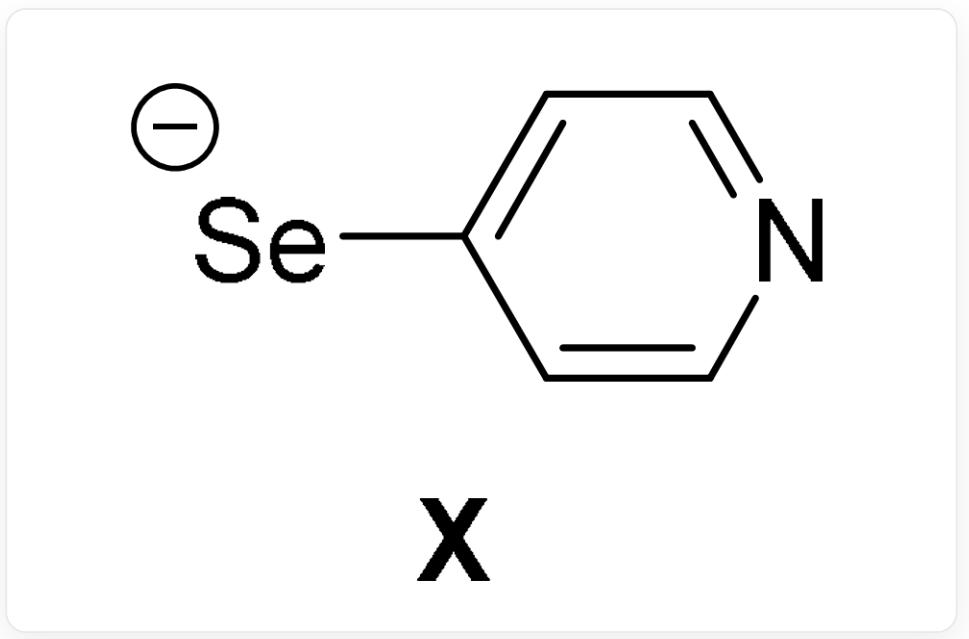
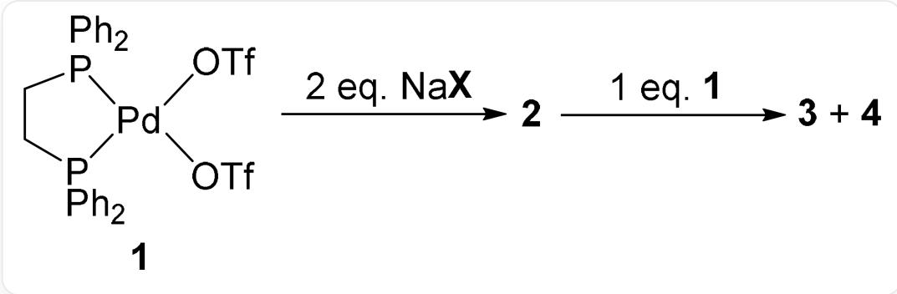
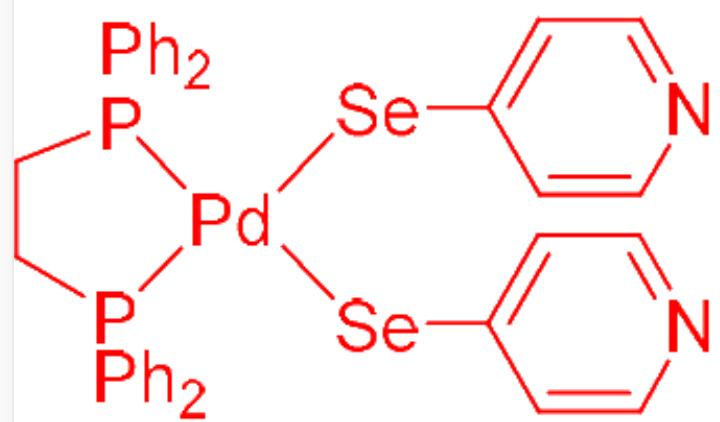
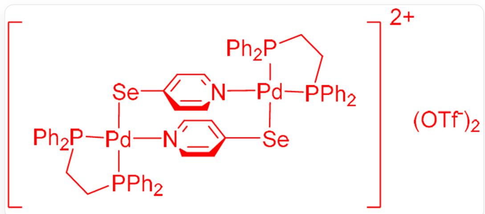
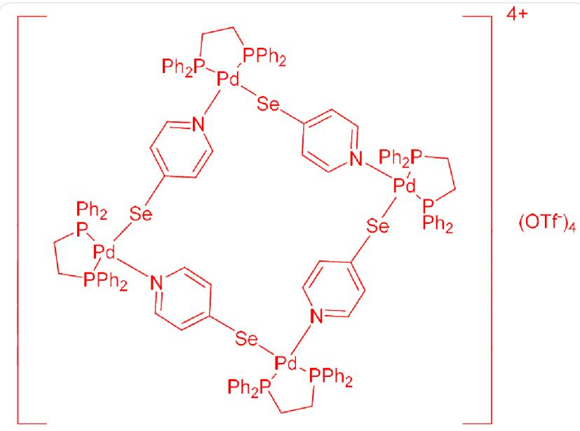

# Question

Ligand  $\mathbf{X}$  can form a series of interesting complexes with  $\mathrm{Pd(II)}$ , and their structures are shown in the figure below:

  
[Se-]C1=CC=NC=C1

The preparation method of this series of complexes is shown below. It is known that 2 is a mononuclear complex, and the molecular weight of 4 is twice that of 3. In 3 and 4, Pd has only one chemical environment and all N atoms participate in coordination.

The figure shows a multi-step reaction: complex 1 reacts with two equivalents of NaX to obtain complex 2; complex 2 then reacts with one equivalent of complex 1 to obtain complex 3 and complex 4. The structure

of 1 is:  $\mathrm{O} = \mathrm{S}(\mathrm{O}[\mathrm{Pd}]\mathrm{l}(\mathrm{OS} (= \mathrm{O})(\mathrm{C}(\mathrm{F})(\mathrm{F}) = \mathrm{O})[\mathrm{P}](\mathrm{C}2 = \mathrm{CC} = \mathrm{CC} = \mathrm{C}2)$

$(C3 = CC = CC = C3)CC[P]1(C4 = CC = CC = C4)C5 = CC = CC = C5)(C(F)(F)F) = O$

Which of the following statements are correct:

1. 2 contains Pd—N coordination bonds  
2. The cation of 3 has a center of symmetry  
3. The cation of 3 has a mirror plane passing through all Pd atoms  
4. The ratio of cations to anions in 4 is 6:1  
5. The cation of 4 has the same symmetry as  $\mathrm{Re}_2\mathrm{Cl}_8^{2-}$  
6. The cation of 4 has the same symmetry as benzene

A. 1,2,3,4  
B. 1,2,4  
C. 1,2,3

D. 1,2  
E. 2,3  
F. 2,5  
G. 2,3,6  
H. 2,3,5  
1. 2,4  
J. 2  
K. All of the above options are incorrect or the answer is incomplete.

# Answer

Correct Answer: J

# Detailed Explanation

Complex 1 undergoes a ligand substitution reaction with two equivalents of  $\mathrm{NaX}$  to generate 2 and two equivalents of  $\mathrm{NaOTf}$ . According to the hard-soft acid-base theory,  $\mathrm{Pd(II)}$  is a cation with a large high-cycle radius, which is relatively soft. At the same time, the negative charge is concentrated on the Se atom, which is more likely to form a coordination bond with the Se atom.

# CHECKPOINT

1 PTS

Therefore,  $Pd$  should bond to  $Se$  rather than  $N$

Therefore, there is no Pd—N coordination bond in 2. The structure of 2 is shown in the figure below:

$$
C 1 ([ S e ]) [ P d ] 2 ([ P ]) (C C [ P ] 2 (C 3 = C C = C C = C 3) C 4 = C C = C C = C 4) (C 5 = C C = C C = C 5) C 6 = C C = C C = C 6)
$$

$$
[ S e ] C 7 = C C = N C = C 7) = C C = N C = C 1
$$

Since Pd is in a planar square coordination, the bond angle is 90 degrees, and it can form dimers and tetramers, but it is difficult to form trimers, hexamers, etc. with bond angles of 60 degrees or 120 degrees. 3 is obtained by reacting 2 with one equivalent of complex 1. Since the molecular weight of 4 is twice that of 3, it is speculated that 3 is a dimer and 4 is a tetramer. Since Pd in 3 and 4 has only one chemical environment and all N atoms are involved in coordination,

# CHECKPOINT

1 PTS

All ligands  $\mathbf{X}$  act as bidentate ligands

, forming a cyclic structure. Therefore, the structure of 3 is as follows:

  
阳离子带两个正电荷，结构为：C1([P]2(CC[P](C3=CC=CC=C3)([Pd]24[N]5=CC=C([Se][Pd]6([P  
(C7=CC=CC=C7)(CC[P]6(C8=CC=CC=C8)C9=CC=CC=C9)C%10=CC=C%10)  
[N]%11=CC=C([Se]4)C=C%11)C=C5)C%12=CC=CC=C%12)C%13=CC=CC=C%13)=CC=CC=C1；阴离子为两  
个  $\mathrm{TfO}^{-}$

So the cation of 3 has a center of symmetry.

The structure of tetramer 4 is as follows:

阳离子带四个正电荷，结构为：[N]1([Pd]2([Se]3)[P](CC[P](C4=CC=CC=C4)2C5=CC=CC=C5)

$$
(C6 = CC = CC = C6)C7 = CC = CC = C7) = CC = C([Se][Pd]8([N](C = C9) = CC = C9[Se][Pd]%10([N]%11 = CC = C([Se]
$$

$$
\left[ \mathrm {P d} \right] \% 12 ([ \mathrm {N} ] \% 13 = \mathrm {C C} = \mathrm {C 3 C} = \mathrm {C} \% 13) [ \mathrm {P} ] (\mathrm {C C} [ \mathrm {P} ] (\mathrm {C} \% 14 = \mathrm {C C} = \mathrm {C C} = \mathrm {C} \% 14) \% 12 \mathrm {C} \% 15 = \mathrm {C C} = \mathrm {C C} = \mathrm {C} \% 15)
$$

$$
(C \% 16 = C C = C C = C \% 16) C \% 17 = C C = C C = C \% 17) C = C \% 11) [ P ] (C C [ P ]
$$

$$
(C \% 18 = C C = C C = C \% 18) \% 10C \% 19 = C C = C C = C \% 19)(C \% 20 = C C = C C = C \% 20)C \% 21 = C C = C C = C \% 21)[P]
$$

$$
(C \% 22 = C C = C C = C \% 22)(C \% 23 = C C = C C = C \% 23) C C [ P ] (C \% 24 = C C = C C = C \% 24) 8 C \% 25 = C C = C C = C \% 25) C = C 1 ;
$$

阴离子为四个  $\mathrm{TfO}^{-}$

# CHECKPOINT

1 PTS

The cation-anion ratio in 4 is 1:4

The point group of  $\mathrm{Re}_2\mathrm{Cl}_8^{2-}$  is  $\mathrm{D}_{4\mathrm{h}}$ , but as shown in the figure, due to the symmetry restriction of ligand  $\mathbf{X}$ , there is no  $\mathrm{C}_2$  axis that bisects the secondary axes perpendicularly to the principal axis.

# CHECKPOINT

1 PTS

The symmetry of the cation of 4 is different from that of  $\mathrm{Re}_2\mathrm{Cl}_8^{2-}$

The cation of 4 obviously does not have a six-fold rotation axis.

# CHECKPOINT

1 PTS

The symmetry of the cation of 4 is different from that of benzene

So the correct answer is J.