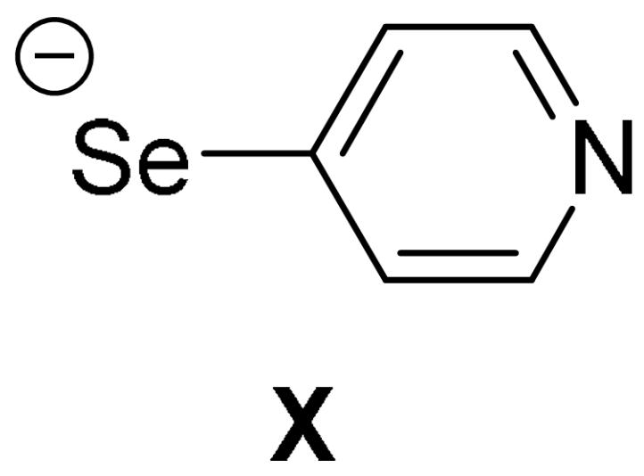
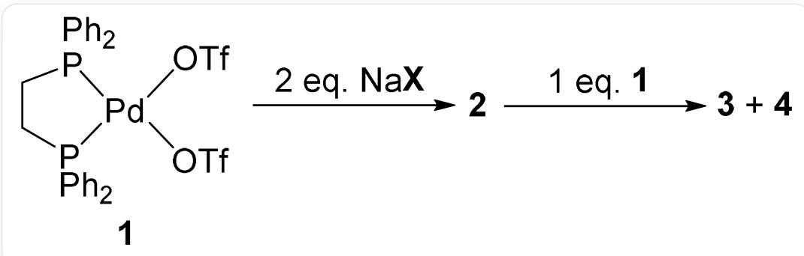
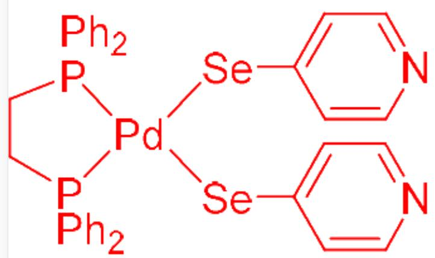
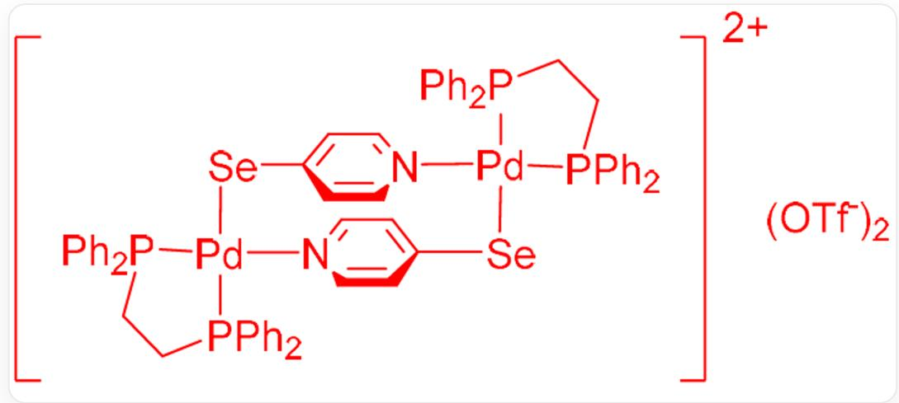

# 题目

配体 X 可以和 Pd(II) 形成一系列有趣的配合物, 其结构如下图所示:

  
[Se-]C1=CC=NC=C1

该系列配合物的制备方法如下所示，已知2为单核配合物，4的分子量是3的两倍。3和4中Pd只具有一种化学环境且所有N原子均参与配位。

  
图中为多步反应：配合物 1 与两当量  $\mathrm{NaX}$  反应得到配合物 2；配合物 2 再与一当量配合物 1 反应可以

得到配合物3和配合物4。1的结构为：  $O = S(O[Pd]1(OS(= O)(C(F)(F)F) = O)[P](C2 = CC = CC = C2)$

$(C3 = CC = CC = C3)CC[P]1(C4 = CC = CC = C4)C5 = CC = CC = C5)(C(F)(F)F) = O$  。

下列说法正确的有：

1.2 中存在 Pd—N 配位键  
2.3 的阳离子具有对称中心  
3.4 中阴阳离子数量比为6：1  
4.4 的阳离子对称性与  $\mathrm{Re}_2\mathrm{Cl}_8^{2-}$  相同  
5.4 的阳离子对称性与苯相同

A. 1,2,3,4  
B. 1,2,4  
C. 1,2,3  
D. 1,2

E. 2,3  
F. 2,5  
G. 2,3,6  
H. 2,3,5  
1. 2,4

J. 2  
K. 以上选项均不正确或答案不完全

# 答案

正确答案: J

# 详细解析

配合物1与两当量NaX发生配体取代反应，生成2和两当量NaOTf。根据软硬酸碱理论，Pd(II)为高周期半径大的阳离子，比较软，同时负电荷集中在Se原子上，更易与Se原子形成配位键，

# CHECKPOINT

1 PTS

因此  $Pd$  应与  $Se$  而非  $N$  成键

因此2中不存在Pd—N配位键。2的结构如下图所示：

$$
C 1 ([ S e ] [ P d ] 2 ([ P ] (C C [ P ] 2 (C 3 = C C = C C = C 3) C 4 = C C = C C = C 4) (C 5 = C C = C C = C 5) C 6 = C C = C C = C 6)
$$

$$
[ \mathrm {S e} ] \mathrm {C 7} = \mathrm {C C} = \mathrm {N C} = \mathrm {C 7}) = \mathrm {C C} = \mathrm {N C} = \mathrm {C 1}
$$

由于 Pd 为平面四方配位，键角为90度，可以形成二聚物与四聚物，而难以形成键角为60度或120度的三聚物、六聚物等。而 3 是由 2 再与一当量配合物 1 反应，由于 4 的分子量是 3 的两倍，猜测 3 为二聚物，4 为四聚物。由于 3 和 4 中 Pd 只具有一种化学环境且所有 N 原子均参与配位，

# CHECKPOINT

1 PTS

所有配体 X 充当双齿配体

，形成环状结构。因此3结构如下：

  
阳离子带两个正电荷，结构为：C1([P]2(CC[P](C3=CC=CC=C3)([Pd]24[N]5=CC=C([Se][Pd]6([P  
(C7=CC=CC=C7)(CC[P]6(C8=CC=CC=C8)C9=CC=CC=C9)C%10=CC=CC=C%10)  
[N]%11=CC=C([Se]4)C=C%11)C=C5)C%12=CC=CC=C%12)C%13=CC=CC=C%13)=CC=CC=C1；阴离子为两  
个  $\mathrm{TfO}^{-}$

所以3的阳离子具有对称中心

四聚体4结构如下：

阳离子带四个正电荷，结构为：[N]1([Pd]2([Se]3)[P](CC[P](C4=CC=CC=C4)2C5=CC=CC=C5)

$$
(C6 = CC = CC = C6)C7 = CC = CC = C7) = CC = C([Se][Pd]8([N](C = C9) = CC = C9[Se][Pd]%10([N]%11 = CC = C([Se]
$$

$$
\left[ \mathrm {P d} \right] \% 12 ([ \mathrm {N} ] \% 13 = \mathrm {C C} = \mathrm {C 3 C} = \mathrm {C} \% 13) [ \mathrm {P} ] (\mathrm {C C} [ \mathrm {P} ] (\mathrm {C} \% 14 = \mathrm {C C} = \mathrm {C C} = \mathrm {C} \% 14) \% 12 \mathrm {C} \% 15 = \mathrm {C C} = \mathrm {C C} = \mathrm {C} \% 15)
$$

$$
(C \% 16 = C C = C C = C \% 16) C \% 17 = C C = C C = C \% 17) C = C \% 11) [ P ] (C C [ P ]
$$

$$
(C \% 18 = C C = C C = C \% 18) \% 10C \% 19 = C C = C C = C \% 19)(C \% 20 = C C = C C = C \% 20)C \% 21 = C C = C C = C \% 21)[P]
$$

$$
(C \% 22 = C C = C C = C \% 22)(C \% 23 = C C = C \% 23) C C [ P ] (C \% 24 = C C = C C = C \% 24) 8 C \% 25 = C C = C C = C \% 25) C = C 1;
$$

阴离子为四个  $\mathrm{TfO}^{-}$

# CHECKPOINT

1 PTS

4中阴阳离子数量比为4：1

$\mathrm{Re}_2\mathrm{Cl}_8^{2-}$  的点群为  $\mathrm{D}_{4\mathrm{h}}$  ，而如图由于配体  $\mathbf{X}$  的对称性限制，不存在垂直主轴平分副轴的  $\mathrm{C}_2$  轴，

# CHECKPOINT

1 PTS

4 的阳离子对称性与  $\mathrm{Re}_2\mathrm{Cl}_8^{2-}$  不同

4 的阳离子显然没有六次旋转轴

# CHECKPOINT

1 PTS

4 的阳离子对称性与苯不同

所以正确答案为J。