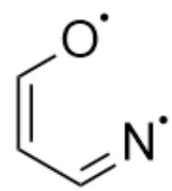
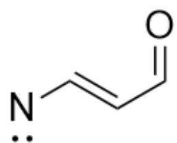

# Question

Isoxazole can isomerize to oxazole under light irradiation. The mechanism of this process is as follows:

Isoxazole C1=CC=NO1 is first converted to X1 under light irradiation, then to X2, then to X3, and finally to oxazole C1=CN=CO1

Where X2 contains a high-strain ring system.

The following statements are made:

1. X1 does not have a conjugated system.  
2. X2 does not have a conjugated system.  
3. X3 has a charge-separated structure.  
4. The carbon atom bonded to the nitrogen atom in oxazole is carbon atoms 3 and 4 in isoxazole.

Which of the following options contains the most correct statements?

A. 1  
B. 2  
C. 3

D. 4  
E. 1,2  
F. 1,3  
G. 1,4  
H. 2,3  
1. 2,4  
J. 1,2,3  
K. 1,2,4  
L. 2,3,4

# Answer

Correct Answer: L

# Detailed Explanation

Under illumination conditions, isoxazole molecules absorb energy and transition to an excited state. The weakest bond in the molecule is the  $\mathrm{N} - \mathrm{O}$  bond, which undergoes homolytic cleavage, leading to ring opening to yield  $\mathbf{X1}$ :  $[\mathrm{N}] = \mathrm{C} / \mathrm{C} = \mathrm{C} \backslash [\mathrm{O}]$ , where the nitrogen and oxygen atoms each carry a single electron; or  $[\mathrm{N}] / \mathrm{C} = \mathrm{C} / \mathrm{C} = \mathrm{O}$ , which contains a nitrene. Both of these structures have conjugated systems.

The left side shows the structure of the diradical,  $[N] = C / C = C\backslash [O]$ , where the nitrogen and oxygen atoms each carry a single electron; the right side shows the structure of the nitrene,  $[N] / C = C / C = O$

# CHECKPOINT

1 PTS

All possible structures of  $\mathbf{X1}$  have conjugated systems, statement 1 is incorrect

X1 is unstable and will rapidly undergo intramolecular cyclization. The nitrogen atom on the nitrene will attack the other carbon atom of the double bond to which it is attached, forming a three-membered ring. This three-membered ring intermediate is X2: O=CC1C=N1, which does not have a conjugated system.

# CHECKPOINT

1 PTS

The structure of  $\mathbf{X2}$  is  $\mathrm{O = CC1C = N1}$ , which does not have a conjugated system, statement 2 is correct.

The strained three-membered ring intermediate X2 will open again to release strain. This time, the weakest C - C single bond on the ring breaks, and the lone pair of electrons on the nitrogen atom participates in the formation of a new double bond, generating X3: C#[N+]/C=C\O-], which has a charge-separated structure.

# CHECKPOINT

1 PTS

The structure of X3 is C#[N+]/C=C\[O-], which has a charge-separated structure, statement 3 is correct

During the isomerization process, the nitrogen atom forms a bond with the original carbon atom at position 4 when X2 is formed, and the bonding atoms do not change again during the subsequent transformation. Therefore, the nitrogen atom in oxazole forms a bond with the carbon atoms at positions 3 and 4 in the original isoxazole.

# CHECKPOINT

1 PTS

The nitrogen atom forms a bond with the original carbon atom at position 4 when X2 is formed, and the nitrogen atom in oxazole forms a bond with the carbon atoms at positions 3 and 4 in the original isoxazole, statement 4 is correct

Select option L