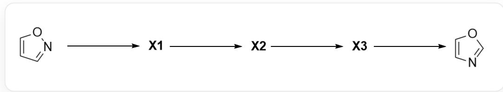
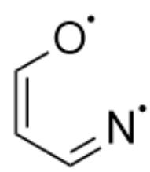
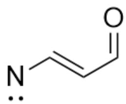

# 题目

异恶唑在光照条件下可异构为恶唑，这一过程机理如下：

异恶唑C1=CC=NO1在光照下首先转化为X1，随后转化为X2，接着转化为X3，最后转化为恶唑 C1=CN=CO1

其中X2含有高张力的环系

有以下说法：

1. X1中不具有共轭体系  
2. X2中不具有共轭体系  
3. X3中具有电荷分离的结构  
4.恶唑中氮原子所连的碳原子为异恶唑中的3号和4号碳原子

以下选项中含有最多正确说法的是：

A. 1  
B. 2  
C. 3

D. 4  
E. 1,2  
F. 1,3  
G. 1,4  
H. 2,3  
1. 2,4  
J. 1,2,3  
K. 1,2,4  
L. 2,3,4

# 答案

正确答案: L

# 详细解析

在光照条件下，异恶唑分子吸收能量跃迁到激发态。分子中最弱的键是N-O键，它会发生均裂，导致开环得到X1：[N]=C/C=C[O]，其中氮原子与氧原子分别带有一个单电子；或[N]/C=C/C=O，其中含有氮宾。这两种结构均具有共轭体系。

左侧展示出双自由基的结构，[N]=C/C=C\O]，其中氮原子与氧原子分别带有一个单电子；右侧展示出氮宾的结构，[N]/C=C/C=O

# CHECKPOINT

1 PTS

X1的可能结构均具有共轭体系，说法1错误

X1是不稳定的，会迅速发生分子内环化。氮宾上的氮原子会进攻其所连接的双键的另一个碳原子，形成一个三元环。这个三元环中间体是X2：O=CC1C=N1，不具有共轭体系。

# CHECKPOINT

1 PTS

X2的结构为O=CC1C=N1，不具有共轭体系，说法2正确

张力的三元环中间体X2会再次开环以释放张力。这次是环上最弱的C-C单键断裂，同时氮原子上的孤对电子参与形成新的双键，生成X3：C#[N+]/C=C\[O-]，具有电荷分离的结构

# CHECKPOINT

1 PTS

X3的结构为C#[N+]/C=C\[O-]，具有电荷分离的结构，说法3正确

在异构过程中，形成X2时氮原子与原4号位碳原子成键，随后转化中成键原子未再发生改变，因此恶唑中氮原子与原异恶唑中3、4号位碳原子成键。

# CHECKPOINT

1 PTS

形成X2时氮原子与原4号位碳原子成键，恶唑中氮原子与原异恶唑中3、4号位碳原子成键，说法4正确

选择选项L