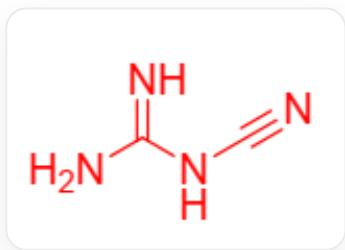
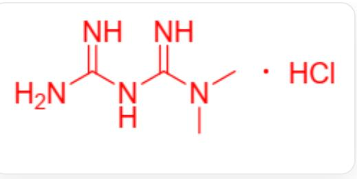

# Question

Calcium carbide reacts with  $\mathrm{N}_2$  at high temperatures to yield compound A. Hydrolysis of A produces an important pesticide intermediate B. Under alkaline conditions, B polymerizes to form dimer C. Heating C with dimethylamine hydrochloride and recrystallization yields D. Reaction of B with sodium cyanide and chlorine under alkaline conditions gives the sodium salt E. Researchers reacted  $0.15\mathrm{g}\mathrm{Cu}(\mathrm{NO}_3)_2\cdot 6\mathrm{H}_2\mathrm{O}$ ,  $1.07\mathrm{g}\mathbf{E}$ , and  $0.52\mathrm{g}$  N,N-dimethylethylenediamine in an aqueous solution to obtain a dinuclear copper complex F, with an experimentally determined copper mass fraction of  $22.55\%$ . X-ray diffraction data reveal that ligand E in F exhibits two distinct configurations—monodentate coordination and bridging coordination—in a 1:1 ratio, with both configurations utilizing the same coordinating atom.

In the molecular structure of  $\mathbf{F}$ , how many bonds separate the two farthest N atoms along the shortest path?

A. 2  
B. 4  
C. 6  
D. 7  
E. 8  
F. 9  
G. 10  
H. 11  
1. 12

J. 13  
K. 14  
L. 15  
M. 16  
N. 17  
O. 18  
P. 19

# Answer

Correct Answer: M

# Detailed Explanation

Based on the properties and reactions, it is inferred that:

A:Ca(NCN),  
B:  $\mathrm{H}_2\mathrm{NCN}$  
$\mathbf{E}:\mathrm{Na}\left[\mathrm{N}(\mathrm{CN})_{2}\right].$

# CHECKPOINT

1 PTS

E:Na[N(CN)2]

and  $\mathbf{C}$  ..

C(\N)NC(=N)N

D:

  
CN(C)C(=N)NC(=N)N.CI

The anion of  $\mathbf{E}$  is abbreviated as dca, and N,N-dimethylethylenediamine is abbreviated as dmen.

The molar ratio is calculated as  $\mathrm{Cu}:\mathrm{dca}:\mathrm{dmen} = 1:2:1$

# CHECKPOINT

1 PTS

1:2:1

Based on the mass fraction of copper, it is determined that  $\mathbf{F}$  contains no water of crystallization,

# CHECKPOINT

1 PTS

no water of crystallization

hence the chemical formula of  $\mathbf{F}$  can be inferred as  $\mathrm{Cu}[\mathrm{N}(\mathrm{CN})_2]_2\left(\mathrm{C}_4\mathrm{H}_{12}\mathrm{N}_2\right)$

# CHECKPOINT

2 PTS

$\mathrm{Cu}[\mathrm{N}(\mathrm{CN})_2]_2(\mathrm{C}_4\mathrm{H}_{12}\mathrm{N}_2)$

$\mathbf{F}$  is a dimer, containing monodentate terminal and bridging  $\left[\mathrm{N}(\mathrm{CN})_{2}\right]^{-}$  ligands. The two farthest N atoms originate from the two most distant N atoms on the monodentate ligands of the two Cu atoms.

The shortest path between the two farthest atoms is:

$$
N - C - N - C - N - C u - N - C - N - C - N - C u - N - C - N - C - N
$$

# CHECKPOINT

2 PTS

The farthest path is  $N - C - N - C - N - Cu - N - C - N - C - N - Cu - N - C - N - C - N$

There are 17 atoms along this path, hence 16 bonds.

# CHECKPOINT

1 PTS

The farthest distance is 16 bonds