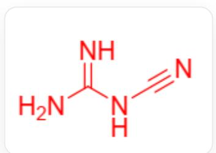
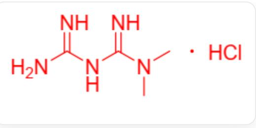

# 题目

电石高温下与  $\mathrm{N}_2$  反应得到化合物A，由A水解得到一种重要的农药中间体B，B在碱性条件下发生聚合得到二聚体C。C与盐酸二甲胺加热反应，重结晶后得到D。B与氰化钠、氯气在碱性条件下反应可得到钠盐E。研究者将  $0.15\mathrm{g}\mathrm{Cu}(\mathrm{NO}_3)_2\cdot 6\mathrm{H}_2\mathrm{O}$ ， $1.07\mathrm{g}$  E和  $0.52\mathrm{g}$  N,N-二甲基乙二胺在水溶液中反应，得到一种双核铜配合物F，实验测得其中Cu的质量分数为  $22.55\%$  。晶体衍射数据表明，F中配体E存在两种不同的构型，分别对应于单齿配位和桥连配位，其数目比为  $1:1$  ，两种构型的配体使用相同的配位原子。

在  $\mathbf{F}$  的分子中，最短路径上距离最远的两个N原子相距多少根键？

A. 2  
B. 4  
C. 6  
D. 7  
E. 8  
F. 9  
G. 10  
H. 11  
1. 12

J. 13  
K. 14  
L. 15  
M. 16  
N. 17  
O. 18  
P. 19

# 答案

正确答案: M

# 详细解析

由性质和反应推断出

A:Ca(NCN),  
B:  $\mathrm{H}_2\mathrm{NCN}$  
$\mathbf{E}:\mathrm{Na}\left[\mathrm{N}(\mathrm{CN})_{2}\right]_{\circ}$

# CHECKPOINT

1 PTS

E:Na[N(CN)2]

以及  $\mathbf{C}$  ：

C(N)NC(=N)N

D:

  
CN(C)C(=N)NC(=N)N.CI

将  $\mathbf{E}$  的阴离子简写作dca，N,N-二甲基乙二胺简写作dmen,

计算摩尔比为  $\mathrm{Cu}:\mathrm{dca}:\mathrm{dmen} = 1:2:1$

# CHECKPOINT

1 PTS

1:2:1

根据铜的质量分数确定  $\mathbf{F}$  中不含结晶水，

# CHECKPOINT

1 PTS

不含结晶水

因此可推断出  $\mathbf{F}$  的化学式为  $\mathrm{Cu}[\mathrm{N}(\mathrm{CN})_2]_2\left(\mathrm{C}_4\mathrm{H}_{12}\mathrm{N}_2\right)$

# CHECKPOINT

2 PTS

$$
\mathrm {C u} [ \mathrm {N} (\mathrm {C N}) _ {2} ] _ {2} \left(\mathrm {C} _ {4} \mathrm {H} _ {1 2} \mathrm {N} _ {2}\right)
$$

$\mathbf{F}$  为二聚体，含有单齿端基和桥连的  $[\mathrm{N}(\mathrm{CN})_2]^{-}$ ，距离最远的两个N原子来自两个Cu原子的单齿配体上的两个最远端N。

距離離最遠遠的兩個N線原子之間的最短路徑徑為 ：

$N - C - N - C - N - Cu - N - C - N - C - N - Cu - N - C - N - C - N$

# CHECKPOINT

# 2 PTS

距离最远的路径为  $N - C - N - C - N - Cu - N - C - N - C - N - Cu - N - C - N - C - N$

该路径上有17个原子，因此有16根键

# CHECKPOINT

# 1 PTS

最远距离为16根键