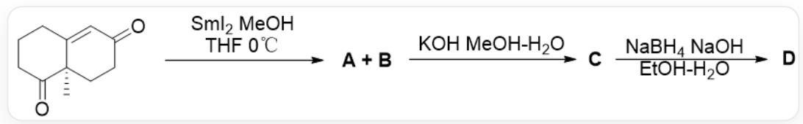
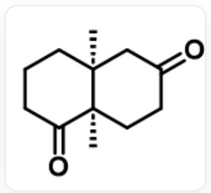
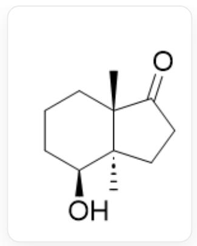
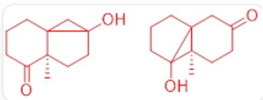
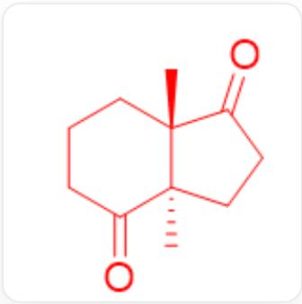
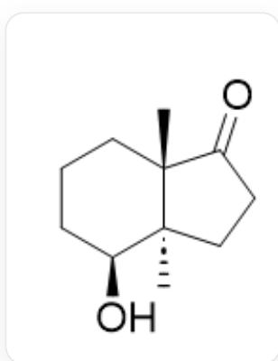

# Question

Observe the following reaction:

$\mathrm{O = C([C@]1(C)CC2)CCC}1 = \mathrm{CC2 = O}$  and Sml2 react in THF/MeOH solvent at  $0^{\circ}\mathrm{C}$  to obtain A and B, both of which can be converted to C under KOH, MeOH/H2O conditions. C can be converted to D under NaBH4, NaOH, EtOH/H2O conditions.

It is known that both  $\mathbf{A}$  and  $\mathbf{B}$  can be converted to compound  $\mathbf{C}$ , and that both  $\mathbf{A}$  and  $\mathbf{B}$  as reaction substrates can yield  $\mathbf{C}$  with similar yields. Both products  $\mathbf{A}$  and  $\mathbf{B}$  contain a three-membered ring. In the  ${}^{1}\mathrm{H}$  NMR spectrum of  $\mathbf{C}$ , there are two peaks whose integral area corresponds to  $3H$ .

Which of the following statements is correct:

1. A and B cannot be converted to each other in the presence of KOH  
2. The structure of  $\mathbf{C}$  is shown in the figure

$$
\mathrm {O} = \mathrm {C} 1 \mathrm {C C C} [ \mathrm {C} @ ] 2 (\mathrm {C}) [ \mathrm {C} @ @ ] 1 (\mathrm {C}) \mathrm {C C C} (\mathrm {C} 2) = \mathrm {O}
$$

3. Given that  $\mathbf{D}$  has one ketone carbonyl group, then the structure of  $\mathbf{D}$  should be as shown in the figure

  
C[C@@]12[C@@](CCC2=O)(C)[C@@H](O)CCC1

4. The reason why only one carbonyl group can be selectively reduced from C to D is that there is a difference in steric hindrance around the two carbonyl groups.

A. All other options are incorrect  
B. 2.4.  
C. 1.3.  
D. 1.2.4.  
E. 3.4.  
F. 2.3.4.  
G. 3.

# Answer

Correct Answer: G

# Detailed Explanation

It is known that both  $\mathbf{A}$  and  $\mathbf{B}$  can be converted into compound  $\mathbf{C}$ , and whether  $\mathbf{A}$  or  $\mathbf{B}$  is used as the reaction substrate,  $\mathbf{C}$  can be obtained with similar yields, indicating that  $\mathbf{A}$  and  $\mathbf{B}$  can be interconverted in the presence of KOH. 1 Incorrect

# CHECKPOINT

1 PTS

A and B can be interconverted in the presence of KOH

Therefore, its structure can be deduced:

  
O=C1CCCCC23[C@@]1(C)CCC(O)2C3 OC12CCCCC31[C@@]2(C)CCC(C3)=O

# CHECKPOINT

2 PTS

The structure of  $\mathbf{A}$  is  $O = C1CCCC23[C@@]1(C)CCC(O)2C3$ , and the structure of  $\mathbf{B}$  is OC12CCCC31[C@@]2(C)CCC(C3)=O

The former can undergo ring-opening to obtain the hexafused-pentacyclic structure C. Contains two methyl groups. 2 Incorrect

C[C@@]12[C@@](CCC2=O)(C)C(CCC1)=O

# CHECKPOINT

1 PTS

The structure of  $\mathbf{C}$  is  $\mathrm{C}[\mathrm{C}@\mathrm{C}]12[\mathrm{C}@\mathrm{C}](\mathrm{CC} \mathrm{C}2 = \mathrm{O})(\mathrm{C})\mathrm{C}(\mathrm{CC} \mathrm{C}1) = \mathrm{O}$

The hexacyclic carbonyl group is reduced more quickly because it experiences less torsional strain during the reduction process, yielding  $\mathbf{D}$

C[C@@]12[C@@](CCC2=O)(C)[C@@H](O)CCC1

# CHECKPOINT

1 PTS

The hexacyclic carbonyl group is reduced more quickly because it experiences less torsional strain during the reduction process

# CHECKPOINT

1 PTS

The structure of  $\mathbf{D}$  is  $\mathrm{C}[\mathrm{C}@\mathrm{@}]12[\mathrm{C}@\mathrm{]}(\mathrm{CCC2} = \mathrm{O})(\mathrm{C})[\mathrm{C}@\mathrm{@H}](\mathrm{O})\mathrm{CCC1}$

3 Correct, 4 Incorrect.

G is correct.