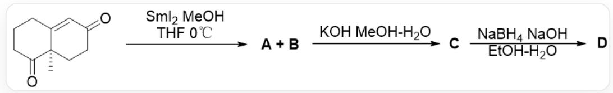
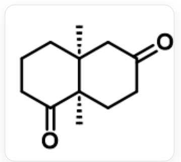
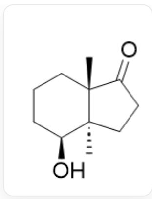
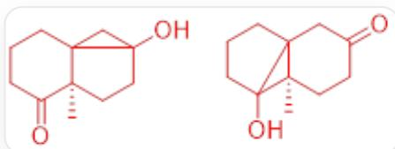
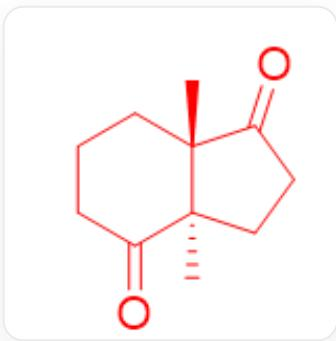
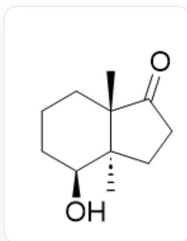

# 题目

观察下面的反应：

O=C([C@]1(C)CC2)CCCC1=CC2=O和Sml2在THF/MeOH溶剂中于0°C下反应得到A和B，它们都可以在 KOH，MeOH/H2O的条件下转化为C. C可以在NaBH4, NaOH, EtOH/H2O的条件下转化为D。

已知  $\mathbf{A}$  和  $\mathbf{B}$  都可以转化为化合物  $\mathbf{C}$ , 且无论是  $\mathbf{A}$  还是  $\mathbf{B}$  作为反应底物时都可以以相近的产率得到  $\mathbf{C}$  。  $\mathbf{A}$  和  $\mathbf{B}$  两种产物都含有三元环。  $\mathbf{C}$  的核磁共振氢谱中存在两个峰的积分面积对应为  $3 H$  。

下面的说法中正确的是：

1. 在KOH的存在下A和B无法互相转化  
2. C的结构如图所示

$\mathrm{O = C1CCC[C@]2(C)[C@@]1(C)CCC(C2) = O}$

3. 已知  $\mathbf{D}$  中有一个酮羰基, 那么  $\mathbf{D}$  的结构应该如图所示

C[C@@]12[C@@](CCC2=O)(C)[C@@H](O)CCC1

4. C到D中能选择性只还原一个羰基的原因是两个羰基周围的空间位阻存在区别。

A. 其他选项均不正确  
B. 2.4.  
C. 1.3.  
D. 1.2.4.  
E. 3.4.  
F. 2.3.4.  
G. 3.

# 答案

正确答案: G

# 详细解析

已知A和B都可以转化为化合物C，且无论是A还是B作为反应底物时都可以以相近的产率得到C说明在KOH的存在下A和B可以互相转化。1错误

CHECKPOINT

1 PTS

在KOH的存在下  $\mathbf{A}$  和  $\mathbf{B}$  可以互相转化

因此，可以推出其结构：

O=C1CCCCC23[C@@]1(C)CCC(O)2C3 OC12CCCC31[C@@]2(C)CCC(C3)=O

CHECKPOINT

2 PTS

A 的结构为  $\mathrm{O} = \mathrm{C}1\mathrm{C}\mathrm{C}\mathrm{C}\mathrm{C}23[\mathrm{C}@\mathbb{a}]1(\mathrm{C})\mathrm{C}\mathrm{C}\mathrm{C}(\mathrm{O})2\mathrm{C}3$ ，B 的结构构为 OC12CCCC31[C@@]2(C)CCC(C3)=O

前者可以开环得到六并五结构的C。含有两个甲基。2错误

C[C@@]12[C@@](CCC2=O)(C)C(CCC1)=O

# CHECKPOINT

1 PTS

C的结构为C[C@@]12[C@](CCC2=O)(C)C(CCC1)=O

六元环羰基因为在还原过程中受到的扭转张力更小，能更快地被还原，得到D

C[C@@]12[C@@](CCC2=O)(C)[C@@H](O)CCC1

# CHECKPOINT

1 PTS

六元环羰基因为在还原过程中受到的扭转张力更小，能更快地被还原

# CHECKPOINT

1 PTS

D的结构为C[C@@]12[C@](CCC2=O)(C)[C@@H](O)CCC1

3正确，4错误。

G是正确的。