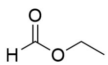
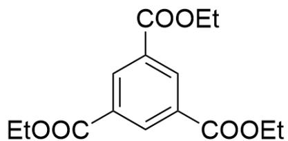

# Question

Ester compounds A and B undergo a condensation reaction in a solution of sodium ethoxide in ethanol. After the reaction, the mixture is treated with water, and one of the products is C; the spectroscopic analysis results are shown in the table below:

<table><tr><td>Compound</td><td>1H-NMR(δ, ppm)</td></tr><tr><td>A</td><td>8.03(1H,s), 4.22(2H,q), 1.29(3H,t)</td></tr><tr><td>B</td><td>4.12(2H,q), 2.04(3H,s), 1.26(3H,t)</td></tr><tr><td>C</td><td>8.82(3H,s), 4.42(6H,q), 1.41(9H,t)</td></tr></table>

Which of the following statements is correct:

A. All other options are incorrect  
B. B Acid hydrolysis produces gas  
C. A, B, C The hydrolysis products under acidic conditions are completely different.  
D. A, B, C all belong to the  $C$  point group  
E. C is capable of self-condensation.  
F. A, B The product of a single condensation reaction occurring between them is only one type.

# Answer

Correct Answer: F

# Detailed Explanation

Analyze the proton NMR spectrum:

Since they are all ester compounds, the alcohol before condensation has at least one methyl group; therefore, for A, B, C, their 3H, t peaks are all methyl peaks, and the high-field 2H, q peak is methylene, suggesting that these five hydrogens constitute an ethyl group, so A, B, C all produce ethanol after hydrolysis. Option C is incorrect.

# CHECKPOINT

1 PTS

3H, t peaks are all methyl peaks, and the high-field 2H, q peak is methylene, constituting an ethyl group

# CHECKPOINT

1 PTS

A,B,C all produce ethanol after hydrolysis

Observing the proton NMR spectrum of C, it has a low-field peak, which can be speculated to be aromatic hydrogen. C has three ethyl groups, which can be speculated to be three ethyl ester groups and three aromatic hydrogens, so C contains a benzene ring; since the chemical shifts of the aromatic hydrogens are the same, their chemical environments are also the same, C is actually meta-tris(ethyl ester)benzene, with the structure of;  $\mathrm{O = C(C1 = CC(C(OCC) = O) = CC(C(OCC) = O) = C1)OCC}$

# CHECKPOINT

1 PTS

C

is actually

meta-tris(ethyl

ester)benzene,

with

the

structure

of

：

$$
O = C (C 1 = C C (C (O C C) = O) = C C (C (O C C) = O) = C 1) O C C
$$

A contains only one low-field hydrogen, which is unlikely to be aromatic hydrogen, considering it to be aldehyde hydrogen; therefore, A is ethyl formate, with the structure of  $\mathrm{O = C([H])OCC}$

# CHECKPOINT

1 PTS

A is ethyl formate, with the structure of  $\mathrm{O = C([H])OCC}$

B does not contain low-field hydrogen but has an extra 3H, s peak, which is obviously the methyl group at the alpha position of the ester group. Therefore, B is ethyl acetate, with the structure of O=C(C)OCC

# CHECKPOINT

1 PTS

B is ethyl acetate, with the structure of  $\mathrm{O = C(C)OCC}$

B produces acetic acid and ethanol after hydrolysis, option B is incorrect. Obviously, C belongs to the D point group, option D is incorrect. C has no  $\alpha$ -H and cannot self-polymerize, option E is incorrect. A has no  $\alpha$ -H, so there is only one ester condensation product, option F is correct.

  
A

  
B

  
C

Structure of C: O=C(C1=CC(C(OCC)=O)=CC(C(OCC)=O)=C1)OCC; Structure of A: O=C([H])OCC; Structure of B: O=C(C)OCC