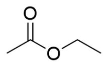

# 题目

酯类化合物A、B在乙醇钠的乙醇溶液中发生缩合反应,反应后用水处理,产物之一为C;其谱学分析结果如下表所示:

<table><tr><td>化合物</td><td>1H-NMR(δ, ppm)</td></tr><tr><td>A</td><td>8.03(1H,s), 4.22(2H,q), 1.29(3H,t)</td></tr><tr><td>B</td><td>4.12(2H,q), 2.04(3H,s), 1.26(3H,t)</td></tr><tr><td>C</td><td>8.82(3H,s), 4.42(6H,q), 1.41(9H,t)</td></tr></table>

下列说法正确的是:

A. 其他选项均不正确  
B. B酸性条件下水解产生气体  
C. A, B, C酸性条件下水解的产物完全不同  
D. A, B, C均属于C点群  
E. C能够自缩合  
F. A, B发生一次缩合的产物只有一种

# 答案

正确答案: F

# 详细解析

对氢谱进行分析：

由于均为酯类化合物，其缩合前的醇至少具有一个甲基；因此对于A,B,C，其3H,t峰均为甲基峰，2H,q的高场峰为亚甲基，可以想到这五个氢构成一个乙基，因此A,B,C水解后均产生乙醇。选项C错误。

# CHECKPOINT

1 PTS

3H, t 峰均为甲基峰, 2H, q 的高场峰为亚甲基, 构成一个乙基

# CHECKPOINT

1 PTS

A,B,C水解后均产生乙醇

观察C的氢谱，其拥有低场的峰，可以猜测为芳香氢。C拥有三个乙基，可以猜测为三个乙酯基和三个芳香氢，因此C含有苯环；由于芳香氢化学位移相同，其化学环境也相同，C实际为间三苯乙酯，结构为； $O = C(C1 = CC(C(OCC) = O) = CC(C(OCC) = O) = C1)OCC$

# CHECKPOINT

1 PTS

C 实际为间三苯乙酯，结构为：  $O = C(C1 = CC(C(OCC) = O) = CC(C(OCC) = O) = C1)OCC$

A只含有一个低场氢，不太可能为芳香氢，考虑为醛氢；因此A为甲酸乙酯，结构为O=C([H])OCC

# CHECKPOINT

1 PTS

A 为甲酸乙酯, 结构为  $O = C([H])OCC$

B 不含有低场氢但多出了一个 3H, s 峰, 明显为酯基  $\alpha$  位的甲基。因此 B 为乙酸乙酯, 结构为  $O = C(C)OCC$

# CHECKPOINT

1 PTS

B 为乙酸乙酯, 结构为  $O = C(C)OCC$

B 水解产生乙酸和乙醇，选项B错误。很明显 C 为D点群，选项D错误。C 没有  $\alpha$ -H，无法自聚，选项E错误。A 没有  $\alpha$ -H，因此酯缩合产物只有一种，选项F正确。

  
A

  
B

  
C

C结构为；  $O = C(C1 = CC(C(OCC) = O) = CC(C(OCC) = O) = C1)OCC$  ；A结构为  $O = C([H])OCC$  ；B结构为 $O = C(C)OCC$