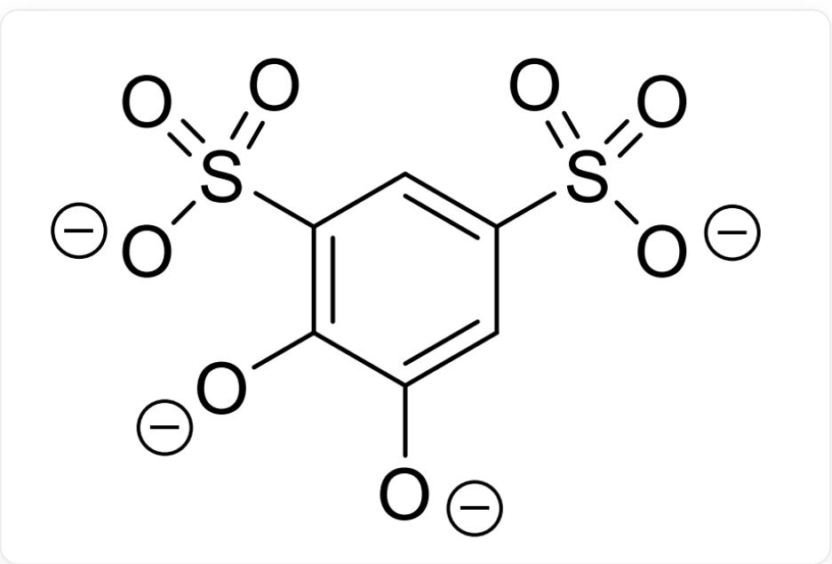
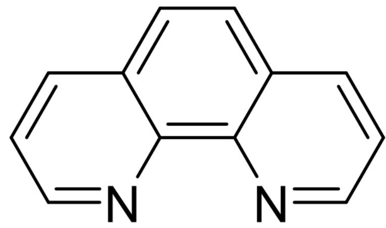

# Question

Add  $0.5\mathrm{mmol}$ $\mathrm{Ce(NO_3)_3\cdot 6H_2O}$ ,  $0.5\mathrm{mmol}$ $\mathrm{Fe(NO_3)_3\cdot 9H_2O}$ ,  $1\mathrm{mmol}$  tiron,  $1\mathrm{mmol}$  phen,  $2\mathrm{mmol}$  NaOH,  $5\mathrm{mL}$  ethanol, and  $8\mathrm{mL}$  distilled water into an  $18\mathrm{mL}$  stainless steel autoclave with a Teflon liner. React at  $175^{\circ}\mathrm{C}$  for 4 days, then allow to cool naturally to room temperature to obtain black-brown block-shaped single crystals with a yield of approximately  $75\%$ .

The molecular formula of the tiron ligand is  $\mathrm{C_6H_2O_8S_2^{4 - }}$ , and the molecular formula of the phen ligand is  $\mathrm{C_{12}H_8N_2}$ . Elemental analysis of the product yielded mass fractions (\%) of: C 47.09; N 7.32; S 8.38; O 20.91. Thermogravimetric analysis of the obtained crystals showed a weight loss of  $4.71\%$  at  $122^{\circ}\mathrm{C}$ , corresponding to the loss of all crystalline water. The relative atomic mass of Ce is known to be 140.1.

The structure of tiron is:

$$
[ O - ] C 1 = C (S (= O) ([ O - ]) = O) C = C (S (= O) ([ O - ]) = O) C = C 1 [ O - ]
$$

The structure of phen is:

  
C12=C(N=CC=C3)C3=CC=C1C=CC=N2

The molar conductivity of the complex measured in DMSO solvent is  $139\mathrm{S}\cdot \mathrm{cm}^2\cdot \mathrm{mol}^{-1}$ , indicating that it is a 2:1 type electrolyte. The number of crystalline water molecules in the complex is a positive integer. The anion has a  $C_3$  symmetry axis.

The following statements are correct:

1. The molecular formula contains 4 crystalline water molecules.  
2. The molecular formula contains 6 crystalline water molecules.  
3. The Ce: Fe ratio in the anion is  $1:2$ .  
4. The cation has only one stereochemical configuration.  
5. Both sulfonate groups in the anion participate in coordination.  
6. The anion has three mirror planes along the principal axis.

A. 1,3,4,5

B. 1,3,4,6  
C. 2,3,4,5  
D. 2,6  
E. 2,4,6  
F. 1,3,5  
G. 1,6  
H. 4,6  
1. 3,6  
J. 2,4,6  
K. None of the above

# Answer

Correct Answer: D

# Detailed Explanation

From the known mass fractions:

$$
n (\mathrm {C}): n (\mathrm {S}) = 1 5. 0 1,
$$

$$
n (\mathrm {C}): n (\mathrm {N}) = 7. 5 0
$$

That is:

$$
n (\mathrm {C}): n (\mathrm {S}): n (\mathrm {N}) = 1 5: 1: 2
$$

# CHECKPOINT

$$
n (\mathrm {C}): n (\mathrm {S}): n (\mathrm {N}) = 1 5: 1: 2
$$

1 PTS

phen contains 12C and 2N, while tiron contains 6C and 2S. Thus:

$$
n (\text {p h e n}): n (\text {t i r o n}) = 2: 1
$$

# CHECKPOINT

$$
n (\text {p h e n}): n (\text {t i r o n}) = 2: 1
$$

1 PTS

From  $n(\mathrm{O}):n(\mathrm{N}) = 5:2$  , we obtain:

$$
n (\mathrm {p h e n}): n (\mathrm {t i r o n}): n (\mathrm {H} _ {2} \mathrm {O}) = 2: 1: 2
$$

# CHECKPOINT

1 PTS

$$
n (\text {p h e n}): n (\text {t i r o n}): n \left(\mathrm {H} _ {2} \mathrm {O}\right) = 2: 1: 2
$$

Let the number of  $\mathrm{H}_2\mathrm{O}$  molecules be  $2x$ . When  $x = 3$  (i.e., 6 water molecules of crystallization), the remaining metal mass is  $307.06\mathrm{g/mol}$ , corresponding to the molar mass of 3 Fe and 1 Ce. Therefore, the chemical formula is:

$$
\mathrm {C} _ {9 0} \mathrm {H} _ {6 6} \mathrm {C e F e} _ {3} \mathrm {N} _ {1 2} \mathrm {O} _ {3 0} \mathrm {S} _ {6}
$$

# CHECKPOINT

2 PTS

The chemical formula is:  $\mathrm{C_{90}H_{66}CeFe_3N_{12}O_{30}S_6}$

The actual structural formula of the complex is:

$$
\left[ \mathrm {F e} (\text {p h e n}) _ {3} \right] _ {2} \left[ \mathrm {C e F e} (\text {t i r o n}) _ {3} \right] \cdot 6 \mathrm {H} _ {2} \mathrm {O}
$$

# CHECKPOINT

2 PTS

The actual structural formula is:  $\left[\mathrm{Fe}(\mathrm{phen})_{3}\right]_{2}\left[\mathrm{CeFe}(\mathrm{tiron})_{3}\right] \cdot 6\mathrm{H}_{2}\mathrm{O}$

The cation belongs to the  $D_{3}$  point group and is thus chiral.

# CHECKPOINT

1 PTS

The cation is chiral

The anion has a  $C_3$  symmetry axis and lacks a mirror plane perpendicular to this axis. Therefore, in the anion, tiron acts as a bidentate ligand, with Fe and Ce lying on the  $C_3$  symmetry axis. Consequently, both hydroxyl anions in the anion participate in coordination, while only one sulfonate ion is involved in coordination. There are three mirror planes passing through the principal axis.

# CHECKPOINT

1 PTS

The anion has three mirror planes passing through the principal axis

# CHECKPOINT

1 PTS

Only one sulfonate ion participates in coordination

Thus, the correct answer is option D.