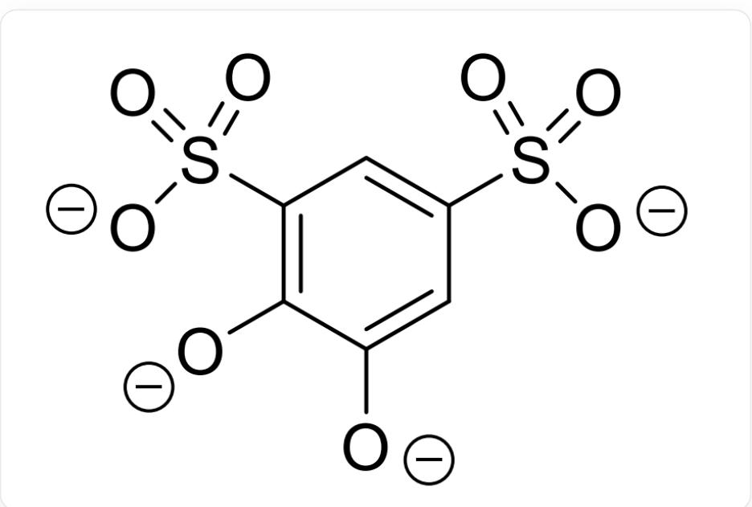
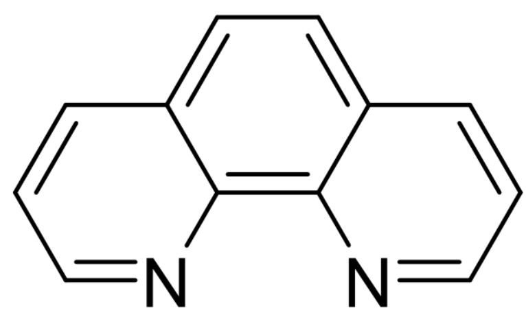

# 题目

将  $0.5 \mathrm{mmol} \mathrm{Ce}(\mathrm{NO}_{3})_{3} \cdot 6 \mathrm{H}_{2} \mathrm{O}$  、  $0.5 \mathrm{mmol} \mathrm{Fe}(\mathrm{NO}_{3})_{3} \cdot 9 \mathrm{H}_{2} \mathrm{O}$  、  $1 \mathrm{mmol} \mathrm{tiron}$  、  $1 \mathrm{mmol} \mathrm{phen}$  、  $2 \mathrm{mmol} \mathrm{NaOH}$  、  $5 \mathrm{mL}$  乙醇和  $8 \mathrm{mL}$  蒸馏水置于  $18 \mathrm{mL}$  的内衬聚四氟乙烯的不锈钢自升压反应釜中，于  $175^{\circ} \mathrm{C}$  下反应4天后，自然冷却至室温，获得黑褐色块状单晶，产率约为  $75 \%$  。

已知 tiron 配体的分子式为  $\mathrm{C}_{6} \mathrm{H}_{2} \mathrm{O}_{8} \mathrm{~S}_{2}^{4-}$ ，phen 配体的分子式为  $\mathrm{C}_{12} \mathrm{H}_{8} \mathrm{~N}_{2}$ 。对产物的元素分析得到质量分数（%）为：C 47.09；N 7.32；S 8.38；O 20.91。对所得晶体热重分析表明， $122^{\circ} \mathrm{C}$  下该配合物失重  $4.71\%$ ，对应失去所有结晶水。已知 Ce 的相对原子质量为 140.1。

其中tiron结构为：

$$
[ O - ] C 1 = C (S (= O) ([ O - ]) = O) C = C (S (= O) ([ O - ]) = O) C = C 1 [ O - ]
$$

phen结构为：

C12=C(N=CC=C3)C3=CC=C1C=CC=N2

该配合物在 DMSO 溶剂中测得的摩尔电导率为  $139 \mathrm{~S} \cdot \mathrm{cm}^{2} \cdot \mathrm{mol}^{-1}$ , 表明其属于 2:1 型电解质。配合物中的结晶水数量为正整数。阴离子具有  $C_{3}$  对称轴。

以下说法正确的有：

1. 该分子式中有4个结晶水  
2.该分子式中有6个结晶水  
3.阴离子中Ce：Fe为1：2  
4.阳离子只有一种立体构型  
5. 阴离子中两个磺酸根离子均参与配位  
6.阴离子中有三个通过主轴的镜面

A. 1,3,4,5  
B. 1,3,4,6

C. 2,3,4,5  
D. 2,6  
E. 2,4,6  
F. 1,3,5  
G. 1,6  
H. 4,6  
1. 3,6  
J. 2,4,6  
K. 以上均不正确

# 答案

正确答案: D

# 详细解析

由已知的质量分数可知:

$$
\begin{array}{l} n (\mathrm {C}): n (\mathrm {S}) = 1 5. 0 1, \\ n (\mathrm {C}): n (\mathrm {N}) = 7. 5 0 \\ \end{array}
$$

即：

$$
n (\mathrm {C}): n (\mathrm {S}): n (\mathrm {N}) = 1 5: 1: 2
$$

# CHECKPOINT

$$
n (\mathrm {C}): n (\mathrm {S}): n (\mathrm {N}) = 1 5: 1: 2
$$

1 PTS

phen 含 12C、2N，tiron 含 6C、2S，可得：

$$
n (\text {p h e n}): n (\text {t i r o n}) = 2: 1
$$

# CHECKPOINT

$$
n (\text {p h e n}): n (\text {t i r o n}) = 2: 1
$$

1 PTS

由  $n(\mathrm{O}):n(\mathrm{N}) = 5:2$  ，可得：

$$
n (\text {p h e n}): n (\text {t i r o n}): n (\mathrm {H} _ {2} \mathrm {O}) = 2: 1: 2
$$

# CHECKPOINT

1 PTS

$$
n (\text {p h e n}): n (\text {t i r o n}): n (\mathrm {H} _ {2} \mathrm {O}) = 2: 1: 2
$$

设  $\mathrm{H}_2\mathrm{O}$  个数为  $2x$  ，当  $x = 3$  时（即6个结晶水)，剩余金属质量为  $307.06\mathrm{g / mol}$  ，对应3个Fe和1个Ce的摩尔质量，故化学式为：

$$
\mathrm {C} _ {9 0} \mathrm {H} _ {6 6} \mathrm {C e F e} _ {3} \mathrm {N} _ {1 2} \mathrm {O} _ {3 0} \mathrm {S} _ {6}
$$

# CHECKPOINT

2 PTS

化学式为：  $\mathrm{C_{90}H_{66}CeFe_3N_{12}O_{30}S_6}$

该配合物实际结构的化学式为：

$$
\left[ \mathrm {F e} (\text {p h e n}) _ {3} \right] _ {2} \left[ \mathrm {C e F e} (\text {t i r o n}) _ {3} \right] \cdot 6 \mathrm {H} _ {2} \mathrm {O}
$$

# CHECKPOINT

2 PTS

实际结构化学式为：  $\mathrm{[Fe(phen)_3]_2[CeFe(tiron)_3]\cdot 6H_2O}$

阳离子为  $D_{3}$  点群，所以有手型。

# CHECKPOINT

1 PTS

阳离子有手性

阴离子具有  $C_3$  对称轴，且不存在垂直于该轴的镜面。所以阴离子中tiron作双齿配体，且  $Fe$  和  $Ce$  处在  $C_3$  对称轴上，因此阴离子中两个羟基负离子均参与配位，只有一个磺酸根离子参与配位，存在通过主轴的三个镜面。

# CHECKPOINT

1 PTS

阴离子中存在通过主轴的三个镜面

# CHECKPOINT

1 PTS

只有一个磺酸根离子参与配位

因此正确答案为选项D