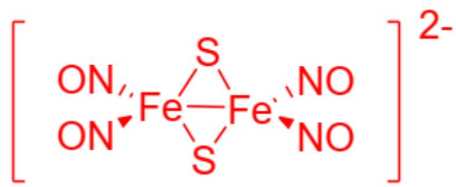

# Question

There exists a binuclear iron complex with the chemical formula  $\mathrm{Na}_{2}\left[\mathrm{Fe}_{2}(\mathrm{NO})_{4}\mathrm{S}_{2}\right]$ . In this complex, both Fe atoms satisfy the 18-electron rule. The structure of the complex should be deduced solely based on the information provided in the problem, without referencing known complex structures.

This complex can be obtained by reacting  $\mathrm{NH_4}$ $\left[\mathrm{Fe}_4\mathrm{S}_3(\mathrm{NO})_7\right]$  and  $\mathrm{NaOH}$  in a stoichiometric ratio of  $1:3$  under heating conditions, with the reaction releasing nitrous oxide.

The following statements are given:

1. The apparent oxidation state of the Fe atom is -1.  
2. The apparent oxidation state of the Fe atom is  $+1$ .  
3. In complex anions, the two atoms farthest apart are separated by at most 6 covalent or coordination bonds, as measured by bond count.  
4. In complex anions, the two atoms farthest apart are separated by at most 5 covalent or coordination bonds, as measured by bond count.  
5. The sum of the coefficients on both sides of the chemical reaction equation in the problem is 17.  
6. The sum of the coefficients on both sides of the chemical reaction equation in the problem is 19.

Which of the following is correct?

A. 1,3,5  
B. 1,3,6  
C. 1,4,5  
D. 1,4,6

E. 2,3,5  
F. 2,3,6  
G. 2,4,5  
H. 2,4,6

# Answer

Correct Answer: A

# Detailed Explanation

The number of valence electrons in Fe is 8, and the negative charge is 2. To satisfy the 18-electron rule, ligands must provide an additional  $10 - 2/2 = 9$  electrons. In dinuclear Fe complexes containing S, the S atom typically serves as a bridging group, donating one electron to each Fe atom. Therefore, each Fe in this complex still requires  $18 - 8 - 1 - 2 = 7$  electrons. NO can act as either a one-electron or three-electron ligand. To provide 7 electrons, NO here should be a three-electron ligand, and the remaining 1 electron must be supplied by the Fe – Fe bond.

# CHECKPOINT

1 PTS

In the complex, NO acts as a three-electron ligand, and the presence of an Fe - Fe bond ensures that each Fe satisfies the 18-electron rule

Thus, the structure of the complex anion consists of one Fe – Fe bond, two bridging S atoms connecting the two Fe atoms, and four NO ligands acting as three-electron donors, evenly distributed between the two Fe atoms:

  
Fig. 1. The following SMILES representation corresponds to a complex anion with an overall charge of -2: O=N[Fe]1(S2)(N=O)[Fe]2(N=O)(N=O)S1

# CHECKPOINT

0.5 PTS

By counting the intervening chemical bonds, the two farthest-apart atoms in the complex anion are separated by a maximum of 6 covalent or coordination bonds

Based on electronegativity, the two negative charges contribute an oxidation state of  $-2/2 = -1$ , the Fe–Fe bond contributes 0, the bridging S contributes  $+1 \times 2 = +2$ , and the three-electron NO ligands contribute  $-1 \times 2 = -2$ . Therefore, the apparent oxidation state of each Fe is  $-1 + 0 + 2 - 2 = -1$ , confirming that statement 1 is correct.

# CHECKPOINT

1 PTS

The apparent oxidation state of Fe is -1

According to the problem, this compound can be obtained by reacting  $\mathrm{NH_4}$ $\left[\mathrm{Fe}_4\mathrm{S}_3(\mathrm{NO})_7\right]$  with NaOH in a 1:3 stoichiometric ratio under heating conditions, releasing nitrous oxide. First, draft the preliminary reaction equation:

$$
\mathrm {N H} _ {4} \left[ \mathrm {F e} _ {4} \mathrm {S} _ {3} (\mathrm {N O} _ {7}) \right] + 3 \mathrm {N a O H} \xrightarrow {\Delta} \mathrm {N a} _ {2} \left[ \mathrm {F e} _ {2} (\mathrm {N O}) _ {4} \mathrm {S} _ {2} \right] + \mathrm {N} _ {2} \mathrm {O} + \text {o t h e r p r o d u c t s}
$$

The right side of the equation lacks Fe and N. Under NaOH,  $\mathrm{NH}_4^+$  should be neutralized directly to  $\mathrm{NH}_3$ , and the N atoms in  $\mathrm{N}_2\mathrm{O}$  are partially reduced. Therefore, the oxidized species should be Fe, which in alkaline conditions should oxidize to the stable  $\mathrm{Fe(OH)}_3$ . Balancing the equation based on electron transfer and material conservation:

$$
2 \mathrm {N H} _ {4} \left[ \mathrm {F e} _ {4} \mathrm {S} _ {3} (\mathrm {N O} _ {7}) \right] + 6 \mathrm {N a O H} \xrightarrow {\Delta} 3 \mathrm {N a} _ {2} \left[ \mathrm {F e} _ {2} (\mathrm {N O}) _ {4} \mathrm {S} _ {2} \right] + 2 \mathrm {F e} (\mathrm {O H}) _ {3} + \mathrm {N} _ {2} \mathrm {O} + 2 \mathrm {N H} _ {3} + \mathrm {H} _ {2} \mathrm {O}. \text {T h e s u m o f}
$$

# CHECKPOINT

1 PTS

$$
2 \mathrm {N H} _ {4} \left[ \mathrm {F e} _ {4} \mathrm {S} _ {3} (\mathrm {N O} _ {7}) \right] + 6 \mathrm {N a O H} \xrightarrow {\Delta} 3 \mathrm {N a} _ {2} \left[ \mathrm {F e} _ {2} (\mathrm {N O}) _ {4} \mathrm {S} _ {2} \right] + 2 \mathrm {F e} (\mathrm {O H}) _ {3} + \mathrm {N} _ {2} \mathrm {O} + 2 \mathrm {N H} _ {3} + \mathrm {H} _ {2} \mathrm {O}
$$