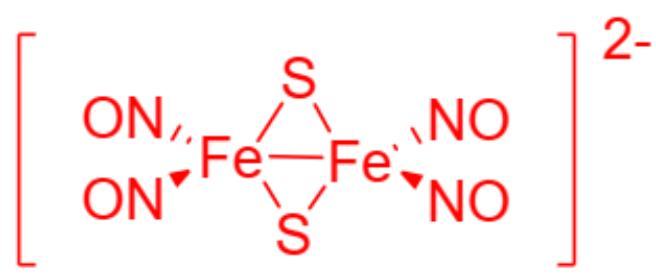

# 题目

现有一种双核铁配合物, 化学

式  $\mathrm{Na}_{2}\left[\mathrm{Fe}_{2}(\mathrm{NO})_{4} \mathrm{~S}_{2}\right]$  。在该配合物中两个 Fe 原子均满足 18 电子规则。仅根据题目给出的信息推断配合物结构，不要参考已知的配合物信息。

该配合物可由  $\mathrm{NH_4[Fe_4S_3(NO)_7]}$  和  $\mathrm{NaOH}$  以  $1:3$  的化学计量比在加热条件下反应得到, 反应放出了笑气。

有以下说法：

1. Fe 原子的表观氧化数为-1  
2. Fe 原子的表观氧化数为  $+1$  
3. 按间隔的化学键计, 配合物阴离子中相距最远的两个原子间最多间隔6根共价键或配位键  
4. 按间隔的化学键计, 配合物阴离子中相距最远的两个原子间最多间隔5根共价键或配位键  
5. 题目中的化学反应方程式左右系数加和为17  
6. 题目中的化学反应方程式左右系数加和为19

下列选项正确的为？

A. 1,3,5  
B. 1,3,6  
C. 1,4,5  
D. 1,4,6

E. 2,3,5  
F. 2,3,6  
G. 2,4,5  
H. 2,4,6

# 答案

正确答案: A

# 详细解析

Fe的价电子数为8，负电荷数为2，满足18电子规则需要配体提供额外  $10 - 2 / 2 = 9$  个电子。在含S双核Fe配合物中，  $S$  原子通常作为桥联基团为每个Fe原子提供一个电子，因此该配合物中每个Fe还需要 $18 - 8 - 1 - 2 = 7$  个电子。NO可以作为单电子或者3电子配体，为提供7电子此处NO应该为3电子配体，其余1电子需要由  $\mathrm{Fe - Fe}$  键提供。

# CHECKPOINT

1 PTS

配合物中NO为三电子配体，而且存在一根Fe-Fe键，使得每个Fe满足18电子规则

因此配合物阴离子结构为一根Fe-Fe键、两个桥联S连接两个Fe原子、四个NO作为三电子配体平均配位到两个Fe原子上：

  
Fig. 1, 以下为SMILES表示是一个配合物阴离子, 整体带电荷为-2:  $O = N[Fe]1(S2)(N = O)[Fe]2(N = O)(N = O)S1$

# CHECKPOINT

0.5 PTS

按间隔的化学键计，配合物阴离子中相距最远的两个原子间最多间隔6根共价键或配位键

根据电负性，两个负电荷贡献氧化数为  $-2 / 2 = -1$  ，Fe-Fe键贡献氧化数为0，桥接S贡献氧化数为  $+1\times 2 = +2$  ，三电子配体NO贡献氧化数为  $-1\times 2 = -2$  ，因此每个Fe的表观氧化数为 $-1 + 0 + 2 - 2 = -1$  ，说法1正确。

# CHECKPOINT

1 PTS

Fe的表观氧化数为-1

根据题目，该化合物可由  $\mathrm{NH}_4[\mathrm{Fe}_4\mathrm{S}_3(\mathrm{NO})_7]$  和  $\mathrm{NaOH}$  以  $1:3$  的化学计量比在加热条件下反应得到，反应放出了笑气。先写出初步的反应方程式：

$\mathrm{NH_4}$ $[\mathrm{Fe}_4\mathrm{S}_3(\mathrm{NO}_7)] + 3\mathrm{NaOH}\xrightarrow{\Delta}\mathrm{Na}_2[\mathrm{Fe}_2(\mathrm{NO})_4\mathrm{S}_2] + \mathrm{N}_2\mathrm{O}+$  其他产物

反应式右侧缺少  $\mathrm{Fe}$  和  $\mathrm{N}$ ,  $\mathrm{NH}_{4}^{+}$ 在  $\mathrm{NaOH}$  下应该直接中和为  $\mathrm{NH}_{3}$ ,  $\mathrm{N}_{2} \mathrm{O}$  中  $\mathrm{N}$  原子被部分还原, 那么被氧化的应该是  $\mathrm{Fe}$ , 且在碱性下应该氧化至稳定的三价  $\mathrm{Fe}(\mathrm{OH})_{3}$  。根据电子转移数和物料守恒配平方程式:

[ 2\mathrm{NH}_{4}\left[\mathrm{Fe}_{4}\mathrm{S}_{3}\left(\mathrm{NO}_{7}\right)\right] + 6\mathrm{NaOH} \xrightarrow{\Delta} 3\mathrm{Na}_{2}\left[\mathrm{Fe}_{2}\left(\mathrm{NO}\right)_{4}\mathrm{S}_{2}\right] + 2\mathrm{Fe}\left(\mathrm{OH}\right)_{3} + \mathrm{N}_{2}\mathrm{O} + 2\mathrm{NH}_{3} + \mathrm{H}_{2}\mathrm{O}, ] 化学反应式左右系数加和为17，说法5正确。

# CHECKPOINT

1 PTS

$$
2 \mathrm {N H} _ {4} \left[ \mathrm {F e} _ {4} \mathrm {S} _ {3} (\mathrm {N O} _ {7}) \right] + 6 \mathrm {N a O H} \xrightarrow {\Delta} 3 \mathrm {N a} _ {2} \left[ \mathrm {F e} _ {2} (\mathrm {N O}) _ {4} \mathrm {S} _ {2} \right] + 2 \mathrm {F e} (\mathrm {O H}) _ {3} + \mathrm {N} _ {2} \mathrm {O} + 2 \mathrm {N H} _ {3} + \mathrm {H} _ {2} \mathrm {O}
$$