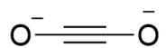
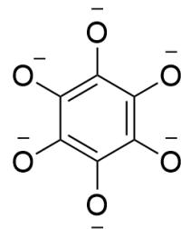
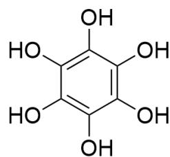
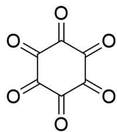

# Question

The reaction of metallic potassium with carbon monoxide can produce a black powder with the chemical composition KCO.

It is known that the powder composition includes two substances, A and B. A reacts with dilute hydrochloric acid to produce a monocarboxylic acid. B reacts with dilute hydrochloric acid to produce a substance D containing only one type of functional group, a hydroxyl group. D is oxidized by chlorine gas in aqueous solution to produce a substance E with 2 waters of crystallization. E produces F under high vacuum heating, where all atoms have the same chemical environment and are extremely unstable.

Which of the following statements is correct?

A. All other options are incorrect  
B. A only has a two-fold rotation axis  
C. The anion of  $\mathbf{B}$  does not possess strong reducing properties.  
D. D, E, F are all ternary compounds  
E. Chemical equation for the synthesis of  $\mathbf{E}$ , when the coefficients are balanced to the simplest integer ratio, the sum of the reactant coefficients and the sum of the product coefficients have a prime number.

# Answer

Correct Answer: E

# Detailed Explanation

The anions of  $\mathbf{A},\mathbf{B}$  obviously have the simplest chemical formula  $\mathrm{CO}^{-}$ . Since  $\mathbf{A}$  reacts with acid to produce a monocarboxylic acid, the anion of  $\mathbf{A}$  can only be  $\mathrm{C}_2\mathrm{O}_2^{2-}$ , with the structure [O-]C#C[O-], which hydrolyzes to produce  $\mathrm{HOCH}_2\mathrm{COOH}$ .  $\mathrm{C}_2\mathrm{O}_2^{2-}$  has a  $C_{\infty}$  axis, so option B is incorrect.

# CHECKPOINT

1 PTS

The anion of  $\mathbf{A}$  can only be  $\mathrm{C}_2\mathrm{O}_2^{2-}$ , with the structure [O-]C#C[O-]

# CHECKPOINT

1 PTS

$\mathrm{C}_2\mathrm{O}_2^{2 - }$  has a  $\mathbf{C}_{\infty}$  axis

$\mathbf{D}$ , produced by the reaction of  $\mathbf{B}$  with acid, has only one type of functional group, the hydroxyl group, which is obviously hexahydroxybenzene, with the structure  $\mathrm{OC1 = C(O)C(O) = C(O)C(O) = C1O}$ , and the chemical formula  $\mathrm{C_6(OH)_6}$ . Therefore, the structure of the anion of  $\mathbf{B}$  is  $[\mathrm{O - }]\mathrm{C1} = \mathrm{C([O - ])C([O - ]) = C([O - ])C([O - ]) = C1[\mathrm{O - }]$ , which has strong reducing properties, so option  $\mathrm{C}$  is incorrect.

# CHECKPOINT

1 PTS

The structure of  $\mathbf{D}$  is OC1=C(O)C(O)=C(O)C(O)=C1O

# CHECKPOINT

1 PTS

The structure of the anion of  $\mathbf{B}$  is [O-]C1=C([O-])C([O-])=C([O-])C([O-])=C1[O-]

# CHECKPOINT

1 PTS

The anion of  $\mathbf{B}$  has strong reducing properties

$\mathbf{D}$  is oxidized in aqueous solution, and should produce cyclohexanhexone, but it is extremely unstable. The carbonyl groups are extremely electron-deficient and are easily attacked by water nucleophilically to form carbonyl hydrates. Therefore, the chemical formula of  $\mathbf{E}$  is  $\mathrm{C_6(OH)}_{12} \cdot 2\mathrm{H}_2\mathrm{O}$ , then obviously  $\mathbf{F}$  is cyclohexanhexone, with the structure  $\mathrm{O = C(C(C(C(C1 = O) = O) = O) = O)C1 = O}$ .

# CHECKPOINT

1 PTS

The chemical formula of  $\mathbf{E}$  is  $\mathrm{C_6(OH)}_{12} \cdot 2\mathrm{H}_2\mathrm{O}$

# CHECKPOINT

1 PTS

$\mathbf{F}$  is cyclohexanhexone, with the structure  $O = C(C(C(C(C1 = O) = O) = O) = O)C1 = O$

The chemical equation for the formation of  $\mathbf{E}$  is:

$$
\mathrm {C} _ {6} (\mathrm {O H}) _ {6} + 3 \mathrm {C l} _ {2} + 8 \mathrm {H} _ {2} \mathrm {O} = \mathrm {C} _ {6} (\mathrm {O H}) _ {1 2} \cdot 2 \mathrm {H} _ {2} \mathrm {O} + 6 \mathrm {H C l}
$$

# CHECKPOINT

1 PTS

$$
\mathrm {C} _ {6} (\mathrm {O H}) _ {6} + 3 \mathrm {C l} _ {2} + 8 \mathrm {H} _ {2} \mathrm {O} = \mathrm {C} _ {6} (\mathrm {O H}) _ {1 2} \cdot 2 \mathrm {H} _ {2} \mathrm {O} + 6 \mathrm {H C l}
$$

According to the chemical formulas and equation, option E is correct, and D is incorrect.

A

B

D

F

The structure of the anion of  $\mathbf{A}$  is [O-]C#C[O-]; the structure of  $\mathbf{D}$  is OC1=C(O)C(O)=C(O)C(O)=C1O; the structure of  $\mathbf{F}$  is O=C(C(C(C1=O)=O)=O)=O)C1=O; the structure of the anion of  $\mathbf{B}$  is

$$
[ O - ] C 1 = C ([ O - ]) C ([ O - ]) = C ([ O - ]) C ([ O - ]) = C 1 [ O - ]
$$