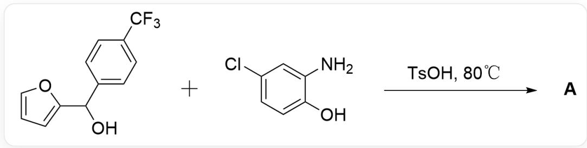
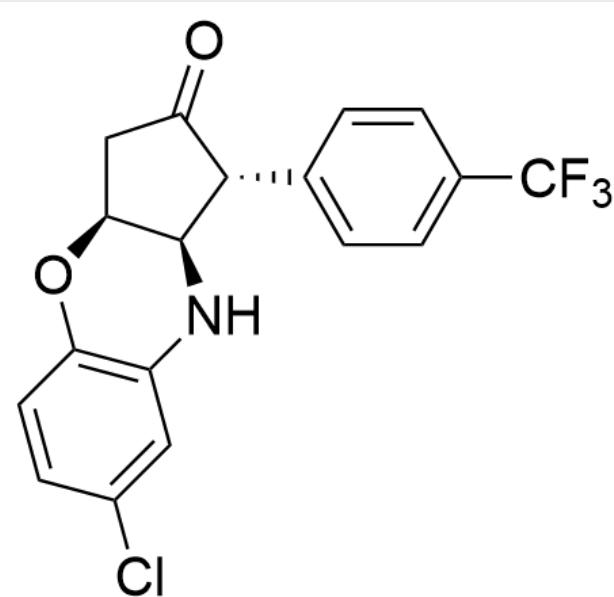
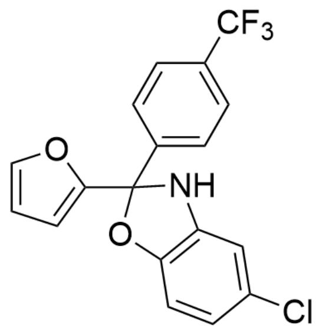
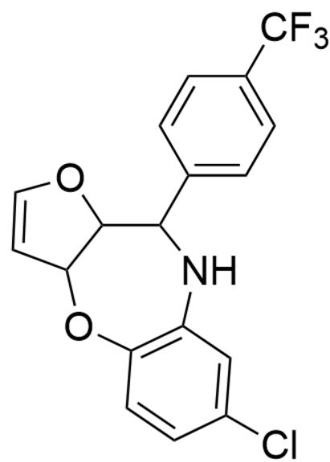
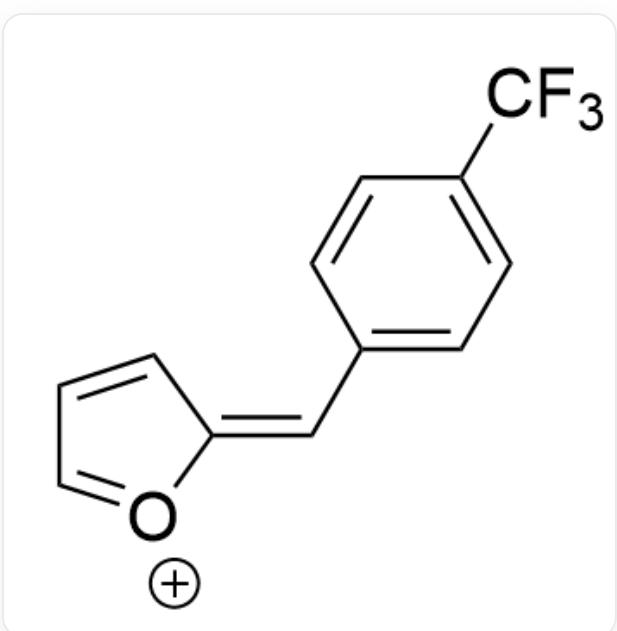
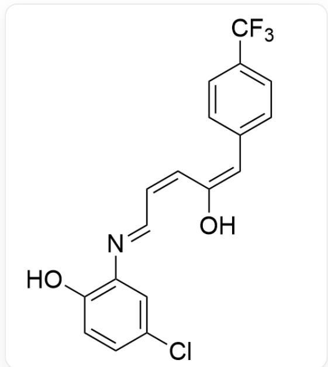
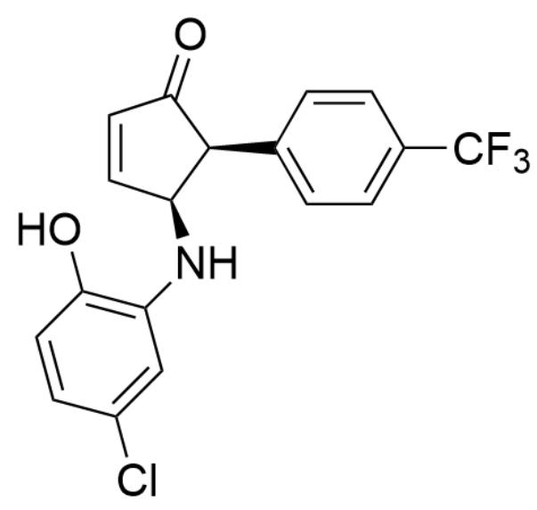
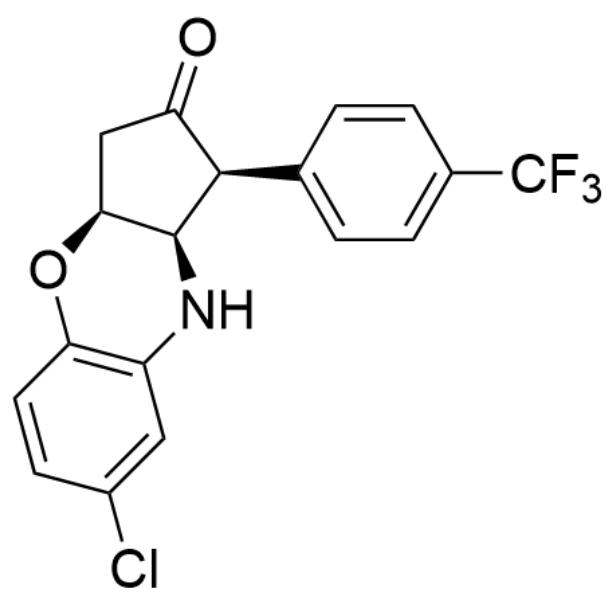

# Question

  
OC(C1=CC=CO1)C2=CC=C(C(F)(F)F)C=C2.NC3=CC(Cl)=CC=C3O>TsOH>[A], the reaction proceeds at  $80^{\circ}\mathrm{C}$ , A is the reaction product

Given that the product  $\mathbf{A}$  contains a total of four rings, including two aromatic rings, and the molecular formula of  $\mathbf{A}$  is  $\mathrm{C_{18}H_{13}ClF_3NO_2}$ , provide the structural formula of  $\mathbf{A}$  without considering enantiomers.

A. All other options are incorrect  
B.

  
$\mathrm{O = C1[C@H](C2 = CC = C(C(F)(F)F)C = C2)[C@@H](NC3 = C(O4)C = CC(Cl) = C3)[C@@H]4C1}$

C.

$\mathrm{O = C1[C@@H](C2 = CC = C(C(F)(F)F)C = C2)[C@H](NC3 = C(O4)C = CC(Cl) = C3)[C@@H]4C1}$

D.

$\mathrm{O = C1[C@@H](C2 = CC = C(C(F)(F)F)C = C2)[C@@H](NC3 = C(O4)C = CC(Cl) = C3)[C@H]4C1}$

E.

  
CIC1=CC(N2)=C(C=C1)OC2(C3=CC=CO3)C4=CC=C(C(F)(F)F)C=C4

F.

  
CIC1=CC(NC(C2OC=CC2O3)C4=CC=C(C(F)(F)F)C=C4)=C3C=C1

G.

OC(C=CC(Cl)=C1)=C1N2C(C3=CC=C(C(F)(F)F)C=C3)C(C=CC2)=O

# Answer

Correct Answer: A

# Detailed Explanation

First, according to the molecular formula  $\mathrm{C_{18}H_{13}ClF_3NO_2}$  of  $\mathbf{A}$ , it can be deduced that the condensation reaction apparently only eliminates one molecule of  $\mathrm{H}_2\mathrm{O}$ .

CHECKPOINT

1 PTS

the condensation reaction apparently only eliminates one molecule of  $\mathrm{H}_2\mathrm{O}$

First, under the catalysis of acid, the substrate loses one molecule of water to obtain intermediate 1

  
FC(F)(F)C1=CC=C(/C=C2O[CH+]C=C/2)C=C1

# CHECKPOINT

1 PTS

intermediate 1: FC(C(C=C1)=CC=C1/C=C2[O+]=CC=C/2)(F)F

Then, because the amino group has a stronger nucleophilicity than the hydroxyl group, the nitrogen atom attacks and opens the ring to obtain intermediate 2

# CHECKPOINT

1 PTS

the amino group has a stronger nucleophilicity than the hydroxyl group

$$
O C / / C = C \backslash C = N \backslash C 1 = C (O) C = C C (C I) = C 1) = C / C 2 = C C = C (C (F) (F) F) C = C 2
$$

# CHECKPOINT

1 PTS

intermediate 2: OC(/C=C\C=N\C1=C(O)C=CC(Cl)=C1)=C/C2=CC=C(C(F)(F)F)C=C2

It is known from the question that the reaction needs to form two more rings, so further cyclization reactions occur under acid catalysis to form a five-membered ring to obtain intermediate 3

$\mathrm{O = C1[C@@H](C2 = CC = C(C(F)(F)F)C = C2)[C@@H](NC3 = C(O)C = CC(Cl) = C3)C = C1}$

# CHECKPOINT

1 PTS

intermediate 3: O=C1[C@@H](C2=CC=C(C(F)(F)F)C=C2)[C@@H](NC3=C(O)C=CC(Cl)=C3)C=C1

The cis regioselectivity of the two groups on the five-membered ring comes from the  $\pi-\pi$  interaction between the aromatic rings.

# CHECKPOINT

1 PTS

The cis regioselectivity of the two groups on the five-membered ring comes from the  $\pi-\pi$  interaction between the aromatic rings

Finally, due to conformational reasons, the hydroxyl group tends to attack the conjugated double bond from the same side of the plane and undergo an addition reaction, forming a cis six-membered ring and a five-membered ring structure, to obtain product A

# CHECKPOINT

1 PTS

the hydroxyl group tends to attack the conjugated double bond from the same side of the plane and undergo an addition reaction, forming a cis six-membered ring and a five-membered ring structure

$\mathrm{O = C1[C@@H](C2 = CC = C(C(F)(F)F)C = C2)[C@@H](NC3 = C(O4)C = CC(Cl) = C3)[C@@H]4C1}$

# CHECKPOINT

1 PTS

product A :  $\mathrm{O} = \mathrm{C}1[\mathrm{C}@\mathrm{a}\mathrm{H}](\mathrm{C}2 = \mathrm{CC} = \mathrm{C}(\mathrm{C}(\mathrm{F})(\mathrm{F})\mathrm{F})\mathrm{C} = \mathrm{C}2)[\mathrm{C}@\mathrm{a}\mathrm{H}](\mathrm{NC}3 = \mathrm{C}(\mathrm{O}4)\mathrm{C} = \mathrm{CC}(\mathrm{Cl}) = \mathrm{C}3)$

[C@@H]4C1