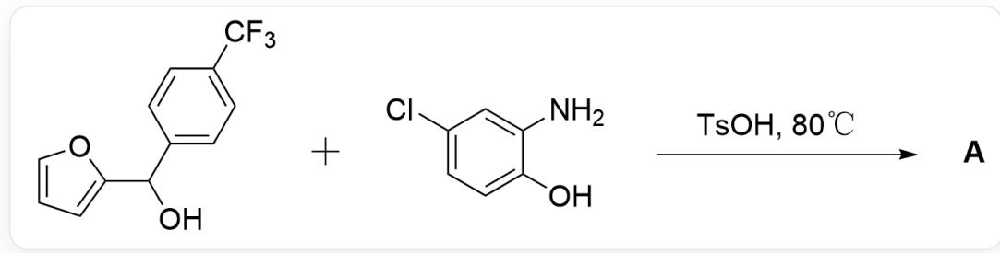
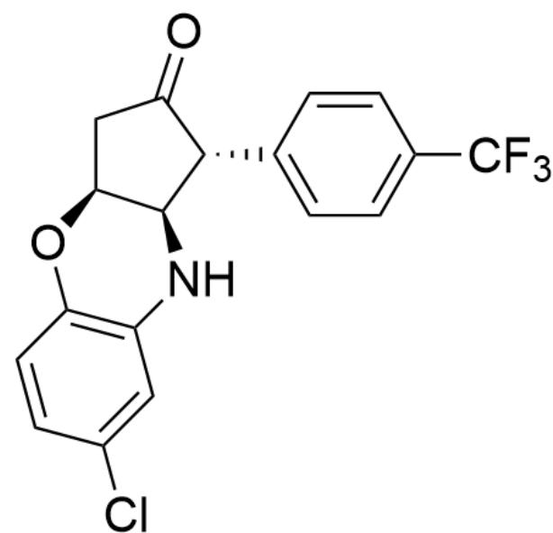
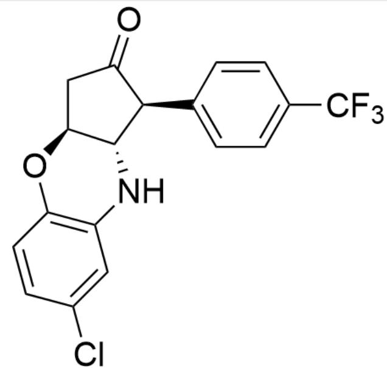
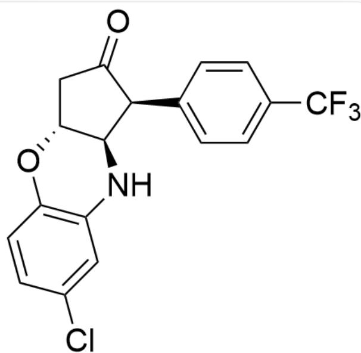
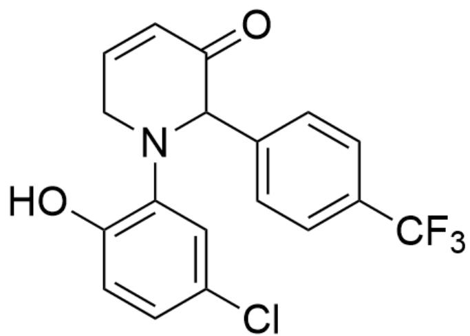
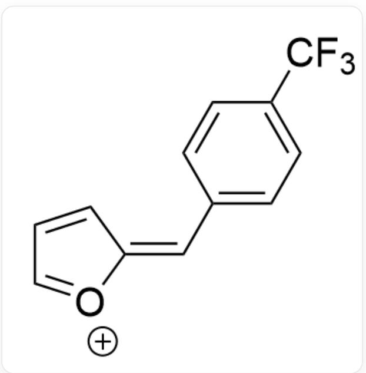
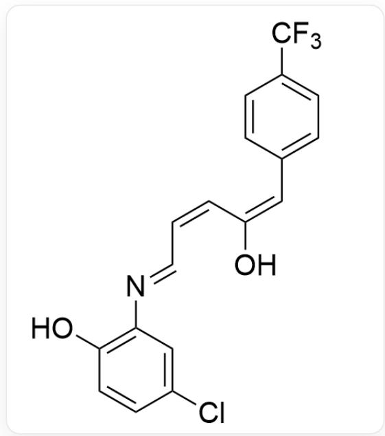
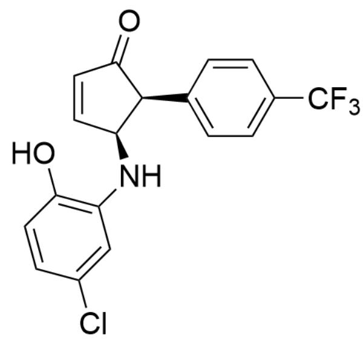
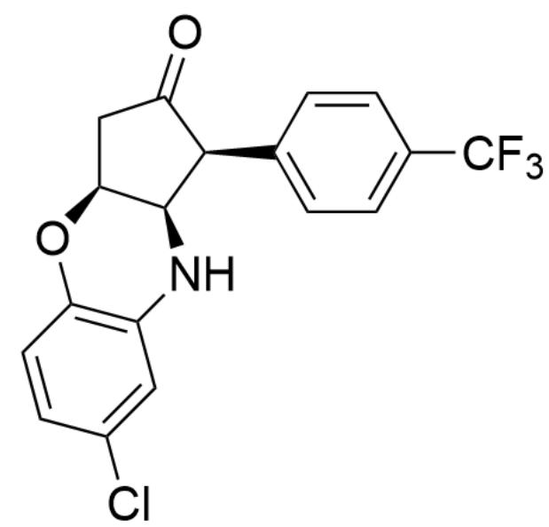

# 题目

  
OC(C1=CC=CO1)C2=CC=C(C(F)(F)F)C=C2.NC3=CC(Cl)=CC=C3O>TsOH>[A],反应在80°C下进行,$\mathbf{\backslash mathbf{b}}f\{\mathbf{A}\} \text{为反应产物}$

已知产物  $\mathbf{A}$  中共含有四个环, 其中包括两个芳香环,  $\mathbf{A}$  的分子式为  $\mathrm{C}_{18} \mathrm{H}_{13} \mathrm{ClF}_{3} \mathrm{NO}_{2}$ , 不考虑对映异构的条件下试给出  $\mathbf{A}$  的结构式。

A. 其他选项均不正确  
B.

  
$\mathrm{O = C1[C@H](C2 = CC = C(C(F)(F)F)C = C2)[C@@H](NC3 = C(O4)C = CC(Cl) = C3)[C@@H]4C1}$

C.

$\mathrm{O = C1[C@@H](C2 = CC = C(C(F)(F)F)C = C2)[C@H](NC3 = C(O4)C = CC(Cl) = C3)[C@@H]4C1}$

D.

$\mathrm{O = C1[C@@H](C2 = CC = C(C(F)(F)F)C = C2)[C@@H](NC3 = C(O4)C = CC(Cl) = C3)[C@H]4C1}$

E.

  
CIC1=CC(N2)=C(C=C1)OC2(C3=CC=CO3)C4=CC=C(C(F)(F)F)C=C4

F.

  
CIC1=CC(NC(C2OC=CC2O3)C4=CC=C(C(F)(F)F)C=C4)=C3C=C1

G.

OC(C=CC(Cl)=C1)=C1N2C(C3=CC=C(C(F)(F)F)C=C3)C(C=CC2)=O

# 答案

正确答案: A

# 详细解析

首先根据  $\mathbf{A}$  的分子式  $\mathrm{C_{18}H_{13}ClF_3NO_2}$  可以推出，表观上该缩合反应仅脱去了一分子  $\mathrm{H}_2\mathrm{O}$  。

CHECKPOINT

1 PTS

表观上该缩合反应仅脱去了一分子  $\mathrm{H}_2\mathrm{O}$

首先在酸的催化下，底物脱去一分子水得到中间体1

FC(F)(F)C1=CC=C(/C=C2O[CH+]C=C/2)C=C1

# CHECKPOINT

1 PTS

中间体1：FC(C(C=C1)=CC=C1/C=C2[O+]=CC=C/2)(F)F

接着由于氨基相对于羟基有着更强的亲核性，因此氮原子进攻开环得到中间体2

# CHECKPOINT

1 PTS

氨基相对于羟基有着更强的亲核性

$$
O C / / C = C \backslash C = N \backslash C 1 = C (O) C = C C (C I) = C 1) = C / C 2 = C C = C (C (F) (F) F) C = C 2
$$

# CHECKPOINT

1 PTS

中间体2：OC(/C=C\C=N\C1=C(O)C=CC(Cl)=C1)=C/C2=CC=C(C(F)(F)F)C=C2

由题干得知反应需要再形成两个环，因此在酸催化下进一步发生成环反应形成五元环得到中间体3

  
$\mathrm{O = C1[C@@H](C2 = CC = C(C(F)(F)F)C = C2)[C@@H](NC3 = C(O)C = CC(Cl) = C3)C = C1}$

# CHECKPOINT

1 PTS

中间体3：O=C1[C@@H](C2=CC=C(C(F)(F)F)C=C2)[C@@H](NC3=C(O)C=CC(Cl)=C3)C=C1

其中五元环上两个基团处于顺式的区域选择性来源于芳环之间的  $\pi-\pi$  相互作用

# CHECKPOINT

1 PTS

其中五元环上两个基团处于顺式的区域选择性来源于芳环之间的  $\pi-\pi$  相互作用

最后限于构象原因，羟基倾向于从平面同侧进攻共轭双键发生加成反应，形成顺式六元环并五元环结构，得到产物A

# CHECKPOINT

1 PTS

羟基倾向于从平面同侧进攻共轭双键发生加成反应，形成顺式六元环并五元环结构

$\mathrm{O = C1[C@@H](C2 = CC = C(C(F)(F)F)C = C2)[C@@H](NC3 = C(O4)C = CC(Cl) = C3)[C@@H]4C1}$

# CHECKPOINT

1 PTS

产物A：O=C1[C@@H](C2=CC=C(C(F)(F)F)C=C2)[C@@H](NC3=C(O4)C=CC(Cl)=C3)[C@@H]4C1