# Question

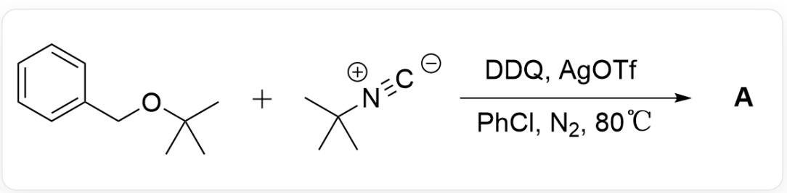  
CC(C)(C)OCC1=CC=CC=C1.CC(C)([N+]#[C-])C> [DDQ],[AgOTf],[PhCl],[ $N_{2}$ ]> [A], A is the reaction product, the reaction temperature is  $80^{\circ}\mathrm{C}$

Where the amount of DDQ and tert-butyl isocyanide is at least twice the amount of benzyl tert-butyl ether. Mechanistic studies show that the reaction is not a free radical reaction mechanism. Deduce the structural formula of the reaction product A (without considering stereoisomers).

A. All other options are incorrect

B.

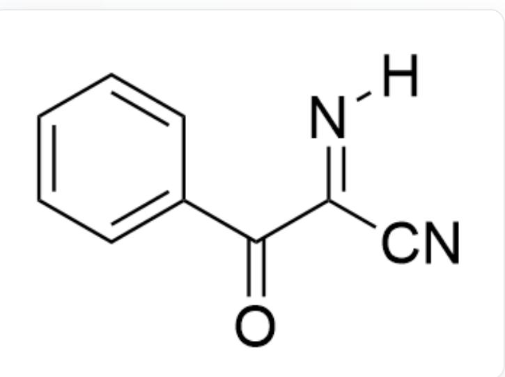  
[H]/N=C(C#N)/C(C1=CC=CC=C1)=O

C.

N#CCC1=CC=CC=C1

D.

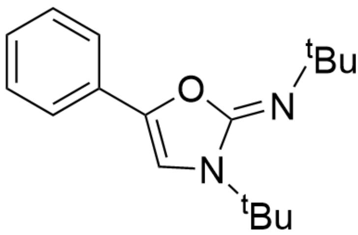

CC(/N=C1N(C(C)(C)C)C=C(O/1)C2=CC=CC=C2)(C)C

E.

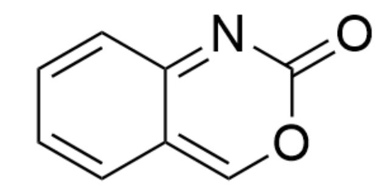

$\mathrm{O = C1OC = C2C = CC = CC2 = N1}$

# F.

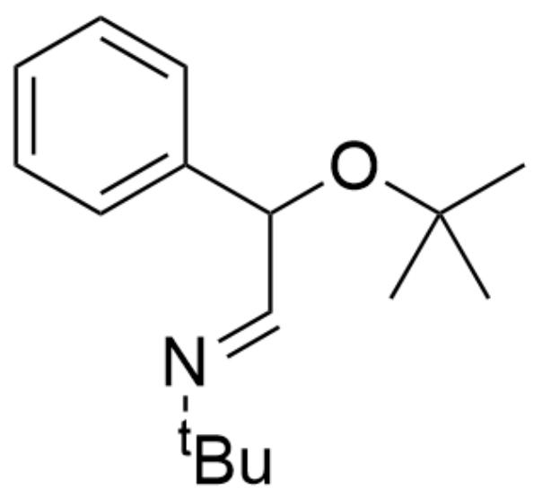

CC(C)(C)OC(/C=N/C(C)(C)C)C1=CC=CC=C1

# G.

CC(OC1=C2C(C=CC=C2)=C(C(C)(C)C)N1)(C)C

H.

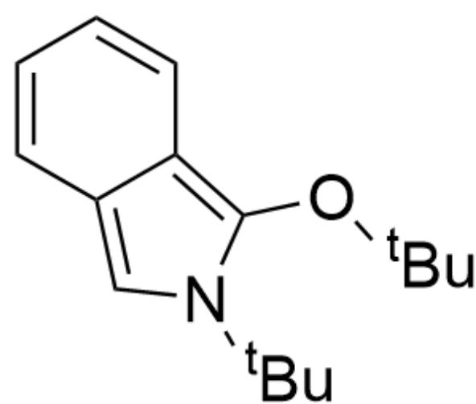

CC(OC1=C2C(C=CC=C2)=CN1C(C)(C)C)

# Answer

Correct Answer: A

# Detailed Explanation

First, the benzyl ether substrate is oxidized by DDQ to form intermediate 1

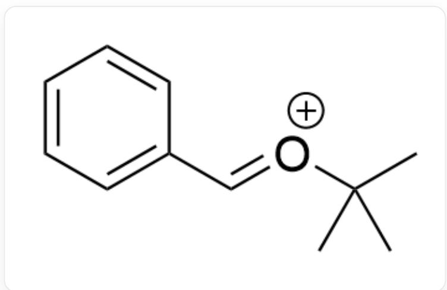

CC(C)(C)/[O+]=C/C1=CC=CC=C1

CHECKPOINT

1 PTS

$$
\mathrm {C C (C) (C)} / [ \mathrm {O} + ] = \mathrm {C / C 1} = \mathrm {C C} = \mathrm {C C} = \mathrm {C 1}
$$

Subsequently, a one-step addition reaction occurs to obtain intermediate 2

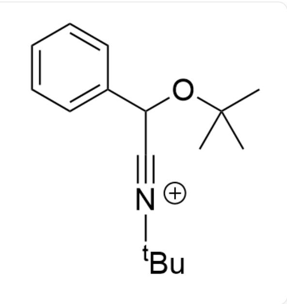

CC(C)(C)OC(C#[N+]C(C)(C)C)C1=CC=CC=C1

# CHECKPOINT

1 PTS

CC(C)(C)OC(C#[N+]C(C)(C)C)C1=CC=CC=C1

A molecule of addition reaction occurs again to obtain intermediate 3

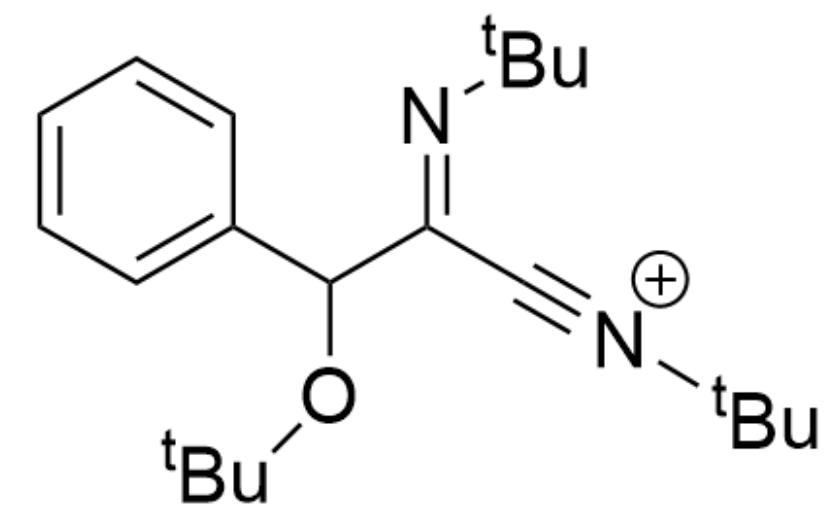

CC(OC(/C(C#[N+]C(C)(C)C)=N/C(C)(C)C)C1=CC=CC=C1)(C)C

# CHECKPOINT

1 PTS

CC(OC(/C(C#[N+]C(C)(C)C)=N/C(C)(C)C)C1=CC=CC=C1)(C)C

Subsequently, a tert-butyl carbenium ion is eliminated to obtain intermediate 4

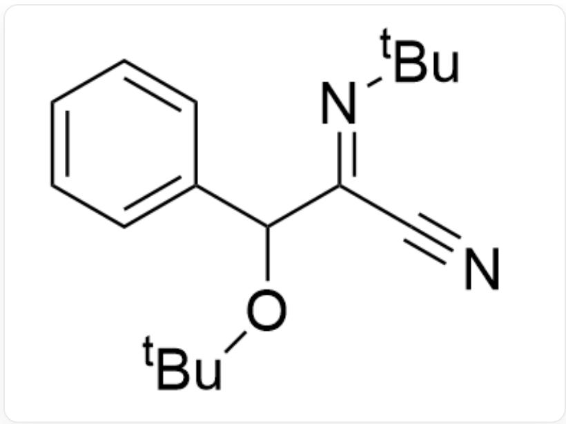

N#C/C(C(OC(C)(C)C)C1=CC=CC=C1)=N\C(C)(C)C

# CHECKPOINT

1 PTS

N#C/C(C(OC(C)(C)C)C1=CC=CC=C1)=N\C(C)(C)C

Finally, it is oxidized again by a molecule of DDQ to obtain the reaction product A

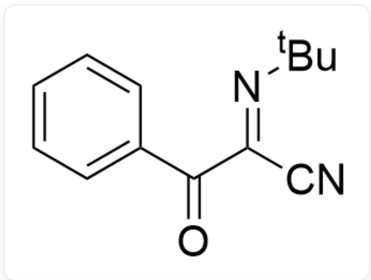

$\mathrm{O = C(/C(C\#N) = N / C(C)(C)C)C1 = CC = CC = C1}$

# CHECKPOINT

1 PTS

$$
\mathrm {O} = \mathrm {C} / / \mathrm {C} (\mathrm {C} \# \mathrm {N}) = \mathrm {N} / \mathrm {C} (\mathrm {C}) (\mathrm {C}) \mathrm {C}) \mathrm {C} 1 = \mathrm {C C} = \mathrm {C C} = \mathrm {C} 1
$$