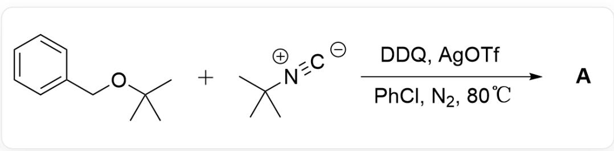
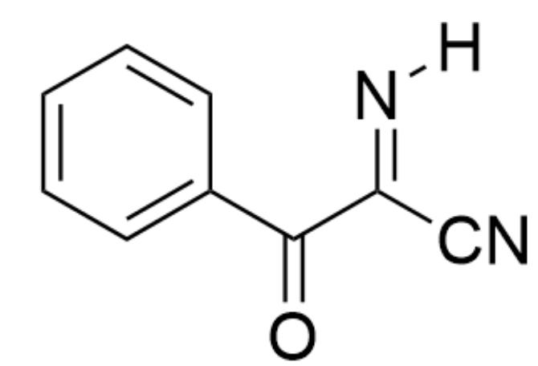
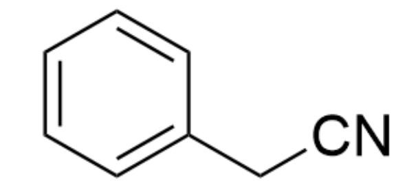
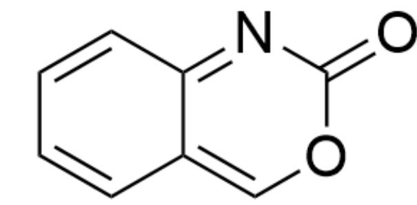
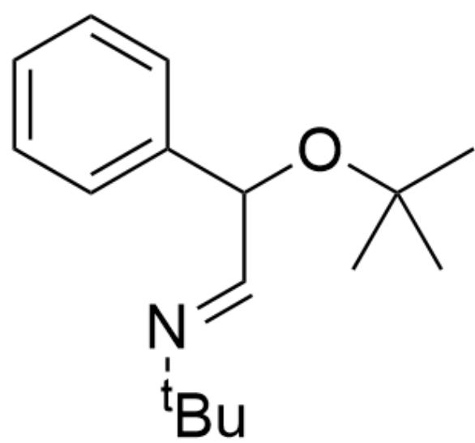
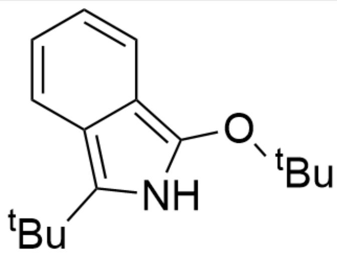
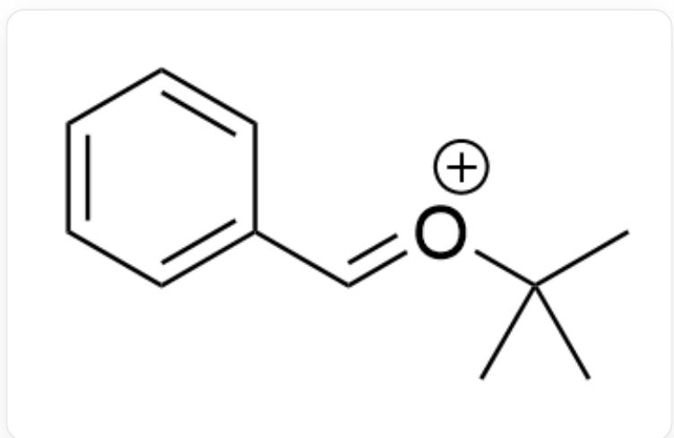
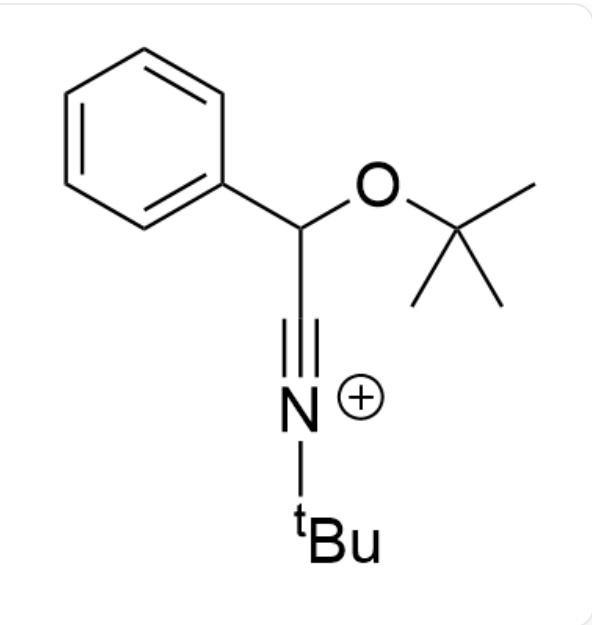
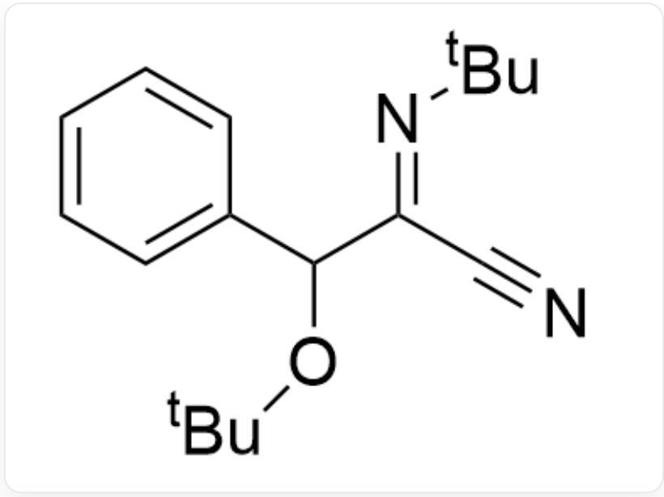
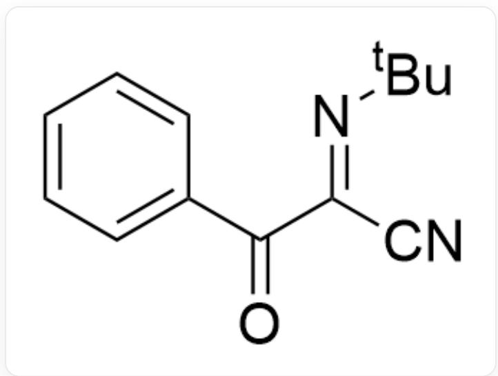

# 题目

  
CC(C)(C)OCC1=CC=CC=C1.CC(C)([N+]#[C-])C> [DDQ],[AgOTf],[PhCl],[ $N_{2}$ ]> [A],A为反应产物,反应温度为  $80^{\circ}\mathrm{C}$

其中DDQ和叔丁基异氰的量至少是苄基叔丁基醚的两倍，机理研究表明该反应并非自由基反应机理，试推断出反应产物A的结构式（不考虑立体异构）

A. 其他选项均不正确  
B.

  
[H]/N=C(C#N)/C(C1=CC=CC=C1)=O

C.

N#CCC1=CC=CC=C1

D.

CC(/N=C1N(C(C)(C)C)C=C(O/1)C2=CC=CC=C2)(C)C

E.

O=C1OC=C2C=CC=CC2=N1

# F.

CC(C)(C)OC(/C=N/C(C)(C)C)C1=CC=CC=C1

# G.

CC(OC1=C2C(C=CC=C2)=C(C(C)(C)C)N1)(C)C

H.

CC(OC1=C2C(C=CC=C2)=CN1C(C)(C)C)

# 答案

正确答案: A

# 详细解析

首先苄醚底物被DDQ氧化形成中间体1

CC(C)(C)/[O+]=C/C1=CC=CC=C1

CHECKPOINT

1 PTS

$$
\mathrm {C C (C) (C)} / [ \mathrm {O} + ] = \mathrm {C / C 1} = \mathrm {C C} = \mathrm {C C} = \mathrm {C 1}
$$

随后发生一步加成反应得到中间体2

CC(C)(C)OC(C#[N+]C(C)(C)C)C1=CC=CC=C1

# CHECKPOINT

1 PTS

CC(C)(C)OC(C#[N+]C(C)(C)C)C1=CC=CC=C1

再次发生一分子加成反应得到中间体3

CC(OC(/C(C#[N+]C(C)(C)C)=N/C(C)(C)C)C1=CC=CC=C1)(C)C

# CHECKPOINT

1 PTS

$$
C C (O C (/ C (C \# [ N + ] C (C) (C) C) = N / C (C) (C) C) C 1 = C C = C C = C 1) (C) C
$$

随后脱去叔丁基正离子得到中间体4

N#C/C(C(OC(C)(C)C)C1=CC=CC=C1)=N\C(C)(C)C

# CHECKPOINT

1 PTS

N#C/C(C(OC(C)(C)C)C1=CC=CC=C1)=N\C(C)(C)C

最后再被一分子DDQ氧化得到反应产物A

$\mathrm{O = C(/C(C\#N) = N / C(C)(C)C)C1 = CC = CC = C1}$

# CHECKPOINT

1 PTS

$$
\mathrm {O} = \mathrm {C} / (\mathrm {C} (\mathrm {C} \# \mathrm {N}) = \mathrm {N} / \mathrm {C} (\mathrm {C}) (\mathrm {C}) \mathrm {C}) \mathrm {C} 1 = \mathrm {C C} = \mathrm {C C} = \mathrm {C} 1
$$