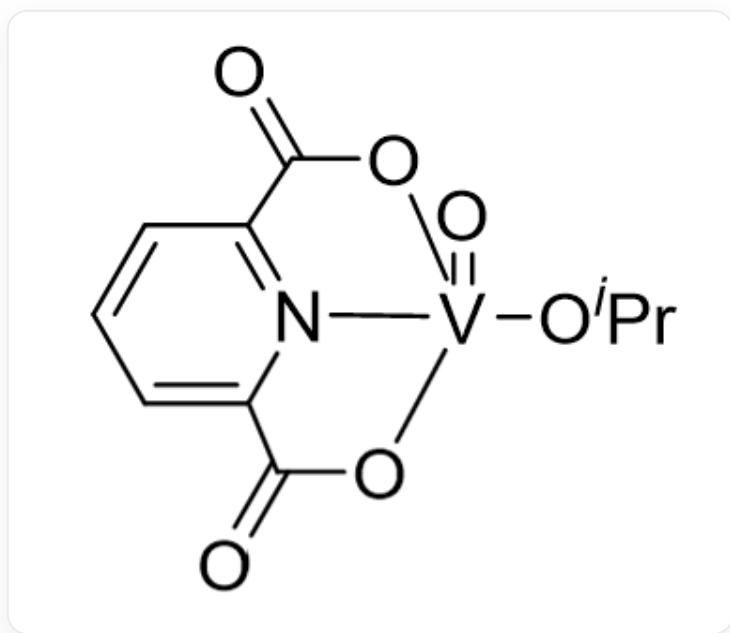
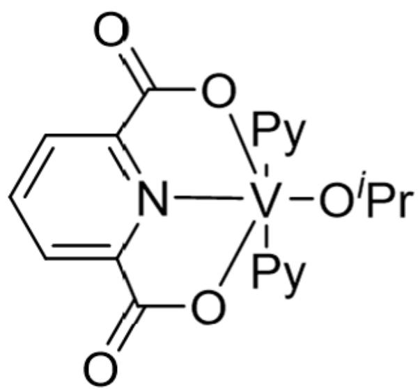
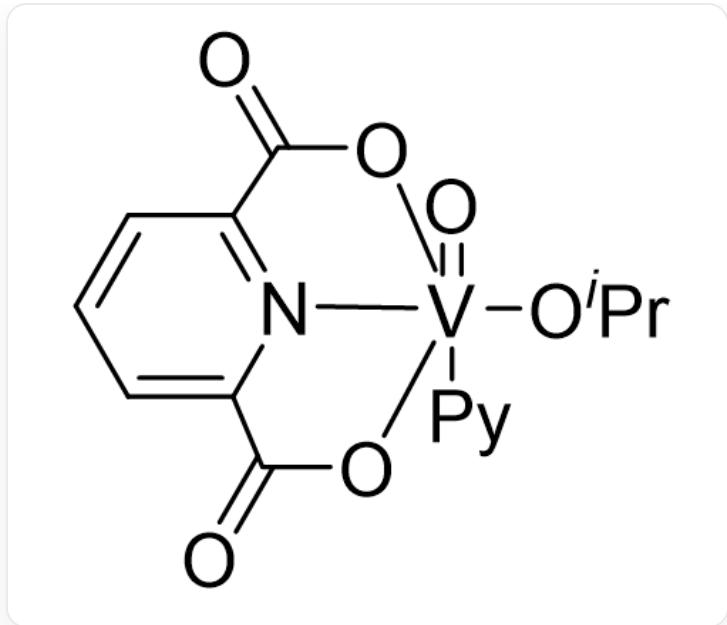
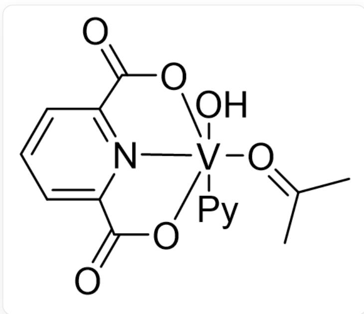
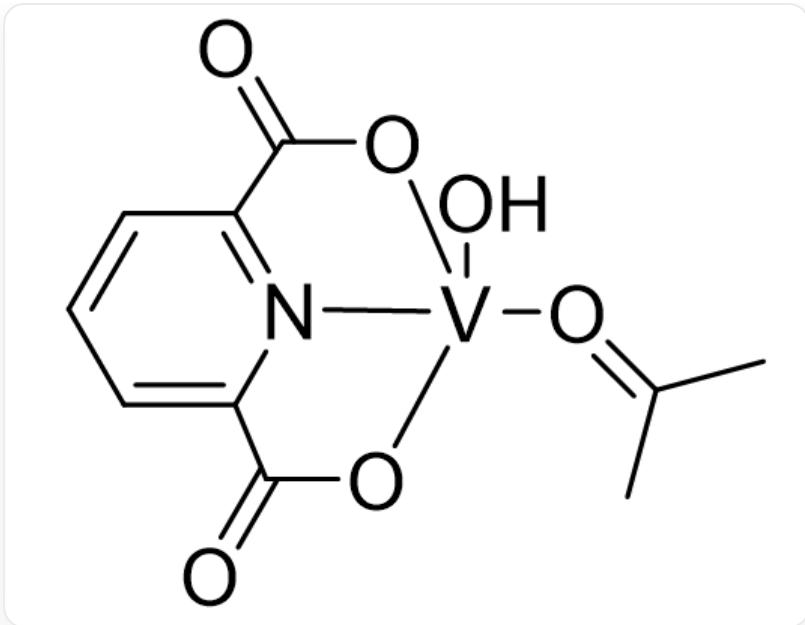
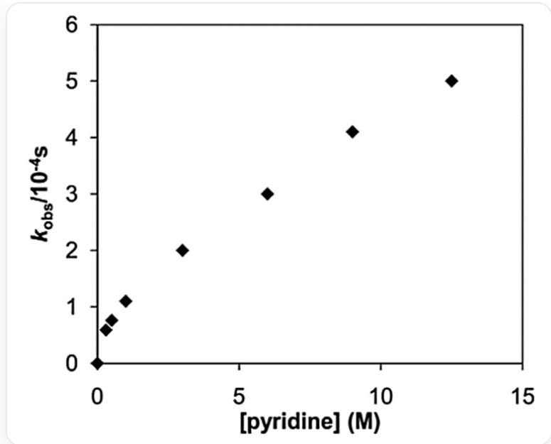

# Question

Perdeuterated pyridine ( $py - d_{5}$ , denoted directly as  $py$  or  $Py$  in responses) can catalyze the pyrolysis of the vanadium compound  $\left[\mathbf{L}(O^{i}Pr)V = O\right](\mathbf{A})$  (where  $\mathbf{L}^{2-}$  represents the 2,6-pyridinedicarboxylate anion). It is known that this reaction proceeds quantitatively and yields the following products (unbalanced):

$$
P y + \mathbf {A} \rightarrow \mathbf {P} + ^ {i} P r O H + C H _ {3} C O C H _ {3}
$$

The structures of  $\mathbf{A}$  and  $\mathbf{P}$  are as follows:

A:

$$
O = [ V ] 1 2 (O C (C) C) [ N ] 3 = C (C (O 2) = O) C = C C = C 3 C (O 1) = O
$$

P:

$$
O = C (O 1) C 2 = C C = C C (C (O 3) = O) = [ N ] 2 [ V ] 1 3 (C 4 = N C = C C = C 4) (C 5 = N C = C C = C 5) O C (C) C
$$

The experimental team proposed three possible reaction pathways for the pyrolysis:

# PathI

$$
P y + \mathbf {A} \backslash \mathrm {x r i g h t l e f t h a r p o o n s} [ ] K _ {e q} \mathbf {B} \xrightarrow {k _ {1}} \mathbf {C} \xrightarrow {f a s t} \mathbf {P}
$$

# PathII

$$
P y + \mathbf {A} \backslash \mathrm {x r i g h t l e f t h a r p o o n s} [ ] K _ {e q} \mathbf {B} \xrightarrow [ P y ]{k _ {1}} \mathbf {C} \xrightarrow {f a s t} \mathbf {P}
$$

# PathIII

$$
\mathrm {B o t h} P y + \mathbf {A} \backslash \mathrm {x r i g h t l e f t h a r p o o n s} [ ] K _ {e q} \mathbf {B} \xrightarrow [ P y ]{k _ {1}} \mathbf {C} \xrightarrow {f a s t} \mathbf {P}
$$

$$
\text {A n d} \mathbf {A} \xrightarrow [ P y ]{k _ {2}} \mathbf {D} \xrightarrow {f a s t} \mathbf {P}
$$

The structures of  $\mathbf{B}$ ,  $\mathbf{C}$ , and  $\mathbf{D}$  are as follows:

B:

[ \mathrm{O} = [\mathrm{V}]12(\mathrm{OC}(\mathrm{C})\mathrm{C})(\mathrm{C}3 = \mathrm{NC} = \mathrm{CC} = \mathrm{C}3)[\mathrm{N}]4 = \mathrm{C}(\mathrm{C}(\mathrm{O}2) = \mathrm{O})\mathrm{C} = \mathrm{CC} = \mathrm{C}4\mathrm{C}(\mathrm{O}1) = \mathrm{O} ]

C:

O[V]12(/O=C(C)/C)(C3=NC=CC=C3)[N]4=C(C(O2)=O)C=C=CC=C4C(O1)=O

D:

  
O[V]12(/O=C(C)/C)[N]3=C(C(O2)=O)C=C=CC=C3C(O1)=O

It is known that in PathII and PathIII, one molecule of  $py - d_{5}$  participates in the proton transfer process during the formation of C or D, while C and D are highly reactive, so their concentrations can be neglected.

Experimental measurements at  $340K$  show the following variation curve of  $k_{obs}$  with  $[py]$ :

This image is a scatter plot of the apparent rate constant  $k_{obs}$  versus the concentration of perdeuterated pyridine [pyridine]. The x-axis represents [pyridine] in units of  $M$ , with a range of 0 - 15, and the y-axis represents  $k_{obs}$  in units of  $10^{-4} s$ , with a range of 0 - 6. The estimated coordinates of the data points are

$(0,0),(0.33,0.59),(0.49,0.75),(0.98,1.47),(2.95,1.98),(5.93,2.98),(8.93,4.07),(12.40,4.96).$

Based on the above information, which of the following statements are incorrect?

1. For all three reaction pathways, the reaction order with respect to [A] is 1.  
2. PathII has a reaction order of 2 with respect to  $[py]$ .  
3. When  $[py] \gg 1 / K_{eq}$ , the variation of  $k_{obs}$  with  $[py]$  at  $340K$  best fits  $\mathbf{PathI}$ .

A. 1  
B. 2  
C. 3  
D. 1,2

E. 2,3  
F. 1,3  
G. 1,2,3  
H. All three statements are correct

# Answer

# Correct Answer: E

# Detailed Explanation

Let  $C_{V(V)}$  denote the sum of the concentrations of all species containing only  $V(V)$ .

For  $PathI$ , the rate equation of the reaction can be expressed as:

$$
r = k _ {1} [ \mathbf {B} ]
$$

By material balance:

$$
C _ {V (V)} = [ \mathbf {B} ] + [ \mathbf {A} ]
$$

Additionally, the equilibrium relationship is:

$$
K _ {e q} = [ \mathbf {B} ] / [ [ \mathbf {A} ] [ p y ] ]
$$

Thus, we have:

$$
[ \mathbf {B} ] = K _ {e q} [ p y ] C _ {V (V)} / \left(K _ {e q} [ p y ] + 1\right)
$$

$$
r = k _ {1} K _ {e q} [ p y ] C _ {V (V)} / \left(K _ {e q} [ p y ] + 1\right)
$$

For PathII, the rate equation of the reaction can be expressed as:

$$
r = k _ {1} [ p y ] [ \mathbf {B} ]
$$

The material balance and equilibrium relationship for PathII are the same as for PathI, so we have:

$$
r = k _ {1} K _ {e q} [ p y ] ^ {2} C _ {V (V)} / \left(K _ {e q} [ p y ] + 1\right)
$$

For PathIII, the rate equation of the reaction can be expressed as:

$$
r = k _ {1} [ p y ] [ \mathbf {B} ] + k _ {2} [ p y ] [ \mathbf {A} ]
$$

From the material balance of  $\mathbf{A}$  and the  $K_{eq}$  relationship, we obtain:

$$
[ \mathbf {B} ] = K _ {e q} [ p y ] C _ {V (V)} / \left(K _ {e q} [ p y ] + 1\right)
$$

$$
[ \mathbf {A} ] = C _ {V (V)} / \left(K _ {e q} [ p y ] + 1\right)
$$

# CHECKPOINT

0.5 PTS

$$
[ \mathbf {B} ] = K _ {e q} [ p y ] C _ {V (V)} / \left(K _ {e q} [ p y ] + 1\right)
$$

# CHECKPOINT

0.5 PTS

$$
[ \mathbf {A} ] = C _ {V (V)} / \left(K _ {e q} [ p y ] + 1\right)
$$

$$
r = k _ {1} K _ {e q} [ p y ] ^ {2} C _ {V (V)} / \left(K _ {e q} [ p y ] + 1\right) + k _ {2} [ p y ] C _ {V (V)} / \left(K _ {e q} [ p y ] + 1\right)
$$

Now, let's analyze each statement:

1. The three reaction paths can be expressed in terms of [A] as:

$$
r _ {P a t h I} = k _ {1} K _ {e q} [ p y ] [ \mathbf {A} ]
$$

$$
r _ {P a t h I I} = k _ {1} K _ {e q} [ p y ] ^ {2} [ \mathbf {A} ]
$$

$$
r _ {P a t h I I I} = \left(k _ {1} K _ {e q} [ p y ] ^ {2} + k _ {2} [ p y ]\right) [ \mathbf {A} ]
$$

Thus, for all three reaction paths, the reaction order with respect to [A] is 1. This is correct.

# CHECKPOINT

1 PTS

For all three reaction paths, the reaction order with respect to [A] is 1. Statement 1 is correct.

2. The rate equation for PathII is:

$$
r = k _ {1} K _ {e q} [ p y ] ^ {2} C _ {V (V)} / \left(K _ {e q} [ p y ] + 1\right)
$$

# CHECKPOINT

1 PTS

$$
r = k _ {1} K _ {e q} [ p y ] ^ {2} C _ {V (V)} / \left(K _ {e q} [ p y ] + 1\right)
$$

It is evident that  $[py]$  does not follow a simple integer-order relationship. Thus, the statement is incorrect.

# CHECKPOINT

1 PTS

$[py]$  does not follow a simple integer-order relationship. Statement 2 is incorrect.

3. When  $[py] \gg 1 / K_{eq}$ , the apparent rate constants for each reaction path are:

$$
\operatorname {P a t h} I: k _ {\text {o b s}} = k _ {1}
$$

$$
\operatorname {P a t h I I}: k _ {o b s} = k _ {1} [ p y ]
$$

$$
\operatorname {P a t h I I I}: k _ {\text {o b s}} = k _ {1} [ p y ] + k _ {2} / K _ {e q}
$$

# CHECKPOINT

0.5 PTS

$$
P a t h I I I: k _ {o b s} = k _ {1} [ p y ] + k _ {2} / K _ {e q}
$$

At high concentrations of  $py - d_{5}$ , plotting the tangent line of  $k_{obs}$  reveals that  $k_{obs}$  has a vertical intercept and exhibits a positive correlation with  $[py]$  (approximately linear). Therefore, PathIII is the most plausible reaction pathway, and the statement is incorrect.

# CHECKPOINT

1 PTS

At high concentrations of  $py - d_{5}$ , plotting the tangent line of  $k_{obs}$  reveals that  $k_{obs}$  has a vertical intercept.

# CHECKPOINT

0.5 PTS

PathIII is the most plausible, so statement 3 is incorrect.

Thus, the correct answer is E (2,3).