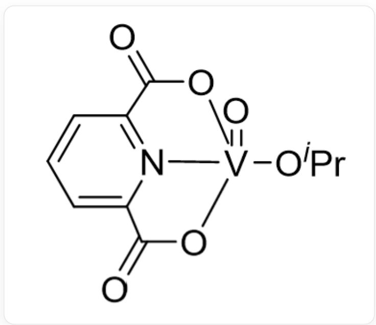
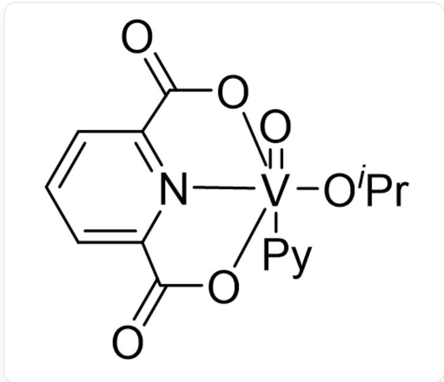
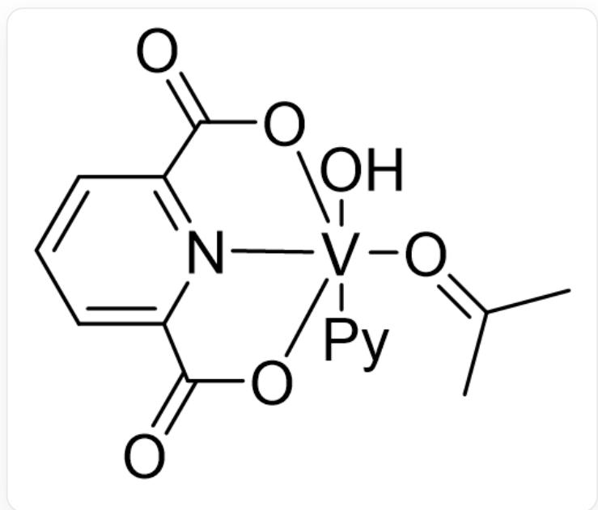
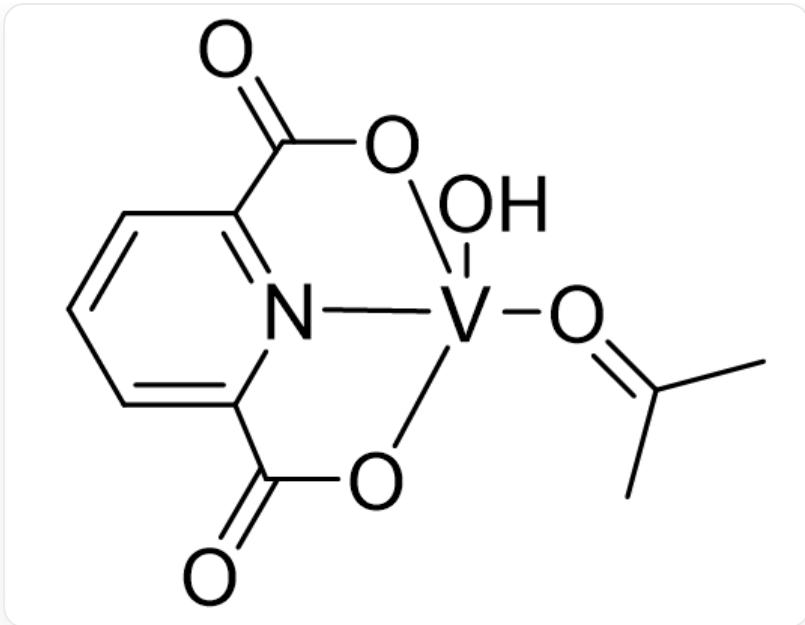
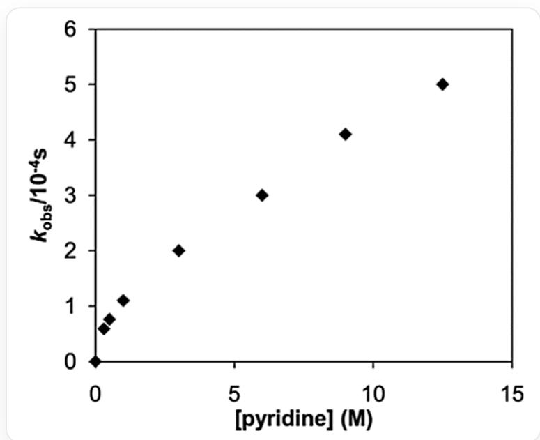

# 题目

五氘代吡啶（ $p y - d_{5}$ ，作答时直接用  $p y$  或  $P y$  表示）可催化钒化合物  $[ \mathbf { L } ( O ^ { i } P r ) V = O ] ( \mathbf { A } )$  的热解（其中  $\mathbf{L}^{2-}$  表示2,6-吡啶二甲酸根)。已知该反应可定量进行并生成如下产物（未配平）：

$$
P y + \mathbf {A} \rightarrow \mathbf {P} + ^ {i} P r O H + C H _ {3} C O C H _ {3}
$$

A和P的结构分别如下：

A:

$$
O = [ V ] 1 2 (O C (C) C) [ N ] 3 = C (C (O 2) = O) C = C C = C 3 C (O 1) = O
$$

P:

$$
O = C (O 1) C 2 = C C = C C (C (O 3) = O) = [ N ] 2 [ V ] 1 3 (C 4 = N C = C C = C 4) (C 5 = N C = C C = C 5) O C (C) C
$$

实验人员对热解反应提出了三种可能的反应历程：

# PathI

$$
P y + \mathbf {A} \backslash \mathrm {x r i g h t l e f t h a r p o o n s} [ ] K _ {e q} \mathbf {B} \xrightarrow {k _ {1}} \mathbf {C} \xrightarrow {f a s t} \mathbf {P}
$$

# PathII

$$
P y + \mathbf {A} \backslash \mathrm {x r i g h t l e f t h a r p o o n s} [   ] K _ {e q} \mathbf {B} \xrightarrow [ P y ]{k _ {1}} \mathbf {C} \xrightarrow [ ]{f a s t} \mathbf {P}
$$

# PathIII

既有  $Py + \mathbf{A}\backslash$  xrightleftharpoons[]  $K_{eq}\mathbf{B}\xrightarrow[Py]{k_1}\mathbf{C}\xrightarrow{fast}\mathbf{P}$

又有  $\mathbf{A}\xrightarrow[Py]{k_2}\mathbf{D}\xrightarrow{fast}\mathbf{P}$

B、C和D的结构分别如下：

B:

[ \mathrm{O} = [\mathrm{V}]12(\mathrm{OC}(\mathrm{C})\mathrm{C})(\mathrm{C}3 = \mathrm{NC} = \mathrm{CC} = \mathrm{C}3)[\mathrm{N}]4 = \mathrm{C}(\mathrm{C}(\mathrm{O}2) = \mathrm{O})\mathrm{C} = \mathrm{CC} = \mathrm{C}4\mathrm{C}(\mathrm{O}1) = \mathrm{O} ]

C:

O[V]12(/O=C(C)/C)(C3=NC=CC=C3)[N]4=C(C(O2)=O)C=CC=C4C(O1)=O

D:

  
$\mathrm{O}[\mathrm{V}]12(/0 = \mathrm{C}(\mathrm{C}) / \mathrm{C})(\mathrm{N}]3 = \mathrm{C}(\mathrm{C}(\mathrm{O}2) = \mathrm{O})\mathrm{C} = \mathrm{CC} = \mathrm{C}3\mathrm{C}(\mathrm{O}1) = 0$

已知在 PathII 与 PathIII 中生成 C 或 D 一步有一分子  $py - d_{5}$  参与质子转移过程，而 C 与 D 十分活泼，故其浓度可以忽略不计。

实验测得在  $340K$  下，  $k_{obs}$  随  $[py]$  的变化曲线如下：

这张图片为表观速率常数  $k_{obs}$  与五氘代吡啶浓度  $[pyridine]$  的散点图。横轴是以  $M$  为单位的  $[pyridine]$ ，

坐标范围是  $0 - 15$  ，纵轴是以  $10^{-4}s$  为单位的  $k_{obs}$  ，坐标范围是  $0 - 6$  。各散点的估读坐标为  $(0,0),(0.33,0.59),(0.49,0.75),(0.98,1.47),(2.95,1.98),(5.93,2.98),(8.93,4.07),(12.40,4.96)$

根据以上信息，以下说法中错误的有哪些？

1. 对于三种反应路径，反应对  $[\mathbf{A}]$  的级数均为 1。  
2. PathII对  $[py]$  的级数为2。  
3. 当  $[py] \gg 1 / K_{eq}$  时，最符合  $340K$  下  $k_{obs}$  随  $[py]$  变化关系的是  $\mathbf{PathI}$

A. 1  
B. 2  
C. 3  
D. 1,2  
E. 2,3  
F. 1,3  
G. 1,2,3  
H. 3种说法均正确

# 答案

# 正确答案: E

# 详细解析

以  $C_{V(V)}$  表示仅含  $V(V)$  的物种浓度之和

对于  $\operatorname{Path} I$ ，反应的速率方程可以表示为：

$$
r = k _ {1} [ \mathbf {B} ]
$$

由物料守恒：

$$
C _ {V (V)} = [ \mathbf {B} ] + [ \mathbf {A} ]
$$

又有平衡关系：

$$
K _ {e q} = [ \mathbf {B} ] / [ [ \mathbf {A} ] [ p y ] ]
$$

故有：

$$
[ \mathbf {B} ] = K _ {e q} [ p y ] C _ {V (V)} / \left(K _ {e q} [ p y ] + 1\right)
$$

$$
r = k _ {1} K _ {e q} [ p y ] C _ {V (V)} / \left(K _ {e q} [ p y ] + 1\right)
$$

对于  $PathII$ ，反应的速率方程可以表示为：

$$
r = k _ {1} [ p y ] [ \mathbf {B} ]
$$

PathII的物料守恒和平衡关系与PathI相同，故有：

$$
r = k _ {1} K _ {e q} [ p y ] ^ {2} C _ {V (V)} / \left(K _ {e q} [ p y ] + 1\right)
$$

对于 PathIII，反应的速率方程可以表示为：

$$
r = k _ {1} [ p y ] [ \mathbf {B} ] + k _ {2} [ p y ] [ \mathbf {A} ]
$$

由  $\mathbf{A}$  的物料守恒以及  $K_{eq}$  的关系式可得：

$$
[ \mathbf {B} ] = K _ {e q} [ p y ] C _ {V (V)} / \left(K _ {e q} [ p y ] + 1\right)
$$

$$
[ \mathbf {A} ] = C _ {V (V)} / \left(K _ {e q} [ p y ] + 1\right)
$$

# CHECKPOINT

0.5 PTS

$$
[ \mathbf {B} ] = K _ {e q} [ p y ] C _ {V (V)} / \left(K _ {e q} [ p y ] + 1\right)
$$

# CHECKPOINT

0.5 PTS

$$
[ \mathbf {A} ] = C _ {V (V)} / (K _ {e q} [ p y ] + 1)
$$

$$
r = k _ {1} K _ {e q} [ p y ] ^ {2} C _ {V (V)} / \big (K _ {e q} [ p y ] + 1 \big) + k _ {2} [ p y ] C _ {V (V)} / \big (K _ {e q} [ p y ] + 1 \big)
$$

下面分析各说法：

1. 三种反应路径分别可以用 [A] 表示成:

$$
r _ {P a t h I} = k _ {1} K _ {e q} [ p y ] [ \mathbf {A} ]
$$

$$
r _ {P a t h I I} = k _ {1} K _ {e q} [ p y ] ^ {2} [ \mathbf {A} ]
$$

$$
r _ {P a t h I I I} = \left(k _ {1} K _ {e q} [ p y ] ^ {2} + k _ {2} [ p y ]\right) [ \mathbf {A} ]
$$

即对于三种反应路径，反应对  $[\mathbf{A}]$  的级数均为1，正确。

# CHECKPOINT

1 PTS

对于三种反应路径，反应对  $[\mathbf{A}]$  的级数均为1，说法1正确

2. PathII的速率方程为

$$
r = k _ {1} K _ {e q} [ p y ] ^ {2} C _ {V (V)} / \left(K _ {e q} [ p y ] + 1\right)
$$

# CHECKPOINT

1 PTS

$$
r = k _ {1} K _ {e q} [ p y ] ^ {2} C _ {V (V)} / \left(K _ {e q} [ p y ] + 1\right)
$$

可见  $[py]$  并非简单的整数级数关系，说法错误。

# CHECKPOINT

1 PTS

[py] 并非简单的整数级数关系，说法2错误

3. 当  $[py] \gg 1 / K_{eq}$  时，各反应路径的表观速率常数为：

$$
\begin{array}{l} \operatorname {P a t h} I: k _ {\text {o b s}} = k _ {1} \\ \operatorname {P a t h I I}: k _ {\text {o b s}} = k _ {1} [ p y ] \\ \operatorname {P a t h I I I}: k _ {\text {o b s}} = k _ {1} [ p y ] + k _ {2} / K _ {e q} \\ \end{array}
$$

# CHECKPOINT

0.5 PTS

$$
P a t h I I I: k _ {o b s} = k _ {1} [ p y ] + k _ {2} / K _ {e q}
$$

高浓度  $p y - d_{5}$  下作  $k_{obs}$  的切线会发现  $k_{obs}$  具有纵轴截距，且  $k_{obs}$  与  $[py]$  呈正相关关系（近似直线），因此 PathIII 为最合理的反应历程，说法错误。

# CHECKPOINT

1 PTS

高浓度  $p y - d_{5}$  下作  $k_{obs}$  的切线会发现  $k_{obs}$  具有纵轴截距

# CHECKPOINT

0.5 PTS

PathIII最合适，说法3错误。

因此正确答案选E（2,3）。