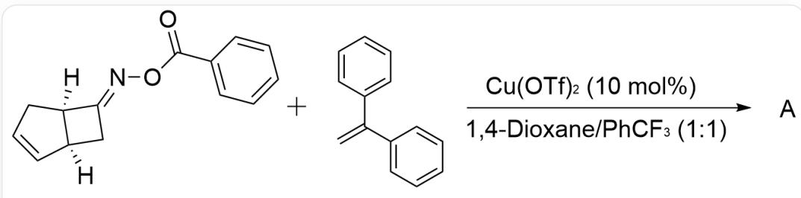
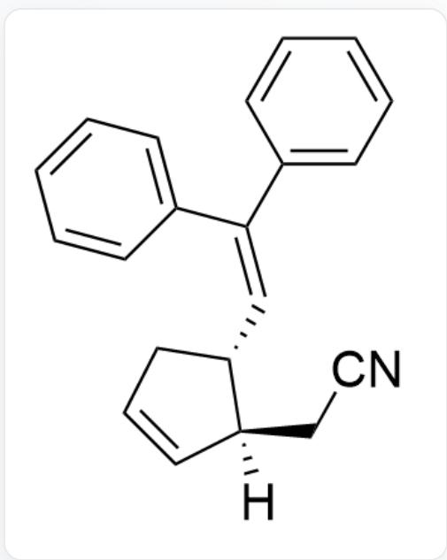
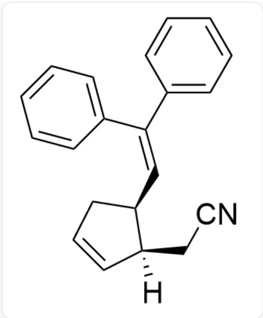
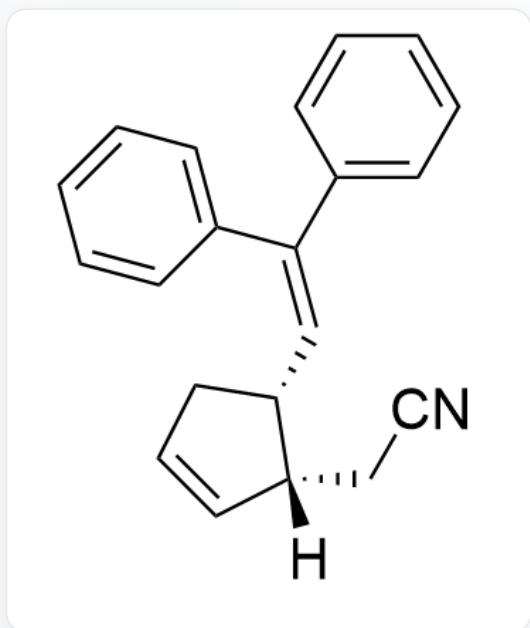
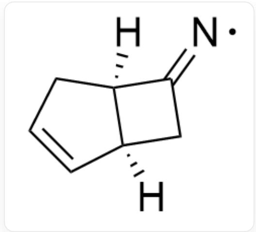
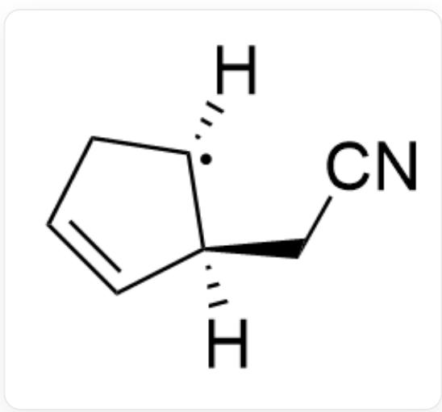
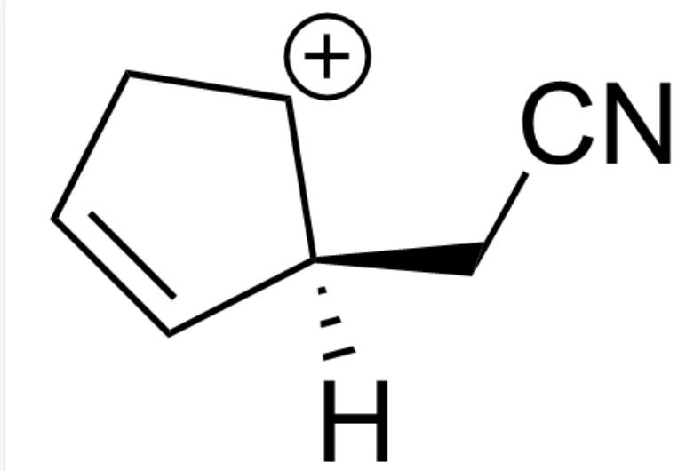
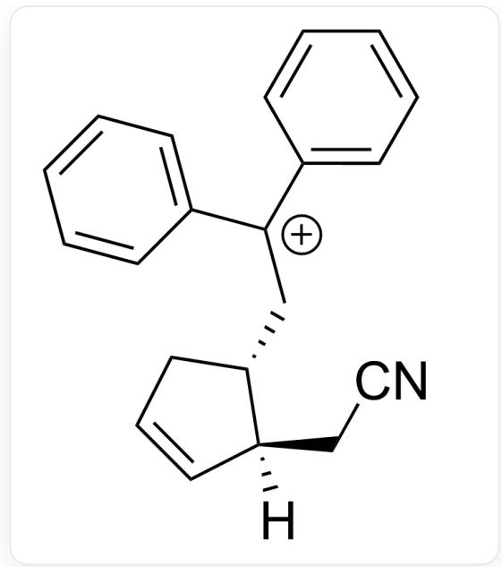

# Question

  
[H][C@]12[C@](C/C2=N\OC(C3=CC=CC=C3)=O)([H])C=CC1.C=C(C1=CC=CC=C1)C2=CC=CC=C2> Cu(OTf)₂ (10 mol%), 1, 4 - Dioxane/PhCF₃(1:1)>A

Please select the most suitable product A

A.

  
[H][C@]1(CC#N)C=CC[C@@H]1/C=C(C2=CC=CC=C2)/C3=CC=CC=C3

B.

[H][C@]1(CC#N)C=CC[C@H]1/C=C(C2=CC=CC=C2)/C3=CC=CC=C3

C.

[H][C@@]1(CC#N)C=CC[C@@H]1/C=C(C2=CC=CC=C2)/C3=CC=CC=C3

D.

[H][C@@]1(CC#N)C=CC[C@H]1/C=C(C2=CC=CC=C2)/C3=CC=CC=C3

# Answer

Correct Answer: A

# Detailed Explanation

This reaction is a radical reaction

# CHECKPOINT

1 PTS

This reaction is a radical reaction

The  $Cu$  in the reaction system acts as a catalyst

# CHECKPOINT

1 PTS

The  $Cu$  in the reaction system acts as a catalyst

$Cu(I)$  first donates a single electron, causing the cleavage of the weaker N-O bond and forming a radical intermediate

[H][C@]12[C@](CC2=[N])([H])C=CC1

# CHECKPOINT

1 PTS

$Cu(I)$  first donates a single electron, causing the cleavage of the weaker N-O bond and forming a radical intermediate

Subsequently, this unstable intermediate rapidly undergoes ring-opening to form a more stable carbon radical

[H][C@]1(CC#N)C=CC[C]1[H]

# CHECKPOINT

1 PTS

Subsequently, this unstable intermediate rapidly undergoes ring-opening to form a more stable carbon radical

Next,  $Cu(II)$  oxidizes this radical to form a carbocation

[H][C@]1(CC#N)C=CC[CH+]1

# CHECKPOINT

1 PTS

Next,  $Cu(II)$  oxidizes this radical to form a carbocation

Due to the greater steric hindrance above this carbocation compared to below, it is selectively captured from below by 1,1-diphenylethylene

[H][C@]1(CC#N)C=CC[C@@H]1C[C+](C2=CC=CC=C2)C3=CC=CC=C3

# CHECKPOINT

1 PTS

Due to the greater steric hindrance above this carbocation compared to below, it is selectively captured from below by 1,1-diphenylethylene

Finally, a proton is eliminated to form product A