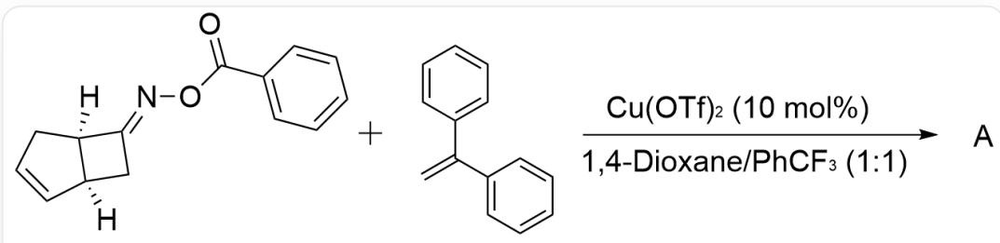
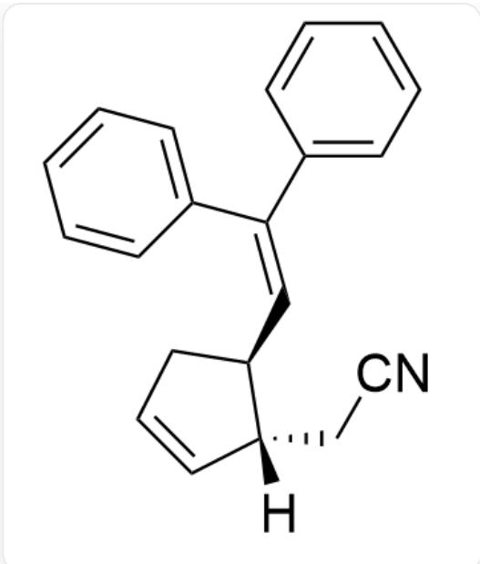
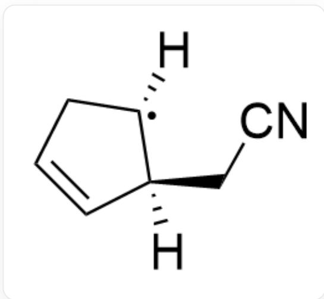
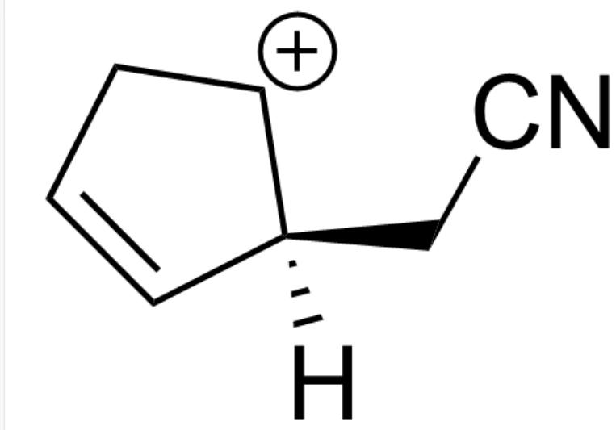

# 题目

  
[H][C@]12[C@](C/C2=N\OC(C3=CC=CC=C3)=O)([H])C=CC1.C=C(C1=CC=CC=C1)C2=CC=CC=C2> Cu(OTf)₂ (10 mol%), 1, 4 - Dioxane/PhCF₃(1:1)>A

请选出最合适的产物A

A.

  
[H][C@]1(CC#N)C=CC[C@@H]1/C=C(C2=CC=CC=C2)/C3=CC=CC=C3

B.

[H][C@]1(CC#N)C=CC[C@H]1/C=C(C2=CC=CC=C2)/C3=CC=CC=C3

C.

[H][C@@]1(CC#N)C=CC[C@@H]1/C=C(C2=CC=CC=C2)/C3=CC=CC=C3

D.

[H][C@@]1(CC#N)C=CC[C@H]1/C=C(C2=CC=CC=C2)/C3=CC=CC=C3

# 答案

正确答案: A

# 详细解析

该反应为自由基反应

# CHECKPOINT

1 PTS

该反应为自由基反应

反应体系中的  $C u$  为催化剂

# CHECKPOINT

1 PTS

反应体系中的  $C u$  为催化剂

$C u(I)$  首先给出一个单电子, 使得较弱的  $\mathrm{N}-\mathrm{O}$  键发生裂解, 形成自由基中间体

[H][C@]12[C@](CC2=[N])([H])C=CC1

# CHECKPOINT

1 PTS

$C u(I)$  首先给出一个单电子，使得较弱的N-O键发生裂解，形成自由基中间体

随后该不稳定中间体迅速发生开环，形成较稳定的碳自由基

[H][C@]1(CC#N)C=CC[C]1[H]

# CHECKPOINT

1 PTS

随后该不稳定中间体迅速发生开环，形成较稳定的碳自由基

接着  $Cu(II)$  将该自由基氧化，形成碳正离子

[H][C@]1(CC#N)C=CC[CH+]1

# CHECKPOINT

1 PTS

接着  $Cu(II)$  将该自由基氧化，形成碳正离子

由于该碳正离子上方的位阻大于下方，因此被1,1-二苯乙烯选择性地从下方捕获

[H][C@]1(CC#N)C=CC[C@@H]1C[C+](C2=CC=CC=C2)C3=CC=CC=C3

# CHECKPOINT

1 PTS

由于该碳正离子上方的位阻大于下方，因此被1,1-二苯乙烯选择性地从下方捕获

最后脱去质子形成产物A