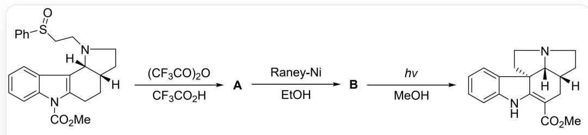
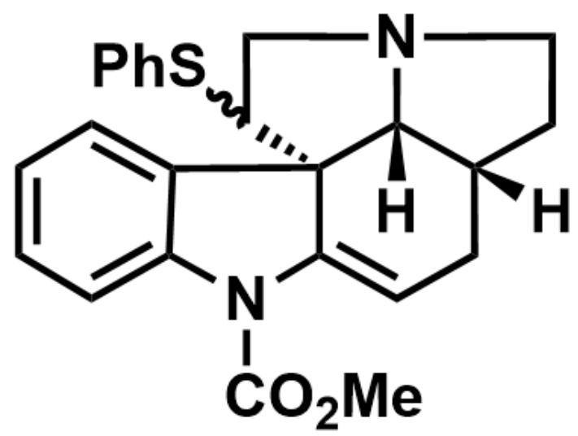
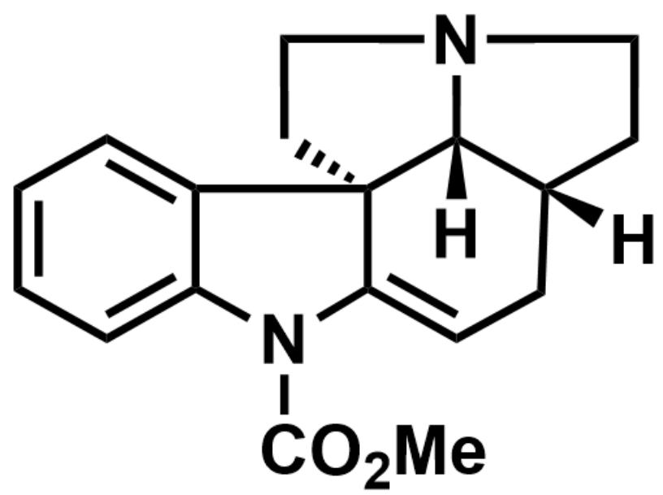

# Question

Pummerer rearrangement typically refers to the chemical reaction of activating the oxygen atom of a sulfoxide with an anhydride, going through a sulfonium ion intermediate, and ultimately generating an  $\alpha$ -functionalized sulfide. In the total synthesis of a certain natural product (as shown in the figure below), Pummerer rearrangement was used to construct a new quaternary carbon center.

The figure shows a multi-step reaction, which can be described as: [H]

$$
[ C @ @ ] 1 (C C N (C C S (C 2 = C C = C C = C 2) = O) [ C @ ] 1 3 [ H ]) C C C 4 = C 3 C 5 = C C = C C = C 5 N 4 C (O C) = O >
$$

$$
\left(C F _ {3} C O\right) _ {2} O, C F _ {3} C O _ {2} H > [ \mathrm {A} ], [ \mathrm {A} ] > R a n e y - N i, E t O H > [ \mathrm {B} ], [ \mathrm {B} ] > h v, M e O H > [ \mathrm {H} ]
$$

$$
\begin{array}{l} {[ C @ @ ] 1 (C C (C (O C) = O) = C 2 N ([ H ]) C 3 = C C = C C = C 3 [ C @ ] 2 4 C C N 5 C C 1) [ C @ ] 4 5 [ H ] \circ W h e r e [ 1 ] > ^ {\prime} 2 ^ {\prime} > [ 3 ] m e a n s} \\ {c o m p o u n d 1 r e a c t s u n d e r t h e c o n d i t i o n s o f 2 t o o b t a i n c o m p o u n d 3.} \end{array}
$$

Which of the following statements about  $\mathbf{A}$  and  $\mathbf{B}$  are correct:

1. A has three stereochemical centers  
2. A and B have the same number of rings  
3. A carbon-carbon double bond shift occurred during the generation of  $\mathbf{B}$  from  $\mathbf{A}$  
4. [1,5]- $\sigma$  migration occurred in  $\mathbf{B}$  under light irradiation  
5. Compared with  $\mathbf{B}$ , there is no generation or disappearance of stereochemical centers in the final product  
6. An imine structure exists in the intermediate of the formation of the final product from B

A. 1,2,4,5,6  
B.  $1,2,3,4,5,6$  
C. 5,6  
D. 2,6  
E. 2,3,6  
F. 1,2,4,6  
G. 1,3,4,5  
H. 2,4,5  
1. 3,4,6  
J. All of the above options are incorrect or the answer is incomplete.

# Answer

Correct Answer: C

# Detailed Explanation

In the process of the reactant generating  $\mathbf{A}$ , firstly, the classical Pummerer rearrangement reaction occurs, that is, the oxygen atom of the sulfoxide nucleophilically attacks trifluoroacetic anhydride, resulting in a sulfonium ion, followed by 1,2-elimination to obtain a carbocation (or an onium ion containing a carbon-sulfur double bond) at the ortho position of the sulfide. Since the indole ring is relatively electron-rich, it can undergo an aromatic electrophilic substitution reaction. The number 3 position of the indole ring nucleophilically attacks the carbocation, constructing a five-membered ring system similar to the product, and generating an imine cation structure, and finally eliminating  $\mathrm{H^{+}}$  to obtain  $\mathbf{A}$ , the structure is as follows:

# CHECKPOINT

1 PTS

The number 3 position of the indole ring nucleophilically attacks the carbocation, constructing a five-membered ring system similar to the product

  
[H][C@@]1(CC=C([C@@](C2=CC=CC=C32)4C(CN5CC1)SC6=CC=CC=C6)N3C(OC)=O)[C@]45[H]

# CHECKPOINT

1 PTS

The

structure

of

A

is

[H][C@@]1(CC=C([C@@])

$$
(C 2 = C C = C C = C 3 2) 4 C (C N 5 C C 1) S C 6 = C C = C C = C 6) N 3 C (O C = O) [ C @ ] 4 5 [ H ]
$$

So A has four stereochemical centers. Statement 1 is incorrect.

A is then reduced by Raney - Ni to cleave the carbon-sulfur bond, finally yielding one molecule of PhSH and  
B. The structure of  $\mathbf{B}$  is as follows:

[H][C@@]1(CC=C([C@@](C2=CC=CC=C32)4CCN5CC1)N3C(OC)=O)[C@@]45[H]

# CHECKPOINT

1 PTS

Raney - Ni reduces the carbon-sulfur bond

# CHECKPOINT

1 PTS

The structure of  $\mathbf{B}$  is [H][C@@]1(CC=C([C@@](C2=CC=CC=C32)4CCN5CC1)N3C(OC)=O)[C@@]45[H]

Because it is reduced,  $\mathbf{B}$  has one less benzene ring than  $\mathbf{A}$ , and no carbon-carbon double bond shift occurs in the process of  $\mathbf{A}$  generating  $\mathbf{B}$ . Statements 2 and 3 are incorrect.

# CHECKPOINT

1 PTS

A has one more ring than B, and no carbon-carbon double bond shift occurs in the process of A generating B

Under illumination, the  $-\mathrm{COOMe}$  in  $\mathbf{B}$  undergoes a  $[1,3]$ - $\sigma$  migration, yielding an imine intermediate, followed by imine-enamine tautomerization to give the final product. In this step, there is no creation or disappearance of stereochemical centers. Therefore, statements 4 is incorrect, and 5 and 6 are correct.

# CHECKPOINT

1 PTS

B undergoes a [1,3]- $\sigma$  migration under illumination

# CHECKPOINT

1 PTS

Compared with B , there is no creation or disappearance of stereochemical centers in the final product

# CHECKPOINT

1 PTS

There is an imine structure in the intermediate of  $\mathbf{B}$  generating the final product

Therefore, statements 5 and 6 are correct, and the answer is C.